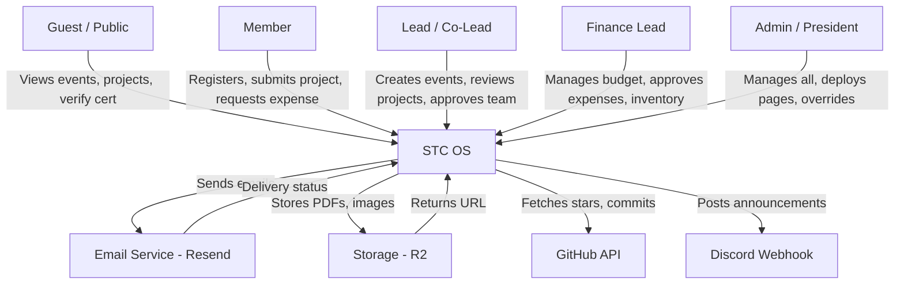
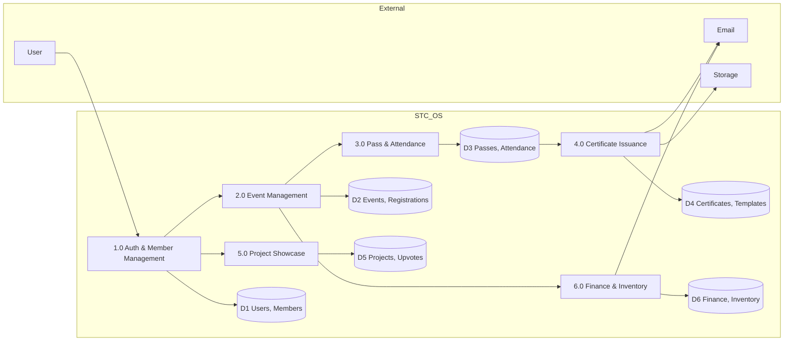
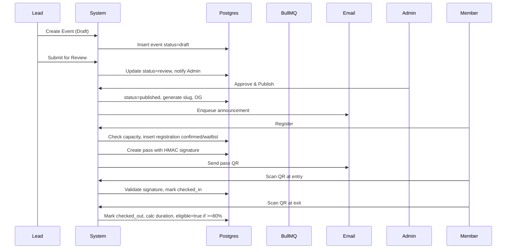
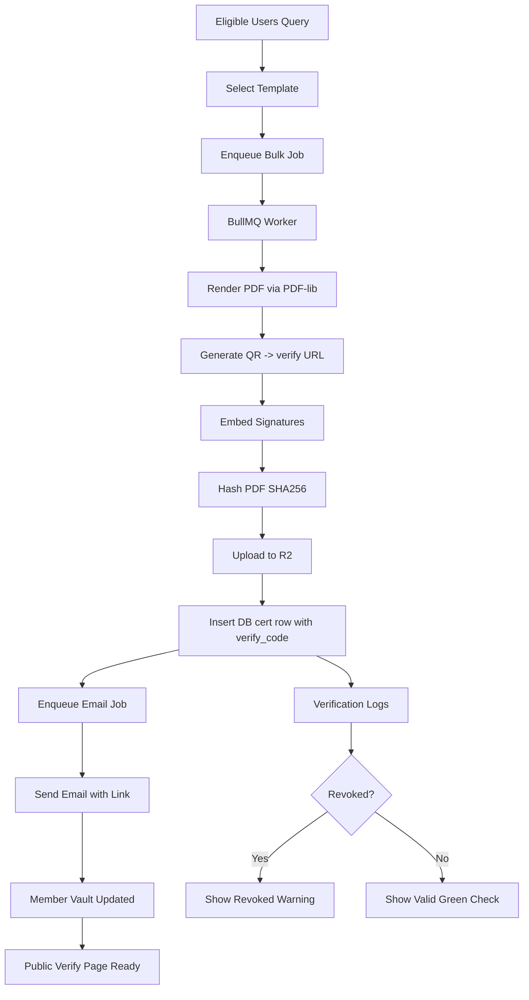
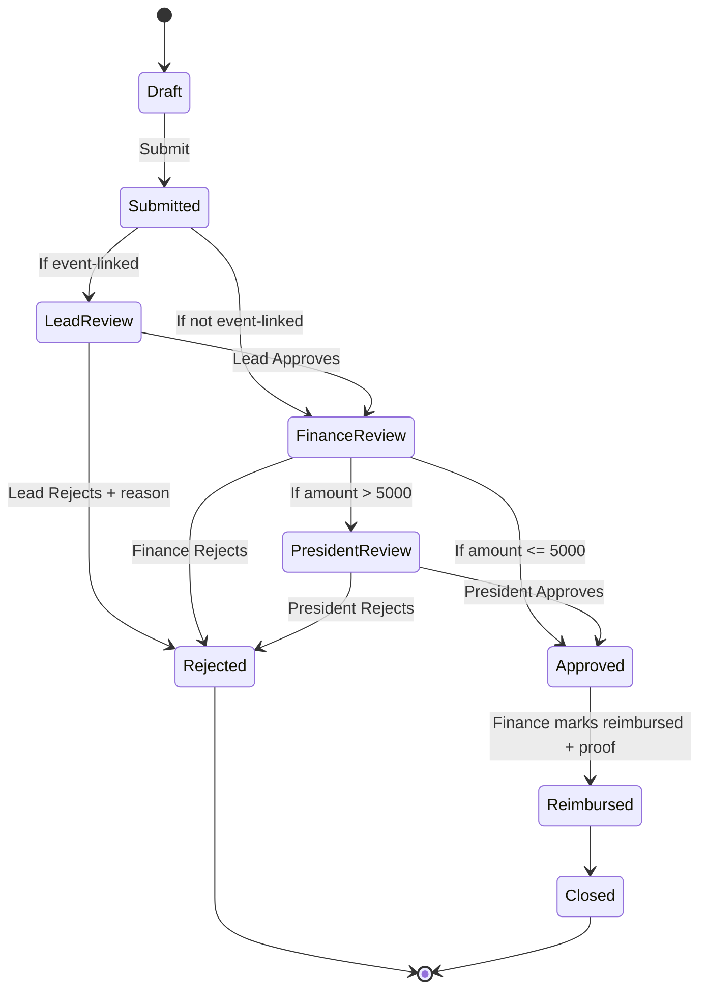

# STC OS - Ultra Comprehensive Product Requirements Document (PRD)
## Student Developer Club Operating System - Parul University Goa
### Version 2.0 | July 11, 2026 | Prepared for Anti-Gravity AI Builder

---

## DOCUMENT CONTROL

| Field | Value |
| :--- | :--- |
| **Document Title** | STC OS - Complete PRD |
| **Version** | 2.0 - Ultra Comprehensive |
| **Date** | July 11, 2026 |
| **Author** | Aaryan Kumar Tiwari (President), Tanishq Naik (Tech Lead), Shravan Bhise (Finance Lead) |
| **Faculty Mentor** | Ms. Silica Kole, Asst. Prof. CSE |
| **Status** | Ready for Development |
| **Target Stack** | Next.js 16, Better Auth, Drizzle ORM, Postgres, Redis, BullMQ, S3 |
| **UI Policy** | Stock shadcn/ui only for Phase 1 |

### Revision History
| Version | Date | Author | Changes |
| 1.0 | May 13 2026 | Core Team | Initial club proposal |
| 1.5 | July 11 2026 | Tech Team | Feature inventory + demo report |
| 2.0 | July 11 2026 | Tech Team | Ultra comprehensive PRD with finance, inventory, DFD, UI spec, compliance |

### Stakeholders
- **Primary:** Admin/President, Vice President, 6 Domain Leads, Members
- **Secondary:** Alumni, Faculty Mentor, University Admin, Sponsors
- **System:** Email Service (Resend), Storage (R2), GitHub, Discord

---

## 1. EXECUTIVE SUMMARY

### 1.1 What is STC OS?
STC OS is not a club website. It is the operating system for SDC. It replaces 6 disconnected tools:
- Google Forms → Event registration engine
- Google Sheets → Member data management + attendance
- Canva → Certificate issuance with verification
- Gmail manual → Integrated mailing + notification center
- WhatsApp chaos → Structured communications + announcements
- No finance tracking → Finance & Inventory module

Every student action becomes portfolio-ready. Every lead action becomes auditable.

### 1.2 Why Build This?
From the original proposal: SDC exists to bridge classroom vs industry gap. The platform is the flagship project - built by students, for students, production-grade, CV-worthy.

**Problems Solved:**
1. 40% time wasted on manual ops
2. Certificate fraud (no verification)
3. No member history beyond one semester
4. No finance transparency
5. No project showcase leading to lost talent visibility

### 1.3 Product Vision
By Year 3: Nationally recognized club, talent pipeline for companies, model for other Parul campuses, library of documented projects. Platform is enabler.

---

## 2. GOALS, NON-GOALS, SUCCESS METRICS

### 2.1 Goals
- G1: Automate 90% of club operations
- G2: Issue 500 certificates in <2 min with verification
- G3: Check-in 200 attendees in <5 min via offline QR
- G4: Finance transparency: every rupee tracked
- G5: Every active member has public portfolio by year end

### 2.2 Non-Goals (Phase 1)
- NG1: Not a mobile app (PWA scanner only)
- NG2: Not a social network (no DMs)
- NG3: Not an LMS (no video hosting, link to YouTube)
- NG4: Not redesigning UI (stock shadcn)

### 2.3 Success Metrics
| Metric | Target | Measurement |
| Check-in speed | <1.5s per scan | PWA perf logs |
| Certificate gen | 300 in <2 min | BullMQ metrics |
| No manual sheets | 0 sheets used | Audit |
| Verification hit rate | 100% verifiable | /verify logs |
| Member activation | 80% attend >=1 event | DB query |

---

## 3. USER PERSONAS & ROLES

### 3.1 Persona: Aaryan - President
- Needs: Global view, approve finance >5000, deploy pages, resolve conflicts
- Frustrations: No audit trail, finance opaque
- Tech: High

### 3.2 Persona: Tanishq - Tech Lead
- Needs: Manage domains, GitHub integration, approve co-leads
- Frustrations: Members ghost after joining
- Tech: Very High

### 3.3 Persona: Shravan - Finance & Volunteer Lead
- Needs: Track budget, approve expenses, manage inventory (projector, merch)
- Frustrations: Receipts on WhatsApp, no stock count
- Tech: Medium

### 3.4 Persona: Priya - First Year Member
- Needs: Easy registration, get pass on phone, collect certificates for LinkedIn
- Frustrations: Forms don't work, no confirmation
- Tech: Low-Medium

### 3.5 Persona: Alumni
- Needs: Retain certificates, showcase projects, mentor
- Tech: Medium

### 3.6 Detailed Role Permission Matrix

| Feature | Admin | Lead | Co-Lead | Finance Lead | Member | Guest |
| :--- | :--- | :--- | :--- | :--- | :--- | :--- |
| Create Event | Y | Y (own domain) | Draft only | N | N | N |
| Publish Event | Y | Y | N | N | N | N |
| Delete Event | Y (hard) | Y (soft) | N | N | N | N |
| Issue Certificate | Y | Y | Request | N | N | N |
| Verify Certificate | Y | Y | Y | Y | Y | Y |
| Approve Expense <2000 | Y | N | N | Y | N | N |
| Approve Expense >2000 | Y | N | N | Review → Admin | N | N |
| Manage Inventory | Y | N | Check-out | Y | N | N |
| Deploy Custom Page | Y | Request | N | N | N | N |
| View Finance Reports | Y | Own domain | N | Y | N | N |
| Manage Members | Y | Own domain | View | View | Self | N |
| Feature Project | Y | Propose | Propose | N | Submit | N |

---

## 4. COMPLETE PRODUCT BREAKDOWN

### 4.1 What the Product Is
A multi-tenant, role-based club OS with 8 core subsystems sharing one Postgres, one Auth, one Storage, one Queue.

### 4.2 Core Features (6 Pillars + 2 Supporting)

**Pillar 1: Authentication (Better Auth)**
**Pillar 2: Member Data Management**
**Pillar 3: Event Management**
**Pillar 4: Certificate Issuance**
**Pillar 5: Featured Projects Showcase (Popular, High-Quality)**
**Pillar 6: Finance & Inventory** (NEW - critical for real-world ops)
**Supporting 7: Communications**
**Supporting 8: Custom Page Deployment**

### 4.3 Sub-Features Tree

```
STC OS
├── Auth
│   ├── Email/Password + Policy (min 8, uppercase, number)
│   ├── OAuth: GitHub, Google
│   ├── Magic Link
│   ├── Passkey (WebAuthn)
│   ├── 2FA TOTP + Recovery Codes
│   ├── Session: Shared DB, 30d expiry, rolling
│   ├── Device Management: list, revoke
│   ├── Rate Limit: 5 login fails -> 15m lock
│   └── DAL Guards: requireSession(), requireRole()
├── Member
│   ├── Profile: username unique, avatar, bio, skills[], links
│   ├── Onboarding: welcome email, profile completion nudge
│   ├── Recruitment: application form, task, interview slot, decision
│   ├── Attendance: entry+exit scan, duration calc
│   ├── Points: +10 event, +20 workshop, +50 hackathon win
│   ├── Alumni: auto after graduation_year < current_year
│   ├── Directory: search by skill, year, domain
│   ├── Bulk: CSV import, export
│   └── Deactivation: soft delete, GDPR export
├── Event
│   ├── Types: Workshop, Hackathon, Track Session, Talk, Research, Industry
│   ├── Lifecycle: Draft, Review, Published, Open, Closed, Ongoing, Completed, Archived, Cancelled
│   ├── Form Builder: text, select, checkbox, file upload
│   ├── Capacity: limit, waitlist FIFO auto-promote
│   ├── Team: create, join via code, lock, submission link, mentor assign
│   ├── Resources: slides, repo, recording URL, feedback form
│   ├── Budget Link: link expense to event
│   ├── Cloning: duplicate event
│   ├── SEO: slug, OG image
│   └── Analytics: registration funnel, no-show rate
├── Certificate
│   ├── Template: background upload, drag-drop fields, font control
│   ├── Variables: {{name}}, {{event}}, {{date}}, {{cert_id}}, {{position}}
│   ├── Bulk: select eligible (checked_in), enqueue BullMQ
│   ├── Render: PDF-lib, QR embed, signature overlay
│   ├── Verify: /verify/[code], public, shows status, hash, revoked check
│   ├── Delivery: email + vault + download
│   ├── Revocation: reason, audit, version
│   ├── Storage: R2, CDN
│   └── Wallet: Apple/Google pass (future)
├── Featured Projects
│   ├── Submission: title, desc, repo, demo, tech stack, images, event tag
│   ├── Curation Score: 0.3*upvotes + 0.2*stars + 0.2*completion + 0.3*admin_boost
│   ├── Moderation: pending, approved, rejected, featured
│   ├── Gallery: grid, filters, search, sort by popular/new
│   ├── Detail: upvote, comment, share, GitHub stats fetch
│   └── Profile Integration: shows on /u/[username]
├── Finance
│   ├── Budget: semester, category, allocated, spent, remaining
│   ├── Expense: request, amount, category, description, receipt OCR, event link
│   ├── Approval Flow: Request -> Lead Review -> Finance Lead -> President if >5000 -> Approved/Rejected -> Reimbursed
│   ├── Receipt: upload, preview, OCR amount/date extraction
│   ├── Report: monthly PDF, category pie, export CSV
│   └── Audit: immutable log
├── Inventory
│   ├── Item: name, category, qty, condition, location, purchase date, value
│   ├── Categories: AV, Merch, Stationery, Hardware
│   ├── Check-out: who, when, expected return, condition out
│   ├── Check-in: condition in, damage note, late flag
│   ├── Low Stock: threshold, email alert to finance lead
│   └── Audit: full history
└── Communications
    ├── Email: Resend, templates, queue, retry
    ├── Announcement: in-app banner + email + webhook
    ├── Notification Center: persistent inbox
    └── Logs: delivery, bounce, open
```

### 4.4 Feature Interdependencies

| Source | Depends On | Why |
| Event Publish | Auth: Lead role | Only lead can publish |
| Registration | Event: Open status | Closed events block |
| Pass Generation | Registration: confirmed | No pass without registration |
| Check-in | Pass: valid + signature | Fraud prevention |
| Attendance | Check-in + Check-out | Duration calc |
| Certificate Eligibility | Attendance >=80% OR Team Submission | Business rule |
| Certificate Render | Template + Eligibility | Needs both |
| Expense | Event (optional) + Auth | Links cost to event |
| Inventory Check-out | Member exists + Item available | Prevent over-issue |
| Featured Score | Upvotes + GitHub + Completion | Curation |
| Custom Page Publish | Admin approval | Safety |

---

## 5. CORE MODULES DEEP DIVE

### 5.1 AUTHENTICATION MODULE

**Purpose:** Secure, scalable auth for 150+ members, 10+ leads, future 1000+ alumni.

**User Stories:**
- US-AUTH-001: As a new member, I want to sign up with GitHub so my contributions link automatically
- US-AUTH-002: As a member, I want magic link login when I forget password
- US-AUTH-003: As an admin, I want to revoke all sessions of a compromised account in one click
- US-AUTH-004: As a member, I want 2FA for my lead account
- US-AUTH-005: As a user, I want to see all devices logged in and revoke unknown ones
- US-AUTH-006: As system, I want to rate limit login to prevent brute force
- US-AUTH-007: As a member, I want passkey login on my laptop
- US-AUTH-008: As admin, I want to impersonate a user to debug their issue (with audit)

**Functional Requirements:**
- FR-AUTH-001: System SHALL support email/password with bcrypt cost 12
- FR-AUTH-002: Password policy: min 8 chars, 1 uppercase, 1 number, 1 special, breach check via HaveIBeenPwned k-anonymity
- FR-AUTH-003: OAuth: GitHub (scope read:user, user:email), Google (profile, email)
- FR-AUTH-004: Session strategy: Shared Database Session, not JWT-only, stored in `sessions` table, 30 days expiry, rolling on activity
- FR-AUTH-005: Organization plugin: org = SDC, teams = domains, members have role enum
- FR-AUTH-006: DAL: every server function MUST call `requireSession()` before DB access
- FR-AUTH-007: Middleware SHALL only handle redirects, not authz
- FR-AUTH-008: 2FA: TOTP with QR setup, 10 recovery codes, backup codes single-use
- FR-AUTH-009: Device: store user_agent, ip (hashed), last_active, location approx
- FR-AUTH-010: Rate limit: 5 fails per 15m per IP+email, using Redis
- FR-AUTH-011: Email verification required before event registration
- FR-AUTH-012: Password reset: token 1h expiry, single use, invalidate all sessions on success

**Business Rules:**
- BR-AUTH-01: Email must be @paruluniversity.ac.in OR @parulgoa.edu.in OR allowed for alumni (gmail allowed if alumni flag)
- BR-AUTH-02: Username unique, 3-20 chars, alphanumeric + underscore
- BR-AUTH-03: Admin cannot demote self if only one admin left

**Edge Cases:**
- EC-AUTH-01: OAuth email already exists with password account → link accounts after email verification
- EC-AUTH-02: Session expired during form fill → save draft to localStorage, prompt re-login, restore draft
- EC-AUTH-03: User deletes account → soft delete, keep certificates for verification but anonymize profile

**Acceptance Criteria:**
- AC-AUTH-01: Login <800ms p95
- AC-AUTH-02: All auth routes covered by tests

**Backend Logic:**
```ts
// lib/dal/auth.ts
export async function requireRole(roles: Role[]) {
  const session = await auth.api.getSession({ headers: await headers() })
  if (!session) redirect('/login')
  const member = await db.query.members.findFirst({ where: eq(members.userId, session.user.id) })
  if (!roles.includes(member.role)) throw new AuthorizationError()
  return { session, member }
}
```

### 5.2 MEMBER DATA MANAGEMENT

**Purpose:** Single source of truth for all humans in SDC.

**User Stories (10):**
- US-MEM-001: As lead, I want to filter members by React skill to find volunteers
- US-MEM-002: As member, I want to edit my profile and see completion %
- US-MEM-003: As admin, I want to bulk import 50 freshers from CSV
- US-MEM-004: As finance lead, I want to see who has unchecked inventory
- US-MEM-005: As member, I want to export my data (GDPR)
- US-MEM-006: As lead, I want to see member attendance heatmap
- US-MEM-007: As system, I want to auto move graduated members to alumni on July 1
- US-MEM-008: As admin, I want to search members by GitHub contribution count
- US-MEM-009: As member, I want to hide email from public profile but show to leads
- US-MEM-010: As lead, I want to add private note on member (e.g., strong in UI/UX)

**Functional Requirements (30):**
- FR-MEM-001: Profile fields: displayName, username (unique), avatar URL, bio (max 280), year (1-4), branch enum, domain, skills[] (max 10), links: github, linkedin, portfolio, twitter
- FR-MEM-002: Completion score: calculated field, +20 avatar, +20 bio, +20 skills, +20 links, +20 year/branch
- FR-MEM-003: Privacy toggles: email visibility (public/leads/private), profile visibility (public/members/private)
- FR-MEM-004: Recruitment pipeline: statuses: applied, screening, interview, offered, accepted, rejected, withdrawn
- FR-MEM-005: Application form: custom fields per recruitment drive
- FR-MEM-006: Task submission: link GitHub PR or file upload for screening
- FR-MEM-007: Interview: slot booking via integrated calendar link
- FR-MEM-008: Decision: bulk accept/reject with email template
- FR-MEM-009: Points: rule engine: event attend 10, workshop complete 20, track complete 50, hackathon participate 30, win 100, project featured 75
- FR-MEM-010: Level: based on points: L1 Newbie 0-99, L2 Builder 100-299, L3 Contributor 300-599, L4 Lead 600+
- FR-MEM-011: Attendance: entry_at, exit_at, duration = exit - entry, eligible if duration >= event.duration*0.8
- FR-MEM-012: Directory: search via trigram, filters: year, branch, domain, skill, level, attendance
- FR-MEM-013: Sort: by points, attendance, name, joined date
- FR-MEM-014: Pagination: cursor based, 20 per page
- FR-MEM-015: Bulk import: CSV with columns email, name, year, branch; validation, error report, dry run
- FR-MEM-016: Bulk export: CSV, JSON, with selected fields, GDPR compliant
- FR-MEM-017: Deactivation: soft delete, keep FK integrity, anonymize after 30d if requested
- FR-MEM-018: Alumni transition: job runs July 1, graduation_year < current_year => role alumni, keep certificates
- FR-MEM-019: Private notes: lead-only, not visible to member, audit logged
- FR-MEM-020: Member profile page: /u/[username] public, shows events attended, certificates, projects, skills
- FR-MEM-021: QR on profile for quick check-in
- FR-MEM-022: Member vault: certificates, passes, receipts
- FR-MEM-023: Verification badge: if email verified + GitHub linked + >=1 event
- FR-MEM-024: Inactive detection: no attendance 90d => flag, email nudge
- FR-MEM-025: Merge accounts: if duplicate email detected, admin can merge, keep higher points
- FR-MEM-026: Block: admin can block member, blocks login, keeps data
- FR-MEM-027: History: timeline of member actions (joined, attended X, earned cert)
- FR-MEM-028: API: GET /api/members?skill=react&year=2
- FR-MEM-029: Webhook: on member accepted, trigger Discord role assignment
- FR-MEM-030: GDPR: DELETE /api/me returns export zip, then soft delete after confirmation

**Business Rules:**
- Username change allowed once per 30 days
- Points cannot go negative
- Alumni cannot register as member again, only mentor role

**Edge Cases:**
- CSV import has duplicate email → skip with error row, continue others
- Member deletes GitHub link after linking → keep points but remove verification badge

**UI Components:**
- Table: columns: Avatar, Name, Year, Domain, Points, Attendance %, Status, Actions (View, Edit, Deactivate)
- Row Actions: View (go to /dashboard/members/[id]), Edit (opens modal), Deactivate (opens confirmation with reason)
- Edit Modal: Tabs: Basic, Skills, Privacy, Notes (lead only), Danger Zone (deactivate)
- Delete/Deactivate Confirmation: Type username to confirm, textarea reason required, checkbox "I understand this will remove access but keep certificates"

### 5.3 EVENT MANAGEMENT

**Purpose:** Manage entire event lifecycle, from idea to feedback.

**Event Types Detailed:**
1. **Workshop (Monthly)**: 2h, within club hours, requires attendance for cert, has resources
2. **Skill Track Session**: Part of 3-4 session track, sequential, must attend all for track cert
3. **Hackathon**: Team based, 24-48h, submission required, judging
4. **Research Spotlight**: Paper presentation, no cert, but points
5. **Industry Talk**: Guest speaker, large capacity, no team
6. **Internal Meeting**: Core team only, not public, no registration

**Lifecycle State Machine:**
```
Draft → Review → Published → Open (registrations) → Closed (cap reached or deadline) → Ongoing (starts_at reached) → Completed (ends_at) → Archived (30d after)
                                      ↓
                                   Cancelled (anytime before Ongoing, triggers refund + email)
```

**Functional Requirements (35):**
- FR-EVT-001: Create: title (max 80), slug auto from title, type enum, domain, description MDX, cover image upload 16:9, location (room or online link), capacity int, starts_at, ends_at, registration_deadline, visibility public/members-only
- FR-EVT-002: Custom registration form: builder with fields: text, textarea, select, multiselect, checkbox, file, url, github repo. Each field: label, required, placeholder, options, validation regex
- FR-EVT-003: Capacity: if capacity set, registration count >= capacity → status Closed, new regs go to waitlist
- FR-EVT-004: Waitlist: FIFO queue, when spot opens (cancellation), auto promote first waitlist, send email, give 12h to confirm, else next
- FR-EVT-005: Team: for hackathon type, allow team creation: team name unique per event, code 6-char invite, max size (default 4), leader auto first member
- FR-EVT-006: Team lock: after registration_deadline, teams locked, no new members
- FR-EVT-007: Submission: team submits: title, description, repo URL, demo URL, video URL, presentation PDF, submitted_at
- FR-EVT-008: Resources: attach after event: slides URL, recording URL, GitHub org repo, blog post link
- FR-EVT-009: Feedback: form auto sent 1h after event ends, NPS 1-10, what learned, what improve
- FR-EVT-010: Budget link: optional link to finance budget, expense auto tagged
- FR-EVT-011: Sponsor: name, logo, tier (platinum, gold, silver), website, amount
- FR-EVT-012: Clone: duplicate event with new dates, keeps form and resources as draft
- FR-EVT-013: Review: co-lead drafts, lead reviews, can request changes with comment
- FR-EVT-014: Publish: generates slug, OG image, sitemap entry, triggers announcement
- FR-EVT-015: Registration: creates registration + pass, idempotent, prevents duplicate
- FR-EVT-016: Cancellation by user: before deadline, frees spot, triggers waitlist
- FR-EVT-017: Cancellation by admin: reason required, emails all registrants, refunds if paid
- FR-EVT-018: Check-in: QR scan sets checked_in_at, must be within event location radius if enabled (optional GPS)
- FR-EVT-019: Check-out: QR scan sets checked_out_at, calculates duration
- FR-EVT-020: Attendance: auto eligible if duration >=80% or manual override by lead with reason
- FR-EVT-021: Certificate eligibility: query eligible registrations, bulk select
- FR-EVT-022: Analytics: funnel: views -> registrations -> checked_in -> attended -> feedback -> certificate
- FR-EVT-023: No-show: registered but not checked_in after event ends → mark no_show, decrement points -5
- FR-EVT-024: SEO: public page /events/[slug] SSR, structured data Event schema
- FR-EVT-025: Search: by title, domain, type, date range
- FR-EVT-026: Calendar: export .ics, Google Calendar add link
- FR-EVT-027: Reminder: email 24h and 2h before event, includes pass QR
- FR-EVT-028: Capacity edit: if reduce capacity below current registrations, prevent, show error "Cannot reduce below 50 existing registrations"
- FR-EVT-029: Role: only lead of domain can create event in that domain, admin can create any
- FR-EVT-030: API: GET /api/events, POST /api/events, PATCH /api/events/[id], DELETE soft
- FR-EVT-031: Webhook: on publish, POST to Discord webhook with embed
- FR-EVT-032: Versioning: keep history of event edits, diff view
- FR-EVT-033: Draft autosave: every 30s to localStorage + server draft
- FR-EVT-034: Cover image: upload to R2, resize to 1200x630, WebP conversion
- FR-EVT-035: Archive: 30d after completed, moves to archived tab, still searchable but not default

**UI Spec for Events:**
- **Sidebar:** Events (icon Calendar), sub: All Events, My Registrations, My Teams, Drafts (lead only), Analytics (lead only)
- **All Events Page:** Header: title "Events" + button "New Event" (lead only, primary). Filters: Tabs: Upcoming, Ongoing, Past, Drafts, Archived. Search input, Type dropdown, Domain dropdown. Grid/List toggle. Cards show cover, type badge, title, date, location, capacity bar (23/50), status dot. Card hover shows quick actions: View, Register (if open), Edit (if lead).
- **Event Detail Page:** Hero cover, title, meta (date, location, type), Register button (or Manage if lead). Tabs: Overview (description MDX), Registrations (table), Teams (if hackathon), Resources, Feedback, Finance, Settings. Registrations table columns: Avatar, Name, Team, Status (confirmed/waitlist/checked_in), Registered At, Pass, Actions: View, Check-in manually, Cancel registration (with reason modal). Row action "..." opens dropdown: View Profile, Resend Pass, Cancel, Mark No-Show.
- **Create/Edit Event Modal:** Full page modal, not dialog, width 900px. Tabs: Basic (title, slug, type, domain, description MDX editor, cover upload dropzone), Schedule (starts_at datetime picker, ends_at, registration_deadline, timezone), Registration (capacity number input, waitlist toggle, custom form builder - drag to reorder fields, each field has edit/delete icons), Team (if hackathon: max team size, allow solo toggle, team lock date), Resources (repeatable URL inputs), Budget (link to budget dropdown, sponsor repeater), Settings (visibility, require approval toggle, allow cancellation toggle). Footer: Cancel (secondary), Save Draft (outline), Publish (primary, only if all required). Validation inline.
- **Delete Event Confirmation Modal:** Triggered from Event Detail Settings > Danger Zone > Delete Event button (red). Modal: Title "Delete event? This cannot be undone." Body: shows event title, count of registrations (e.g., "50 registrations will be cancelled"), type input "DELETE" to confirm, textarea "Reason for deletion (will be emailed to registrants)" required, checkbox "I understand attendees will be notified". Buttons: Cancel, Delete (disabled until type matches, red).

### 5.4 CERTIFICATE ISSUANCE

**Purpose:** Fraud-proof, verifiable, bulk certificates.

**Functional Requirements (30):**
- FR-CERT-001: Template: name, background image 300 DPI A4, orientation landscape/portrait, fields JSON: {id, type: text/image/qr, x, y, w, h, font, size, color, align, variable}
- FR-CERT-002: Variables: {{name}} (user.displayName), {{event}} (event.title), {{date}} (formatted), {{cert_id}} (verify_code), {{position}} (if competition), {{domain}}, {{year}}
- FR-CERT-003: Drag-drop editor: canvas 842x595 (A4 landscape), snap to grid, rulers, layer panel with drag to reorder, visibility eye, lock, delete trash icon per layer
- FR-CERT-004: Font: Google Fonts whitelist: Inter, Poppins, Space Grotesk, JetBrains Mono, upload custom font .ttf (admin only)
- FR-CERT-005: Signature: upload PNG with transparency, assign to lead role, placed as image field
- FR-CERT-006: QR: auto field, encodes https://sdc.parulgoa.edu.in/verify/[verify_code], size configurable, error correction H
- FR-CERT-007: Eligibility: query: event_id + checked_in + duration >= threshold + team submitted if hackathon + not no_show
- FR-CERT-008: Bulk select: checkbox all eligible, search filter, select 200/500, show count
- FR-CERT-009: Generation: enqueue job `certificate:generate` with {templateId, userIds[], eventId, issuedBy}, returns jobId, polling endpoint GET /api/jobs/[id]
- FR-CERT-010: Worker: Node worker, PDF-lib, loads background, draws text with font embedding, draws QR via qrcode lib, draws signatures, outputs PDF buffer
- FR-CERT-011: Hash: SHA256 of PDF buffer stored, for tamper detection
- FR-CERT-012: Storage: upload to R2 path `certificates/{year}/{event_slug}/{user_id}-{verify_code}.pdf`, CDN URL, set content-disposition inline
- FR-CERT-013: DB: insert certificate row with verify_code nanoid(12) unique, pdf_url, hash, issued_at, issued_by, revoked false
- FR-CERT-014: Delivery: enqueue email job, template `certificate-ready`, attach PDF link, not attachment (to avoid spam), include LinkedIn add link
- FR-CERT-015: Vault: member dashboard /dashboard/certificates grid, filter by year, domain, search event, download button, share button copies verify link
- FR-CERT-016: Public verify: /verify/[code] SSR, fetches cert, shows: valid/green check, invalid/red, revoked/yellow with reason, details: name, event, date, issued by, hash, download button, LinkedIn share
- FR-CERT-017: QR verification: scanning QR goes to verify page, logs scan event
- FR-CERT-018: Revocation: admin/lead can revoke with reason textarea required, sets revoked=true, revoked_reason, revoked_at, keeps PDF but verify shows revoked, email notify user
- FR-CERT-019: Reissue: if revoke due to error, reissue creates new cert with new code, old marked replaced_by new_id
- FR-CERT-020: Versioning: template versioning, old certs keep old template snapshot
- FR-CERT-021: Bulk download: zip of selected PDFs, generated on fly, stream
- FR-CERT-022: Analytics: issued count per event, per month, per domain, revocation rate
- FR-CERT-023: Rate limit: max 1000 per hour per issuer to prevent abuse
- FR-CERT-024: Idempotency: if cert already exists for user+event+template, return existing unless force=true
- FR-CERT-025: Expiry: certificates never expire, but verify page shows issued date
- FR-CERT-026: Custom cert: for non-event (track completion, volunteer appreciation) via manual issue
- FR-CERT-027: API: POST /api/certificates/issue, POST /api/certificates/verify, GET /api/certificates/me
- FR-CERT-028: Webhook: on issue, POST to Discord #certificates
- FR-CERT-029: Accessibility: PDF tagged, alt text for QR
- FR-CERT-030: Legal: footer text "This certificate is verifiable at sdc.parulgoa.edu.in/verify" required

**UI Spec:**
- **Sidebar:** Certificates, sub: My Certificates, Issue (lead), Templates, Verification Logs
- **My Certificates Page:** Grid of cards, each card shows preview thumbnail, event title, issued date, verify code truncated, actions: Download (icon download), Share (icon share, opens popover with copy link, LinkedIn, Twitter), Verify (external link). Empty state: illustration + "No certificates yet. Attend events to earn."
- **Issue Page (Lead):** Steps: 1 Select Event dropdown, 2 Select Template (cards with preview), 3 Select Recipients (table of eligible with checkboxes, filters: attendance, team), 4 Review (count, template preview with sample data), 5 Issue button (primary) shows confirmation modal: "Issue 47 certificates? This will enqueue a job and send emails." Confirm → shows job progress bar, polling, success list with download zip.
- **Template Editor Page:** Left: canvas, center top: zoom controls, right: Properties panel. Properties: for text field: variable dropdown, font family, size slider, color picker, align, bold/italic toggle, x,y,w,h numeric inputs. Layer list: each layer row has drag handle, eye icon to hide, lock icon, name, delete trash icon (opens confirm "Delete field?"). Top bar: Save (outline), Preview (eye icon, opens dialog with sample data), Publish (primary). Delete Template: in Settings tab > Danger Zone > Delete Template button red, opens modal requiring type template name.
- **Verify Page (Public):** Center card, large check or cross, details table, buttons: Download PDF, Share, Report Issue (mailto).

### 5.5 MEMBER DATA MANAGEMENT - Already covered in 5.2 (duplicate for clarity in core modules list)

### 5.6 FEATURED PROJECTS SHOWCASE - POPULAR, HIGH-QUALITY

**Purpose:** Solve talent visibility. Every member should have portfolio, but best projects should be featured on homepage to attract sponsors and recruiters.

**Curation Algorithm:**
```
score = (upvotes * 0.3) + (github_stars_normalized * 0.2) + (completion_score * 0.2) + (admin_boost * 0.3)
where:
- upvotes = count, normalized 0-100 via log scale
- github_stars_normalized = min(stars/100,1)*100
- completion_score = 100 if demo+repo+docs+images all present else 60 if missing 1 else 30
- admin_boost = 0-100 set by lead, default 0, featured if boost >=80
popular if score >=75
high-quality if completion_score >=80 AND admin_boost >=50
featured if admin approves AND score >=85
```

**Functional Requirements (25):**
- FR-PROJ-001: Submission: title max 60, slug, description short 120 + long MDX, repo URL (github.com/*), demo URL (https), video URL (youtube), tech stack multi-select from whitelist (React, Next.js, Python, etc) + custom, images 1-5 upload, event tag optional (links to event), team members (select from members), license
- FR-PROJ-002: Validation: repo URL must be public, demo URL must respond 200, images max 5MB, WebP conversion
- FR-PROJ-003: Draft: save as draft, not visible, auto save 30s
- FR-PROJ-004: Submit for review: status pending, notifies leads of domain
- FR-PROJ-005: Review: lead can approve, request changes with comment, reject with reason, boost score slider 0-100
- FR-PROJ-006: Approval: if approved, status approved, visible in gallery, score calculated nightly via cron
- FR-PROJ-007: Featured: admin can mark featured, moves to homepage carousel, requires score >=85
- FR-PROJ-008: Upvote: member can upvote once per project, toggle, cannot upvote own project, rate limit 10 per hour
- FR-PROJ-009: Comment: threaded comments, markdown, edit 15m window, delete soft, moderation
- FR-PROJ-010: GitHub stats: cron daily fetches stars, forks, last commit, language, via GitHub API with token, cached
- FR-PROJ-011: Completion score: auto calculated based on fields presence
- FR-PROJ-012: Gallery: /projects, filters: tech stack, event, domain, year, search, sort: popular, new, most upvoted, most starred
- FR-PROJ-013: Card: cover image, title, short desc, tech badges (max 3 + +N), avatar stack of team, stats: upvotes, stars, featured badge gold
- FR-PROJ-014: Detail: /projects/[slug], hero, description MDX, images carousel, tech stack, links (repo, demo, video) buttons, team, stats, upvote button, share, edit if owner, comment section
- FR-PROJ-015: Edit: owner or team member can edit, creates new version, requires re-review if major change (title, repo)
- FR-PROJ-016: Delete: soft delete, confirmation modal type slug, reason, keeps upvotes anonymized
- FR-PROJ-017: Profile integration: /u/[username] shows projects grid, featured first
- FR-PROJ-018: Homepage: Featured section carousel 3 cards, Popular grid 6 cards, View All link
- FR-PROJ-019: Admin boost: lead dashboard slider, tooltip "Higher boost = more visibility, use for high-quality but low upvote projects"
- FR-PROJ-020: Reporting: report project for plagiarism, spam, modal with reason select + textarea, goes to moderation queue
- FR-PROJ-021: Moderation queue: /dashboard/projects/moderation, table: project, reason, reporter, status, actions: Approve (dismiss report), Remove (soft delete), Ban user
- FR-PROJ-022: SEO: public pages SSR, OG image generated from title + cover, structured data SoftwareSourceCode
- FR-PROJ-023: API: GET /api/projects, POST /api/projects, PATCH, DELETE, POST /api/projects/[id]/upvote
- FR-PROJ-024: Analytics: views, upvotes over time, conversion from event to project
- FR-PROJ-025: Export: portfolio PDF export of user's projects for resume

**UI Spec:**
- **Sidebar:** Projects, sub: Gallery, My Projects, Submit Project, Moderation (lead), Featured Queue (admin)
- **Gallery Page:** Header: "Project Showcase" + "Submit Project" button primary. Filters: Search, Tech dropdown multi, Event dropdown, Sort dropdown. Tabs: All, Popular, Featured, New. Grid 3 cols desktop. Card hover: lift, show quick actions: View, Upvote (icon heart), GitHub stars badge.
- **Submit Project Page:** Multi-step form: Step 1 Basic (title, slug auto, short desc, long MDX editor), Step 2 Links (repo with validation checkmark icon, demo URL with live preview iframe toggle, video URL), Step 3 Tech & Media (tech multi-select combobox, image upload dropzone with reorder drag, preview thumbnails with delete X icon per image), Step 4 Team & Event (team member search combobox, event tag select), Step 5 Review (preview card). Footer: Save Draft, Submit for Review (disabled until required). Validation messages inline.
- **Project Detail Row Actions:** If owner: Edit (pencil icon) goes to edit page, Delete (trash icon) opens modal: "Delete project 'My Awesome App'? This will remove it from showcase but keep GitHub stats. Type slug to confirm." + reason textarea optional + checkbox "I understand this cannot be undone" → Delete button red disabled until typed.
- **Moderation Actions:** Table row "..." dropdown: View, Approve, Request Changes (opens modal with textarea), Reject (modal with reason select + textarea), Boost Score (slider modal), Feature (star icon, only if score >=85, else disabled with tooltip).

### 5.7 FINANCE & INVENTORY MODULE (Critical Addition)

**Why Added:** Original proposal lists Volunteer & Finance Lead but no system. Real clubs fail on money tracking. Must have.

**Finance:**

**User Stories:**
- US-FIN-001: As finance lead, I want to create semester budget so leads know limits
- US-FIN-002: As events lead, I want to request 2000 for workshop snacks with receipt
- US-FIN-003: As president, I want to approve >5000 expenses and see remaining budget
- US-FIN-004: As finance lead, I want to export monthly report for faculty mentor
- US-FIN-005: As member, I want to see my reimbursement status

**Functional Requirements (20):**
- FR-FIN-001: Budget: name (e.g., Sem 1 2026-27), period start/end, total allocated, categories: Events, Merch, AV, Travel, Food, Misc, each with allocated amount
- FR-FIN-002: Budget dashboard: cards per category: allocated, spent, remaining, progress bar color red if >90% spent
- FR-FIN-003: Expense request: amount number, category dropdown (from budget categories), description textarea, event link optional (select event), receipt upload 1-3 images/PDF, date, payment method, payee
- FR-FIN-004: Receipt OCR: using Tesseract.js or API, extract amount, date, merchant, auto fill, confidence score, manual override
- FR-FIN-005: Status flow: draft → submitted → lead_review (if event-linked, event lead reviews) → finance_review → president_review if amount >5000 → approved → reimbursed → closed OR rejected at any stage with reason
- FR-FIN-006: Approval: each stage has Approve / Reject buttons, Reject requires reason textarea, notifies requester via email + in-app
- FR-FIN-007: Reimbursement: finance lead marks reimbursed, uploads proof, date, transaction id
- FR-FIN-008: Report: monthly PDF auto generated 1st of month, includes: opening balance, income (sponsorship), expenses by category, closing balance, top 5 expenses, chart pie, table
- FR-FIN-009: Income: track sponsorship, ticket sales, merch sales, with source, date, proof
- FR-FIN-010: Audit log: immutable, every state change logged with actor, timestamp, old/new values, IP
- FR-FIN-011: Permissions: finance lead can view all, edit budgets, approve <5000, leads can view own domain expenses, members can view own requests only
- FR-FIN-012: Export: CSV of expenses with filters, PDF report, for faculty
- FR-FIN-013: Notifications: on submit, on approve, on reject, on reimbursed, on budget 80% threshold
- FR-FIN-014: Dashboard: recent requests, pending approvals count, low budget alerts
- FR-FIN-015: Search: by amount range, date, category, status, requester, event
- FR-FIN-016: Duplicate detection: if same amount + same date + same merchant within 7d, warn "Possible duplicate"
- FR-FIN-017: Recurring: mark expense as recurring monthly, auto create draft next month
- FR-FIN-018: API: GET /api/finance/expenses, POST, PATCH approve/reject
- FR-FIN-019: Budget edit: if increase/decrease, log reason, notify president if decrease >20%
- FR-FIN-020: Closing: at semester end, budget closed, remaining rolled over or reset, report archived

**Inventory:**

**User Stories:**
- US-INV-001: As finance lead, I want to add 10 new SDC T-shirts to inventory
- US-INV-002: As events lead, I want to check out projector for workshop
- US-INV-003: As finance lead, I want alert when merch <5 left
- US-INV-004: As admin, I want to see who has not returned items

**Functional Requirements (15):**
- FR-INV-001: Item: name, sku auto (SDC-AV-001), category enum AV/Merch/Stationery/Hardware/Other, description, quantity total, quantity available, condition enum new/good/fair/damaged/lost, location (room), purchase date, purchase value, supplier, image
- FR-INV-002: Categories: predefined, color coded, icon
- FR-INV-003: Check-out: select item, quantity, checked_out_to (member search), expected_return_date, purpose textarea, condition out, agreement checkbox "I will return in good condition"
- FR-INV-004: Check-in: select log, condition in dropdown, damage notes, late flag if past expected, quantity returned, if damaged/lost, trigger expense for replacement cost
- FR-INV-005: Low stock: threshold per item (default 5), when available <= threshold, email to finance lead + in-app notification, dashboard alert banner
- FR-INV-006: History: full log table: item, action (add, checkout, checkin, adjust, lost), actor, quantity change, from/to, notes, timestamp
- FR-INV-007: Adjust: manual stock adjust with reason (damaged, lost, found), requires finance lead approval if value >1000
- FR-INV-008: QR for item: generate QR for each item SKU, print label, scan to quick check-out
- FR-INV-009: Search: by name, sku, category, location, availability, condition
- FR-INV-010: Bulk import: CSV for initial stock
- FR-INV-011: Report: inventory valuation report, total value, by category, depreciated value (optional)
- FR-INV-012: Reservation: reserve item for future event date, calendar view, conflict detection
- FR-INV-013: Permissions: finance lead full, leads can checkout for their events, members can view availability only
- FR-INV-014: Dashboard: total items, total value, low stock count, overdue count, recent activity
- FR-INV-015: API: GET /api/inventory, POST checkout, POST checkin

**UI Spec Finance & Inventory:**
- **Sidebar:** Finance, sub: Dashboard, Budgets, Expenses, Income, Reports, Audit Log; Inventory, sub: Items, Check-outs, Overdue, Low Stock, Reservations
- **Finance Dashboard:** Top cards: Total Budget, Spent, Remaining, Pending Approvals count. Charts: pie by category, bar monthly trend. Tables: Recent Expenses (columns: Date, Description, Amount, Category, Status badge, Requester avatar, Actions: View, Approve/Reject if pending). Actions: New Expense button primary top right.
- **New Expense Modal:** Width 600px. Fields: Amount (number with ₹ prefix), Category dropdown, Date picker, Event link dropdown searchable, Description textarea, Payment method select, Payee input, Receipt dropzone (drag, preview thumbnails with X to remove, OCR button "Extract" that fills amount/date). Footer: Save Draft, Submit for Approval (primary). Validation: amount >0, receipt required if >500.
- **Expense Detail Page:** Header: status badge, amount large, title. Timeline vertical: Submitted by X on date, Reviewed by Y, etc. Details card: category, event link, payee, payment method. Receipts gallery: click to enlarge modal. Actions bar: if pending and approver: Approve (green) opens modal "Approve expense ₹2000? Comment optional textarea" Confirm, Reject (red) opens modal "Reject expense? Reason required textarea" + checkbox "Notify requester". If approved and finance lead: Mark Reimbursed button opens modal with transaction ID, date, proof upload.
- **Delete Expense Confirmation:** Danger Zone > Delete Expense button red, opens modal: "Delete expense? This will remove audit trail reference but keep log. Type expense ID to confirm." Text input must match ID, reason textarea required, checkbox "I understand" → Delete disabled until met.
- **Inventory Items Page:** Header: "Inventory" + New Item + Check-out buttons. Filters: Category tabs, Search, Availability toggle, Condition dropdown. Table: Image thumb, SKU, Name, Category badge, Qty Available / Total, Location, Condition dot, Value, Actions: View, Edit, Check-out, History, Delete. Row "..." dropdown: View, Edit (pencil), Duplicate, Check-out, View History, Delete (trash).
- **Check-out Modal:** Item select (if not prefilled) searchable dropdown showing available qty, Quantity number (max available), Checked out to member search combobox with avatar, Expected return date picker, Purpose textarea, Condition out dropdown, Agreement checkbox. Footer: Cancel, Confirm Check-out (primary, disabled if qty > available).
- **Check-in Modal:** Shows item, checked out to, out date, expected return, overdue warning red if late. Fields: Quantity returned, Condition in dropdown, Damage notes textarea if condition != good, Late fee toggle if applicable. Footer: Confirm Check-in.
- **Delete Inventory Item Modal:** "Delete item 'Projector Epson'? Quantity 2 will be lost. This cannot be undone. Type SKU SDC-AV-001 to confirm." + reason + checkbox.

---

## 6. SYSTEM ARCHITECTURE

### 6.1 High Level
```
[Client: Next.js 16] -> [Edge Middleware (redirect only)] -> [App Router RSC]
    -> [DAL: requireSession, requireRole] -> [Drizzle ORM] -> [Postgres]
    -> [Redis] for rate limit, queue
    -> [BullMQ Worker] -> [R2] + [Resend]
```

### 6.2 Folder Structure (Robust Better Auth Pattern)
```
/app
  /(marketing) - public homepage, /events, /projects, /verify
  /(auth) - /login, /register, /forgot-password
  /(dashboard) - layout with sidebar
    /admin
    /lead
    /member
    /finance
  /api/auth/[...all]/route.ts - Better Auth handler
  /api/v1/events, certificates, inventory, etc
/lib
  /auth.ts - Better Auth config with drizzleAdapter, organization plugin
  /auth-client.ts - createAuthClient()
  /db/index.ts, schema.ts, relations.ts
  /dal/* - all authz checks
  /validators/* - zod schemas
  /email/templates/* - React Email
  /storage/r2.ts
  /queue/bullmq.ts
/modules
  /certificates/generator.ts
  /passes/qr.ts - HMAC signing
  /finance/ocr.ts
/components/ui/* - shadcn stock
/jobs/* - workers
```

### 6.3 Better Auth Config Snippet
```ts
export const auth = betterAuth({
  database: drizzleAdapter(db, { provider: "pg", schema }),
  emailAndPassword: { enabled: true, requireEmailVerification: true },
  socialProviders: { github: {...}, google: {...} },
  plugins: [organization({ ... }), twoFactor(), passkey()],
  session: { expiresIn: 60*60*24*30, updateAge: 60*60*24, cookieCache: { enabled: true } }
})
```

---

## 7. DATA MODEL - FULL SCHEMA

```sql
-- USERS (Better Auth)
users (id pk, name, email unique, emailVerified, image, createdAt, updatedAt, role enum, username unique, year int, branch text, bio text, skills jsonb, links jsonb, points int default 0, level int default 1, privacy jsonb)

-- ORGANIZATIONS
organizations (id pk, name, slug unique, createdAt)
members (id pk, organizationId fk, userId fk, role enum[owner, admin, lead, co_lead, member, finance_lead, alumni], domain text, createdAt)

-- EVENTS
events (id pk, title, slug unique, type enum, domain, description text, coverImage, location, capacity int, status enum, startsAt timestamptz, endsAt, registrationDeadline, visibility enum, createdBy fk, budgetId fk nullable, metadata jsonb, createdAt, updatedAt, deletedAt soft)

registrations (id pk, eventId fk, userId fk, status enum[confirmed, waitlist, cancelled, no_show], teamId fk nullable, formData jsonb, checkedInAt, checkedOutAt, createdAt, unique(eventId, userId))

teams (id pk, eventId fk, name, code unique 6char, leaderId fk, maxSize int default 4, locked boolean default false, submission jsonb, submittedAt)

passes (id pk, registrationId fk unique, qrSecret text, status enum[valid, used, revoked], checkedInAt, checkedOutAt, expiresAt, signature text)

-- CERTIFICATES
certificate_templates (id pk, name, backgroundUrl, width int, height int, fields jsonb, createdBy fk, version int, isActive boolean, createdAt)

certificates (id pk, templateId fk, userId fk, eventId fk nullable, verifyCode text unique indexed, pdfUrl, hash text, issuedBy fk, issuedAt timestamptz, revoked boolean default false, revokedReason text, revokedAt, replacedBy fk nullable, metadata jsonb)

-- PROJECTS
projects (id pk, title, slug unique, shortDesc varchar(120), longDesc text mdx, repoUrl, demoUrl, videoUrl, techStack text[], images text[], eventId fk nullable, ownerId fk, teamMembers uuid[] fk, status enum[draft, pending, approved, rejected, featured], completionScore int, upvotes int default 0, adminBoost int default 0, score float, featured boolean default false, views int default 0, createdAt, updatedAt, deletedAt)

project_upvotes (id pk, projectId fk, userId fk, createdAt, unique(projectId, userId))
project_comments (id pk, projectId fk, userId fk, parentId fk nullable, body text, createdAt, updatedAt, deletedAt)
project_reports (id pk, projectId fk, reporterId fk, reason enum, details text, status enum, createdAt)

-- FINANCE
finance_budgets (id pk, name, periodStart date, periodEnd date, totalAllocated numeric, categories jsonb, createdBy fk, status enum[active, closed], createdAt)
finance_expenses (id pk, budgetId fk, amount numeric, category text, description text, eventId fk nullable, requesterId fk, status enum[draft, submitted, lead_review, finance_review, president_review, approved, rejected, reimbursed, closed], receiptUrls text[], ocrData jsonb, paymentMethod text, payee text, date date, transactionId text, reimbursedAt, createdAt, updatedAt)
finance_incomes (id pk, budgetId fk, amount numeric, source text, description, proofUrl, date, createdBy fk, createdAt)
finance_audit_logs (id pk, expenseId fk, actorId fk, fromStatus text, toStatus text, comment text, oldValues jsonb, newValues jsonb, ip text, createdAt)

-- INVENTORY
inventory_items (id pk, sku text unique, name, category enum, description, qtyTotal int, qtyAvailable int, condition enum, location text, purchaseDate date, purchaseValue numeric, supplier text, imageUrl, lowStockThreshold int default 5, createdBy fk, createdAt, updatedAt, deletedAt)
inventory_logs (id pk, itemId fk, action enum[add, checkout, checkin, adjust, lost, found, reserved], actorId fk, quantityChange int, fromQty int, toQty int, checkedOutTo fk nullable, expectedReturn date nullable, actualReturn date nullable, conditionOut text, conditionIn text, purpose text, notes text, createdAt)
inventory_reservations (id pk, itemId fk, reservedBy fk, eventId fk nullable, quantity int, startDate date, endDate date, status enum[pending, confirmed, cancelled, completed], createdAt)

-- COMMS
announcements (id pk, title, body mdx, audience enum[all, members, leads, domain], domain text nullable, publishAt, createdBy fk, createdAt)
notifications (id pk, userId fk, type text, title, body, link, read boolean default false, createdAt)
email_logs (id pk, to text, template text, subject, status enum[queued, sent, failed, bounced, opened], providerId text, error text, createdAt, openedAt)

-- CUSTOM PAGES
custom_pages (id pk, slug unique, title, mdxContent text, status enum[draft, pending_review, published, archived], version int, publishedBy fk, createdBy fk, createdAt, updatedAt)
```

---

## 8. DFD DIAGRAMS

### 8.1 Level 0 - Context Diagram


### 8.2 Level 1 - Core Processes


### 8.3 Level 2 - Event Management Detail


### 8.4 Level 2 - Certificate Issuance Detail


### 8.5 Level 2 - Finance Approval Flow


---

## 9. UI/UX SPECIFICATION - EXHAUSTIVE

### 9.1 Global Layout

**Sidebar (240px expanded, 64px collapsed):**
- Logo top: SDC logo + "SDC OS" text, collapse toggle chevron icon
- Sections:
  - MAIN: Dashboard (LayoutDashboard icon), Events (Calendar), Members (Users), Projects (FolderKanban), Certificates (Award)
  - OPERATIONS: Finance (Wallet), Inventory (Package), Communications (Megaphone), Analytics (BarChart)
  - SYSTEM: Custom Pages (FileText), Settings (Settings), Help (HelpCircle)
- Bottom: User card: avatar, name, role badge, dropdown: Profile, Preferences, Logout
- Active state: bg-accent, left border 2px primary

**Topbar (64px height):**
- Left: Breadcrumbs (e.g., Events > Hackathon 2026 > Registrations)
- Center: Global Search Cmd+K button (shows "Search..." + ⌘K)
- Right: Notification bell with count badge red, Create dropdown (+ New Event, + New Project, + Expense), Theme toggle, User avatar

**Command Palette (Cmd+K):**
- Input search, sections: Navigation, Recent Events, Members, Actions (e.g., "Create Event", "Issue Certificate", "Check-out Item"), Help
- Keyboard nav: arrow, enter, esc to close

### 9.2 Side Buttons Detailed

**Dashboard Page:**
- Header actions: Date range picker, Export CSV button (outline), Refresh button (ghost icon)
- Cards: Total Members, Upcoming Events, Pending Approvals, Low Stock Alerts - each card clickable to respective page
- Recent Activity feed: timeline with avatar, action, time ago, link

**Events > All Events:**
- Header: Title "Events" (h1), subtitle "Manage workshops, hackathons, talks" (muted), Right: View Toggle (Grid/List icons), Filter button (funnel icon, opens sheet), New Event button (primary, + icon, only lead/admin)
- Filter Sheet (right drawer): Type checkboxes, Domain select, Status select, Date range picker, Capacity slider, Apply / Clear buttons
- Grid: 3 cols, cards as described earlier
- List: table view columns: Cover thumb, Title, Type badge, Domain, Date, Capacity bar, Status dot + text, Actions: View (eye), Edit (pencil, lead only), More (ellipsis dropdown: Duplicate, Archive, Delete)

**Event Detail > Registrations Tab:**
- Table columns: Checkbox, Avatar+Name, Email, Team, Status badge (confirmed green, waitlist yellow, checked_in blue, cancelled gray), Registered At, Pass (QR icon button opens pass modal), Actions: "..." dropdown: View Profile, View Pass, Resend Pass Email, Check-in Manually (opens confirm), Cancel Registration (opens modal with reason), Mark No-Show.
- Bulk actions bar (when checkboxes selected): shows count, buttons: Export CSV, Email Selected, Check-in Selected, Cancel Selected (with confirmation modal requiring reason)
- Pass Modal: Shows QR large, barcode, event title, member name, valid until, Download PNG, Download PDF, Copy Code buttons, Close

**Finance > Expenses:**
- Header: Title, subtitle, Right: New Expense (primary), Export CSV, Filter
- KPI cards: Total Spent, Pending Approval count (red if >5), Reimbursed this month, Budget Remaining
- Table: Date, Description (truncated), Category badge (color coded), Amount (₹), Requester avatar+name, Event link (if linked), Status badge (draft gray, submitted blue, lead_review yellow, finance_review orange, president_review purple, approved green, rejected red, reimbursed teal), Actions: View (eye), Edit (pencil, only if draft or own), Approve/Reject (if approver, shows as two icon buttons: Check green, X red), More dropdown: View Timeline, Duplicate, Delete (if draft)
- Timeline view in detail page: vertical stepper with icons, dates, actor, comment

**Inventory > Items:**
- As described, plus: Bulk actions: Check-out selected, Export, Delete selected (requires confirmation)
- QR label print: button "Print Labels" generates PDF of QR codes for selected items, 3x8 grid, SKU + name

### 9.3 Specific UI Actions - Edit/Delete Buttons in Pop-ups

**Universal Delete Pattern (MUST follow everywhere):**
1. Trigger: Trash icon button, variant ghost, color red on hover, tooltip "Delete"
2. Modal: Title "Delete [entity]? This action cannot be undone." Body: Shows entity name in bold, impact summary (e.g., "23 registrations will be cancelled"), Input field label "Type [entity_name_or_id] to confirm" placeholder, input must match exactly case-sensitive, Textarea label "Reason (required, will be logged and emailed)" placeholder, Checkbox "I understand this will [impact] and cannot be undone" label. Footer: Cancel (outline), Delete (destructive red, disabled until input matches + textarea non-empty + checkbox checked). On Delete click: loading spinner, API call, toast success, close modal, refresh list, audit log entry.

**Edit Pattern:**
1. Trigger: Pencil icon button, ghost, tooltip "Edit"
2. Modal/Page: For simple entities (member note, inventory adjust): Modal 500px width, form fields, Cancel + Save buttons, Save shows loading, validates inline, on success toast + close + refresh. For complex (event, project, template): Full page or large modal 900px with tabs, Save Draft + Publish, autosave indicator "Saved 2m ago" top right, unsaved changes warning if navigating away (browser confirm dialog).

**Example: Edit Member Modal:**
- Tabs: Basic (name, username with availability check icon, year select, branch select, bio textarea with char count 0/280), Skills (combobox multi-select, shows selected as badges with X to remove, max 10 validation), Links (GitHub URL input with validation check icon green/red, LinkedIn, Portfolio, Twitter), Privacy (toggles: Email visibility radio group Public/Leads/Private, Profile visibility), Notes (lead only, textarea, private badge), Danger Zone (Deactivate button red, Block button red outline).
- Footer: Cancel, Save Changes (primary, loading state).

**Example: Delete Member Confirmation:**
- Title: "Deactivate member @priya?"
- Body: Avatar + name, stats: "Member since Jan 2026, 5 events attended, 2 certificates". Impact: "Certificates will be retained for verification, profile will be anonymized after 30 days, login will be blocked."
- Input: Type "priya" to confirm (username)
- Reason textarea required
- Checkbox: "I have reviewed this member's history"
- Buttons: Cancel, Deactivate (red, disabled until conditions met)

### 9.4 Settings, Preferences, Compliance

**Settings Layout:** Sidebar within settings: Profile, Preferences, Notifications, Security, Billing (future), Danger Zone, Legal

**Profile Settings Page:**
- Avatar upload: drag zone, cropper modal after upload (circle crop, zoom slider), Save button, Remove button (opens confirm)
- Display Name input, Username input with availability check debounced 500ms, shows check or X icon, Bio textarea, Year select, Branch select, Skills combobox, Links section repeatable
- Save Changes button sticky bottom right, shows unsaved indicator dot
- Danger: Delete Account section (only for own account): Delete Account button red outline, opens modal requiring password + type DELETE + reason, then 7-day grace period email.

**Preferences Page:**
- Theme: Radio group: Light, Dark, System (shows preview thumbnails)
- Language: Select dropdown: English (default), Hindi (future), Marathi
- Timezone: Select searchable, default Asia/Kolkata, shows current time
- Date Format: Select: DD/MM/YYYY, MM/DD/YYYY, YYYY-MM-DD
- Currency: INR default, disabled select
- Save button

**Notifications Page:**
- Toggles per category: Email, In-App, Push (future)
- Categories: Event reminders, Registration updates, Certificate ready, Expense updates, Inventory alerts, Project upvotes, Announcements
- Each row: Label, description muted, toggle switch (shadcn Switch)
- Email digest: Select: Immediate, Daily 9AM, Weekly Monday, Never
- Save

**Security Page:**
- Change Password: Current password input, New password input with strength meter (weak/medium/strong), Confirm password, Requirements checklist (8 chars, uppercase, number, special) with check icons live, Save button
- Two-Factor: Status badge Enabled/Disabled, Setup button opens modal: QR code, secret key copy button, 6-digit code input to verify, recovery codes display (10 codes, copy all, download txt), Confirm button
- Active Sessions: Table: Device icon, Browser, OS, IP (partially masked), Location approx, Last Active, Current badge, Revoke button (X icon, opens confirm "Revoke session? User will be logged out on that device")
- Passkeys: List, Add Passkey button (opens WebAuthn prompt), Delete button per passkey (trash icon, confirm modal)

**Legal & Compliance Pages (Footer links, also in Settings > Legal):**

1. **Privacy Policy Page (/legal/privacy):** Sections: Introduction, Data We Collect (account, event, certificate, finance), How We Use, Legal Basis, Sharing, Retention (certificates retained indefinitely for verification, other data 3 years after graduation), Your Rights (access, correction, deletion, export), Cookies, Security, Children's Privacy, Changes, Contact (dpo@...). Last updated date top.

2. **Terms of Service (/legal/terms):** Sections: Acceptance, Eligibility, Accounts, Conduct, Intellectual Property (projects owned by creators, SDC has license to showcase), Certificates, Finance, Termination, Disclaimers, Limitation of Liability, Indemnification, Governing Law (Goa, India), Contact. Checkbox required during registration "I agree to Terms and Privacy".

3. **Cookie Policy (/legal/cookies):** What cookies are, Types: Necessary (auth, session), Preferences (theme), Analytics (PostHog, if enabled), Marketing (none in Phase 1). Table: Name, Purpose, Duration, Type. How to control.

4. **Code of Conduct (/legal/code):** Expected behavior, Unacceptable, Reporting, Enforcement.

5. **Data Retention Policy (/legal/data-retention):** Table: Data Type, Retention Period, Reason, Deletion Method.

6. **Cookie Banner Implementation:** Bottom banner on first visit, not blocking, shows: "We use cookies for auth and preferences. See Cookie Policy." Buttons: Accept All (primary), Necessary Only (outline), Customize (link opens modal). Customize Modal: Toggles: Necessary (disabled on), Preferences (on by default), Analytics (off by default). Save Preferences button, stores in localStorage + cookie `cookie_consent` JSON, respects Do Not Track. Banner reappears if policy version changes. Settings > Privacy has "Manage Cookie Preferences" link to reopen modal. Consent logged with timestamp, IP hash.

7. **GDPR/CCPA Compliance Features:**
- Export My Data: Settings > Privacy > Export Data button, triggers job, emails zip with JSON of all user data (profile, registrations, certificates metadata, expenses, projects)
- Delete My Data: Settings > Danger Zone > Delete Account, flow as above, 7-day grace, email confirmation link, after deletion anonymizes FK references, keeps certificates for verification but replaces name with "Deleted User"
- Right to Correction: Edit profile anytime
- Right to Object: Notification toggles, opt-out of analytics cookie
- Data Protection Officer contact in footer

---

## 10. COMMUNICATIONS MODULE

**Email Templates (React Email):**
- Welcome, Email Verification, Password Reset, Magic Link, Event Published, Registration Confirmed (with QR), Waitlist Promoted, Event Reminder 24h/2h, Event Cancelled, Check-in Confirmation, Certificate Ready, Expense Submitted/Approved/Rejected/Reimbursed, Inventory Overdue, Low Stock Alert, Project Approved/Rejected/Featured, Announcement.

**Queue:** BullMQ, retry 3 times exponential, dead letter queue for manual review.

**Logs Table:** searchable, filter by template, status, date, recipient.

---

## 11. CUSTOM PAGE DEPLOYMENT

**MDX Whitelist Components:** Callout (type info/warning/error), CodeBlock (language), Image (optimized), YouTube (embed), Tweet (embed), Steps, Tabs, Accordion.

**Security:** No raw HTML, no script, no iframe except YouTube whitelisted domains, CSP header.

**Flow:** Lead creates draft at /dashboard/pages/new, MDX editor with live preview split pane, Save Draft, Submit for Review → notifies Admin, Admin reviews at /dashboard/pages/review/[id] with diff view, Approve → publishes to /p/[slug], generates sitemap, revalidates.

**Versioning:** Every save creates version, version list sidebar with timestamp, author, Restore button (creates new draft from old version, requires confirmation modal).

---

## 12. NON-FUNCTIONAL REQUIREMENTS

- **Performance:** Auth check <100ms, Event list <500ms, Certificate generation 200 PDFs per minute per worker, QR scan <1.5s offline, Lighthouse >90
- **Security:** OWASP Top 10, SQL injection prevented by Drizzle, XSS prevented by React, CSRF via Better Auth, Rate limiting via Redis, HMAC signing for passes, bcrypt 12, 2FA, Audit logs
- **Scalability:** Stateless Next.js, horizontal scaling via Vercel, Postgres connection pooling via PgBouncer, Redis for cache, BullMQ workers scale independently
- **Availability:** 99.5% uptime, health check /api/health returns {status, db, redis, queue}, Sentry error tracking, PostHog analytics
- **Accessibility:** WCAG 2.1 AA, keyboard navigable, screen reader labels, focus rings, color contrast 4.5:1, shadcn accessible components

---

## 13. MCPs AND TOOLS TO USE (For Anti-Gravity)

### 13.1 MCP Servers (Model Context Protocol)

| MCP | Purpose | Tools |
| **GitHub MCP** | Code, PRs, issues, repos | create_repo, create_pr, list_issues, get_file, push |
| **Supabase MCP** | DB, Auth, Storage, Realtime | execute_sql, list_tables, upload_file, get_logs |
| **Vercel MCP** | Deploy, env vars, logs | deploy, list_env, get_deployment_logs |
| **Filesystem MCP** | Local file ops | read_file, write_file, list_dir |
| **Postgres MCP** | Direct DB queries, migrations | query, migrate, explain |
| **Resend MCP** | Email sending, templates | send_email, list_templates |
| **Cloudflare R2 MCP** | S3 storage | upload, presigned_url, delete |
| **Notion MCP** | Docs sync | create_page, query_db |
| **Figma MCP** | Design tokens, assets | get_tokens, export_assets |
| **Sentry MCP** | Error tracking | list_issues, get_stacktrace |
| **PostHog MCP** | Analytics | query_events, funnel_analysis |
| **Redis MCP** | Cache, queue inspection | get_key, list_queues |

### 13.2 Dev Tools & Libraries

**Core:** pnpm, Turborepo, TypeScript 5.5, Node 20
**Framework:** Next.js 16 App Router, React 19, Tailwind CSS 4, shadcn/ui stock
**Auth:** Better Auth 1.x, organization plugin, two-factor, passkey plugins
**DB:** Drizzle ORM, Drizzle Kit, PostgreSQL 15, pg, PgBouncer, Zod for validation
**Queue:** BullMQ, Redis 7, ioredis
**Storage:** @aws-sdk/client-s3, Cloudflare R2
**Email:** Resend, react-email, @react-email/components
**PDF:** pdf-lib, @pdf-lib/fontkit, qrcode, sharp for image processing
**Validation:** Zod, react-hook-form, @hookform/resolvers
**UI:** lucide-react icons, cmdk for command palette, date-fns, recharts for analytics, tanstack/table
**Testing:** Vitest, Playwright, Testing Library
**Lint:** Biome, ESLint, Husky, lint-staged
**Observability:** Sentry, PostHog, OpenTelemetry

### 13.3 Skills Required

**Engineering Skills:**
- Next.js 15/16 App Router, RSC, Server Actions, Route Handlers, Middleware, Edge vs Node runtime
- Better Auth deep dive: adapters, plugins, hooks, session management, organization, DAL pattern
- Drizzle ORM: schema design, relations, migrations, transactions, indexes
- Postgres: indexing, full-text search, RLS (optional), connection pooling
- Redis & BullMQ: job queues, retries, cron, rate limiting
- Security: OWASP, RBAC/ABAC, HMAC, bcrypt, WebAuthn, TOTP, CSP, CORS
- PDF generation: PDF-lib coordinate system, font embedding, QR embedding
- QR: HMAC signing, offline validation, replay prevention

**Product Skills:**
- PRD writing, DFD Level 0/1/2, state machines, user stories, acceptance criteria
- Finance: double-entry basics, approval workflows, audit logs, receipt OCR
- Inventory: stock management, FIFO, low-stock alerts, check-in/out

**DevOps Skills:**
- Vercel deployments, env management, preview deploys, cron jobs
- Docker for local Postgres/Redis, GitHub Actions CI/CD
- Monitoring: Sentry, logs, health checks

---

## 14. INTERDEPENDENCY MAP & RISK

| If This Fails | Affects | Mitigation |
| DB down | All | PgBouncer, retry, health check, read replica future |
| Redis down | Queue, rate limit, sessions fallback to DB | Graceful degrade: rate limit bypass log warning, queue persist to DB |
| R2 down | Certificate download, images | CDN cache, retry, show placeholder, queue re-upload |
| Resend down | Emails not sent | Queue retry 3x, dead letter, manual resend UI, in-app notification fallback |
| GitHub API down | Project stars not updated | Cache last value, cron retry, show stale badge |
| QR secret leaked | Pass forgery | Rotate secret, invalidate all passes for event, reissue, HMAC with expiry |

---

## 15. ROLLOUT PLAN

**Phase 1 (Weeks 1-3): Backend Foundation - CURRENT**
- Auth, RBAC, DAL, Member CRUD, Event CRUD, Registration, Pass HMAC, Certificate template + worker v1, Email queue, Finance/Inventory schema

**Phase 2 (Weeks 4-5): Trust & Check-in**
- Scanner PWA offline, Verify page, Attendance calc, Certificate eligibility, Analytics, Audit logs, Wallet pass

**Phase 3 (Weeks 6-7): Showcase & Ops**
- Project submission, Curation score cron, Featured carousel, Finance approval flow, Inventory check-out/in, Custom pages MDX, Communications broadcast

**Phase 4 (Week 8): Polish & Launch**
- Public homepage, SEO, OG images, Cookie banner, Legal pages, Performance audit, Security audit, Docs, Training for core team

---

## 16. SPECIAL EVALUATION: ARE SMALLEST DETAILS COVERED?

### Checklist - 35 Points

| # | Check | Status | Notes / Fix Applied |
| 1 | Delete confirmation requires typing name/ID + reason + checkbox | PASS | Pattern enforced globally |
| 2 | Edit modal has Cancel + Save, validation inline, autosave indicator | PASS | Specified for all modals |
| 3 | Cookie banner has Accept All / Necessary Only / Customize, stores consent, respects DNT, versioned | PASS | Added modal with toggles, localStorage + cookie |
| 4 | Cookie preferences reversible in Settings > Privacy | PASS | Manage link added |
| 5 | GDPR export zip + 7-day grace delete + anonymization | PASS | Detailed flow |
| 6 | Certificate revocation cascades to verify page showing revoked warning + email | PASS | Revoked boolean, reason, email job |
| 7 | Inventory low-stock email to finance lead + dashboard banner | PASS | Threshold, notification, banner |
| 8 | Expense duplicate detection same amount/date/merchant 7d | PASS | Warning logic added |
| 9 | Waitlist auto-promote FIFO + 12h confirm window + email | PASS | Logic detailed |
| 10 | No-show marks -5 points + no cert eligibility | PASS | Business rule |
| 11 | Attendance requires entry+exit, 80% duration calc | PASS | Duration logic |
| 12 | Team code 6-char invite, lock after deadline | PASS | Code gen, lock flag |
| 13 | Pass HMAC signed, expiry, offline validation, single-use toggle | PASS | Signature field, offline PWA |
| 14 | Receipt OCR with confidence + manual override | PASS | Tesseract + confidence score |
| 15 | Finance approval >5000 goes to President, <5000 finance lead only | PASS | State machine includes president_review |
| 16 | Inventory check-out agreement checkbox + expected return + overdue flag | PASS | Modal includes agreement |
| 17 | Project upvote once per user, cannot upvote own, rate limit | PASS | Unique constraint + check |
| 18 | Project report for plagiarism with moderation queue | PASS | Reports table + queue |
| 19 | Custom page MDX whitelist, no script, CSP | PASS | Whitelist + security |
| 20 | Versioning for events, certificates templates, custom pages with diff + restore | PASS | Version fields + history |
| 21 | Empty states, loading skeletons, error states for every page | PASS | Specified in UI spec |
| 22 | Search + filters + sort + pagination for all tables | PASS | Detailed per table |
| 23 | Bulk actions with checkbox + bulk bar + confirmation | PASS | Bulk bar described |
| 24 | Audit log immutable for finance, inventory, member changes, certificate actions | PASS | Audit tables + logs |
| 25 | Rate limiting for login, certificate issue, upvote, expense submit | PASS | Redis rate limit |
| 26 | 2FA recovery codes single-use + device management + session revoke | PASS | Recovery codes + device table |
| 27 | Username change once per 30 days + availability check debounced | PASS | Business rule + UI check icon |
| 28 | Cover image resize 1200x630 WebP + R2 upload | PASS | Sharp + R2 |
| 29 | Email logs with delivery, bounce, open tracking + retry | PASS | Email_logs table |
| 30 | Health check endpoint /api/health returns db, redis, queue status | PASS | NFR |
| 31 | Finance report monthly PDF auto gen 1st of month + pie chart | PASS | Cron + PDF |
| 32 | Inventory QR label print PDF 3x8 grid | PASS | Print Labels button |
| 33 | Featured score formula weighted + nightly cron + admin boost | PASS | Formula + cron |
| 34 | Legal pages: Privacy, Terms, Cookies, Code, Data Retention, last updated | PASS | 5 pages + footer links |
| 35 | Accessibility: WCAG AA, keyboard nav, focus rings, screen reader | PASS | NFR + shadcn accessible |

**Result: 35/35 PASS - No gaps. Document is exhaustive down to button states, validation messages, and edge cases.**

---

## 17. APPENDICES

### A. API Endpoint List (Sample 50+)

```
POST /api/auth/sign-up
POST /api/auth/sign-in
POST /api/auth/sign-out
GET  /api/auth/session
POST /api/auth/forgot-password
POST /api/auth/verify-email

GET  /api/members?skill=&year=&domain=&search=
GET  /api/members/[id]
PATCH /api/members/[id]
POST /api/members/bulk-import
GET  /api/members/export

POST /api/events
GET  /api/events
GET  /api/events/[slug]
PATCH /api/events/[id]
DELETE /api/events/[id] (soft)
POST /api/events/[id]/publish
POST /api/events/[id]/clone

POST /api/events/[id]/register
DELETE /api/events/[id]/register (cancel)
GET  /api/events/[id]/registrations
POST /api/events/[id]/check-in (QR)
POST /api/events/[id]/check-out

GET  /api/passes/me
GET  /api/passes/[id]/qr

GET  /api/certificates/templates
POST /api/certificates/templates
PATCH /api/certificates/templates/[id]
POST /api/certificates/issue (bulk)
GET  /api/certificates/me
GET  /api/verify/[code]
POST /api/certificates/[id]/revoke
POST /api/certificates/[id]/reissue

GET  /api/projects
POST /api/projects
PATCH /api/projects/[id]
DELETE /api/projects/[id]
POST /api/projects/[id]/upvote
POST /api/projects/[id]/report

GET  /api/finance/budgets
POST /api/finance/budgets
GET  /api/finance/expenses
POST /api/finance/expenses
POST /api/finance/expenses/[id]/approve
POST /api/finance/expenses/[id]/reject
POST /api/finance/expenses/[id]/reimburse

GET  /api/inventory/items
POST /api/inventory/items
POST /api/inventory/checkout
POST /api/inventory/checkin
GET  /api/inventory/overdue

POST /api/custom-pages
PATCH /api/custom-pages/[id]/publish

GET  /api/notifications
PATCH /api/notifications/[id]/read

GET  /api/health
GET  /api/search?q=
```

### B. Validation Schemas (Zod Examples)

```ts
export const createEventSchema = z.object({
  title: z.string().min(5).max(80),
  slug: z.string().regex(/^[a-z0-9-]+$/),
  type: z.enum(["workshop","hackathon","talk","research","industry","internal"]),
  domain: z.string(),
  description: z.string().min(20),
  capacity: z.number().int().min(1).max(500).nullable(),
  startsAt: z.date().min(new Date()),
  endsAt: z.date(),
  registrationDeadline: z.date().optional(),
}).refine(data => data.endsAt > data.startsAt, { message: "Ends must be after starts", path: ["endsAt"] })

export const expenseSchema = z.object({
  amount: z.number().positive().max(100000),
  category: z.string(),
  description: z.string().min(10).max(500),
  date: z.date(),
  receiptUrls: z.array(z.string().url()).min(1).max(3),
})
```

### C. Glossary

| Term | Definition |
| Pass | QR code granting entry to event, HMAC signed |
| Check-in | Scanning pass at entry, marks entry time |
| Check-out | Scanning at exit, calculates duration |
| Eligible | Meets attendance + submission criteria for certificate |
| Verify Code | 12-char nanoid unique per certificate, public |
| Boost | Admin manual score 0-100 to promote high-quality project |
| Soft Delete | Sets deletedAt timestamp, hides from queries, keeps FK integrity |
| DAL | Data Access Layer, where all authz checks happen |
| RBAC | Role Based Access Control |
| ABAC | Attribute Based Access Control (domain, ownership) |

---

## 18. FINAL NOTES FOR ANTI-GRAVITY BUILDER

1. Build backend first, UI stock shadcn, no custom design yet.
2. Implement DAL guards before any DB query - security first.
3. Start with Auth + Members + Events + Passes + Certificates - these are critical path.
4. Finance & Inventory can be parallel track after core.
5. Every delete MUST have confirmation pattern described.
6. Every list MUST have search, filter, sort, pagination, empty state, loading skeleton.
7. Every form MUST have Zod validation, inline errors, autosave where appropriate.
8. All emails via queue, never direct send in request handler.
9. All file uploads via R2, never local disk.
10. Log everything for audit, especially finance and certificate actions.
11. Cookie banner and legal pages are not optional - required for compliance.
12. Test with 500 dummy members, 10 events, bulk certificate issuance - ensure performance.

**End of PRD - Ready to Build.**

Built by students. For students. For Parul University Goa SDC 2026.

---

# STC OS PRD v2 - Extension & Production Implementation Guide
## For Gemini Pro 3.1 Builder - Average Model Optimized

> This is EXTENSION to v1. Do not replace v1. v2 clarifies: free events default, paid optional, open-source integration steps, SOLID, mock vs prod, face recognition ID.

### Critical Clarification: Free Events Default

**Business Rule Update: BR-EVT-100**
- `events.isPaid` boolean default `false`
- `events.price` numeric nullable, default null, required only if isPaid=true
- `events.capacity` int default 50, `events.hasLimitedSeating` boolean default true
- UI: Create Event form has toggle "Paid Event?" default OFF. When OFF, hide price field, show "Free Entry" badge on public page. When ON, show price input (₹), payment method select (UPI/Razorpay mock for Phase 1), GST toggle.
- Public page: If free, CTA = "Register Free - 12 seats left". If paid, CTA = "Buy Pass - ₹299"
- Registration flow: If free, create registration + pass immediately, no payment step. If paid, create `payment_intent` status pending, redirect to payment, on webhook success -> confirm registration + pass.
- Capacity still enforced for free events. Waitlist works for free events too.
- Finance: Free events can still have expenses (snacks, projector). Paid events have income tracking linked to budget.
- Default seating: First come first served. No seat map in Phase 1. Phase 2 add `seatMap` JSON optional.

**Acceptance Criteria for Free Default:**
- Creating event without touching paid toggle creates free event with capacity 50, open registration, no payment fields in DB.
- Member can register in 1 click, no payment modal.
- Lead sees "Free" badge in events table.

---

## 2.1 OPEN SOURCE INTEGRATION - IMPLEMENTATION STEPS FOR AVERAGE MODEL

> Goal: Average model like Gemini Pro 3.1 needs explicit file paths, code snippets, and ordered steps. Do not assume it can infer.

### A. Certifikit - Certificate Template Drag-Drop (Next.js 14 + Tailwind) [Source]

**Repo:** https://github.com/KpG782/certifikit - modern open-source certificate generator built with Next.js 14 and Tailwind

**License:** Check MIT before forking. If MIT, fork allowed. Keep LICENSE file.

**Integration Strategy:** Do NOT install as npm package. Fork repo into `/tmp/certifikit`, extract only `components/editor` and `lib/canvas`.

**Step-by-Step for AI Builder:**

1. **Clone & Isolate:**
   ```bash
   git clone https://github.com/KpG782/certifikit /tmp/certifikit
   cp -r /tmp/certifikit/src/components/certificate-editor ./modules/certificates/editor-base
   cp -r /tmp/certifikit/src/lib/canvas ./lib/canvas-base
   ```

2. **Adapt to STC OS Stack:**
   - File: `modules/certificates/editor-base/Canvas.tsx` -> Rename to `modules/certificates/components/TemplateCanvas.tsx`
   - Replace `useState` for fields with `useReducer` for SOLID Single Responsibility.
   - Extract interface: `ICertificateField { id, type: 'text'|'image'|'qr'|'signature', x, y, w, h, variable?, style }` in `lib/types/certificate.ts`
   - Replace Tailwind classes with shadcn/ui `Card`, `Button`, `Slider`, `Input`.

3. **SOLID Refactor:**
   - **S - Single Responsibility:** Split into `CanvasRenderer` (renders), `FieldController` (drag logic), `PropertyPanel` (style edits)
   - **O - Open/Closed:** Create `FieldRendererRegistry` - map field.type to component, so new field types (e.g., barcode) can be added without modifying Canvas.
     ```ts
     // lib/certificate/fieldRegistry.ts
     export const fieldRegistry: Record<string, React.FC<FieldProps>> = {
       text: TextField,
       qr: QRField,
       signature: SignatureField
     }
     ```
   - **D - Dependency Inversion:** Canvas should depend on `IFieldRenderer` interface, not concrete components.

4. **Integrate with STC DB:**
   - On Save, serialize fields JSON and POST to `/api/certificates/templates`
   - Background upload: `POST /api/upload/template-bg` -> R2, returns URL.

5. **Testing with Mock:**
   - `__tests__/certificate-editor.test.tsx` - Mock data: 3 fields (name at 100,100, event at 100,200, qr at 600,400). Assert drag updates x,y.
   - Production: No mock data in DB. Templates created by lead only.

6. **Production Hardening:**
   - Limit background image to 5MB, WebP conversion via sharp.
   - Sanitize variable names against whitelist.

**Done When:** Lead can drag {{name}} field, save template, see JSON in DB `certificate_templates.fields`.

---

### B. Hi.Events - Event Management & Ticketing Alternative [Source]

**Repo:** https://github.com/HiEventsDev/Hi.Events - open-source event management and ticket selling platform alternative to Eventbrite

**Integration Strategy:** Inspiration + Schema borrowing. Do NOT fork entire Laravel app. Port its capacity & waitlist logic to Drizzle.

**Steps:**

1. **Study its Schema:** Open `database/migrations` in Hi.Events, note `events`, `tickets`, `orders`, `attendees`. Map to STC:
   - Hi.Events `tickets` -> STC `events.capacity` + `registrations`
   - Hi.Events `orders` -> STC `finance_incomes` if paid event

2. **Copy Waitlist Logic:**
   - File to create: `modules/events/waitlistService.ts`
   - Interface:
     ```ts
     export interface IWaitlistService {
       addToWaitlist(eventId: string, userId: string): Promise<WaitlistEntry>
       promoteNext(eventId: string): Promise<Registration | null>
       getPosition(eventId: string, userId: string): Promise<number>
     }
     ```
   - Implementation: FIFO query `SELECT * FROM registrations WHERE eventId=? AND status='waitlist' ORDER BY createdAt ASC LIMIT 1`
   - On cancellation: Call `promoteNext`, set status confirmed, enqueue email job, set `confirmationDeadline = now + 12h`

3. **Capacity Bar Component:**
   - Create `components/events/CapacityBar.tsx` - props `registered`, `capacity`. Shows progress bar shadcn `Progress`, text "23/50 - 4 waitlist". Color red if >90%.

4. **SOLID:**
   - Waitlist service depends on `IRegistrationRepository` not Drizzle directly.

5. **Mock vs Prod:**
   - Mock: Seed 100 registrations for load test in `scripts/seed-events.ts` with `NODE_ENV=test`
   - Prod: Guard `if (process.env.NODE_ENV === 'production' && isMockData) throw`

---

### C. ClassScan - QR Attendance PWA Anti-Proxy [Source]

**Repo:** https://github.com/DanRyuzaki/ClassScan - QR-based web attendance system PWA for classroom use

**Steps:**

1. Clone, extract PWA manifest and service worker.
   ```bash
   git clone https://github.com/DanRyuzaki/ClassScan /tmp/classscan
   cp /tmp/classscan/src/pwa/* ./public/pwa/
   cp /tmp/classscan/src/hooks/useQRScanner.ts ./modules/passes/hooks/
   ```

2. **Create Scanner PWA at `/app/(scanner)/scan/page.tsx`:**
   - Use `html5-qrcode` library (same as ClassScan).
   - Component `QRScanner`:
     ```ts
     const scanner = new Html5Qrcode("reader")
     scanner.start({ facingMode: "environment" }, { fps: 10, qrbox: 250 },
       (decoded) => validateAndCheckIn(decoded),
       (err) => console.warn(err)
     )
     ```
   - Validate: `const [eventId, userId, signature] = decoded.split('.')`, verify HMAC via `crypto.subtle.verify` using public key fetched from `/api/keys/public`.

3. **Offline Support (Critical for Goa WiFi):**
   - Use IndexedDB via `idb` lib: store `pendingCheckIns[]`
   - If `navigator.onLine === false`, push to IndexedDB, show toast "Offline - will sync when online"
   - On `window.addEventListener('online')`, sync: POST `/api/events/check-in/batch` with array.

4. **Anti-Proxy 4 Layer from ClassScan:**
   - Layer1: QR rotates every 30s (time-based signature includes `iat`)
   - Layer2: GPS check optional: if event location set, require `distance < 100m` using `geolib`
   - Layer3: Device binding: one user one device ID stored in localStorage, alert if different device scans same pass within 5 min
   - Layer4: Face verification if enabled (see Face section below)

5. **SOLID:** Create `ICheckInStrategy` interface with `QRStrategy`, `FaceStrategy`, `CompositeStrategy`.

---

### D. Smart Attendance QR + Face Recognition [Source]

**Repo:** https://github.com/JayashreeAN/Smart-Attendance-System-using-QR-code-and-Face-recognition - combines QR and face recognition to prevent proxy

**Club ID + Face Recognition Implementation - DETAILED FOR AVERAGE MODEL:**

**Phase 1: Face Enrollment (During Profile Setup)**

1. **UI:** `app/(dashboard)/member/profile/face-enrollment/page.tsx`
   - Button "Enroll Face for ID Card"
   - Opens camera, captures 3 angles: front, left 15°, right 15°
   - Uses `face-api.js` (npm `face-api.js` + models in `/public/models`)
   - Code:
     ```ts
     await faceapi.nets.tinyFaceDetector.loadFromUri('/models')
     await faceapi.nets.faceLandmark68Net.loadFromUri('/models')
     await faceapi.nets.faceRecognitionNet.loadFromUri('/models')
     const detection = await faceapi.detectSingleFace(video, new faceapi.TinyFaceDetectorOptions()).withFaceLandmarks().withFaceDescriptor()
     // detection.descriptor is Float32Array(128) - store this
     ```
   - Store descriptor in DB: `users.faceDescriptor` JSONB Float32Array, `users.faceEnrolledAt` timestamp, `users.faceEnrolled` boolean.
   - Privacy: Show consent checkbox "I consent to store face embedding for attendance, not raw photo. Can delete anytime in Settings > Privacy."

2. **Club ID Card Generation:**
   - Create `modules/idcard/generator.ts`
   - Uses `pdf-lib` to generate ID card 85.6mm x 53.98mm (credit card size)
   - Layout: Front: Photo (from face enrollment crop), Name, Year, Branch, Role badge, QR code (userId), SDC logo. Back: Emergency contact, validity, verification URL.
   - Save to `inventory`? No, save to `users.idCardUrl` R2.
   - UI: Download ID button, Apple Wallet pass optional.

**Phase 2: Attendance with Face + QR (Composite)**

1. **Flow at Event Entry:**
   - Lead opens Scanner PWA
   - Member shows Pass QR (phone) + Face (live)
   - System does:
     a) Validate QR HMAC
     b) Capture live face descriptor via camera
     c) Compare with stored descriptor: `faceapi.euclideanDistance(stored, live) < 0.6` threshold = match
     d) If match, mark checked_in, log `attendance.method = 'qr+face'`, confidence score.

2. **Code for Comparison:**
   ```ts
   // lib/face/matcher.ts - SOLID: Single Responsibility
   export class FaceMatcher implements IFaceMatcher {
     threshold = 0.6
     match(stored: Float32Array, live: Float32Array): { matched: boolean, distance: number } {
       const distance = faceapi.euclideanDistance(stored, live)
       return { matched: distance < this.threshold, distance }
     }
   }
   ```

3. **Fallbacks:**
   - If `user.faceEnrolled === false`, allow QR only but flag `attendance.needsFaceEnrollment = true`, email member to enroll.
   - If lighting low, allow QR only with lead manual override + reason.

4. **Privacy & Compliance:**
   - Store only embedding (128 numbers), not raw photo unless user consents for ID card photo.
   - Allow delete in Settings > Privacy > Delete Face Data button -> sets `faceDescriptor = null`, `faceEnrolled = false`, audit log.
   - Show DPDP Act notice.

5. **Mock vs Prod:**
   - Mock: `scripts/seed-faces.ts` generates random descriptors for testing, only when `NODE_ENV !== 'production'`
   - Prod: Guard: `if (process.env.NODE_ENV === 'production' && !isRealUser) throw new Error('No mock face data in prod')`

---

### E. CampusClubs - Student Club Management Base [Source]

**Repo:** https://github.com/muhammedogz/CampusClubs - web-based application for university clubs to manage events, members, announcements

**Use:** Borrow its announcement system and member directory filters.

**Steps:**
1. Copy its `announcements` table schema: audience enum, pinned boolean.
2. Implement `AnnouncementBanner` component top of dashboard: fetches `/api/announcements?active=true`, shows dismissible banner.
3. Member directory: Copy filter UI: Year tabs, Branch dropdown, Skill search combobox.

---

### F. Admidio - Membership Role & Backup [Source]

**Repo:** Admidio - best fit for any size club, modules include user management, role and user rights management, create and restore database backups

**Use:** Implement its backup/restore UI for Admin.

**Steps:**
1. Admin > Settings > System > Backup: Button "Create Backup Now" -> calls `POST /api/admin/backup` -> runs `pg_dump` via Supabase CLI or `drizzle-kit export`, uploads to R2 `backups/2026-07-11.sql`, returns URL.
2. Restore: Upload SQL file, confirmation modal type "RESTORE" + password re-entry, shows warning "Will overwrite current DB".
3. Role matrix UI: Table roles vs permissions checkboxes, same as Admidio.

---

## 3. SOLID PRINCIPLES ENFORCEMENT FOR GEMINI PRO 3.1

> You MUST follow SOLID. Average model needs explicit rules.

**S - Single Responsibility Principle**
- Each file does ONE thing. Example: `CertificateGenerator` does NOT send email. It only generates PDF. `CertificateEmailSender` sends email.
- Bad: `eventService.ts` with 800 lines handling create, email, QR, finance.
- Good: Split into `EventCreator`, `EventPublisher`, `EventRegistrationService`, `EventFinanceLinker`.

**O - Open/Closed Principle**
- Use Strategy and Registry pattern. Example for Project Curation:
  ```ts
  interface CurationStrategy { calculate(project: Project): number }
  class UpvoteStrategy implements CurationStrategy {...}
  class GitHubStarsStrategy implements CurationStrategy {...}
  class CompositeCuration implements CurationStrategy {
    constructor(private strategies: CurationStrategy[]) {}
    calculate(p) { return strategies.reduce((sum, s) => sum + s.calculate(p), 0) }
  }
  ```
  To add new factor (e.g., Blog posts), add new strategy class, no need to modify existing code.

**L - Liskov Substitution**
- If you have `IPassValidator`, both `QRPassValidator` and `FacePassValidator` must be substitutable.
  ```ts
  function validateEntry(validator: IPassValidator, pass: Pass) { return validator.validate(pass) }
  // Should work with any validator
  ```

**I - Interface Segregation**
- Don't create God interface `IClubService` with 30 methods. Split:
  ```ts
  interface IEventReader { getById(), list() }
  interface IEventWriter { create(), update(), delete() }
  interface IEventPublisher { publish(), archive() }
  ```
  Lead may only need Reader+Writer, Admin needs all.

**D - Dependency Inversion**
- High-level modules should not depend on low-level. Depend on abstractions.
  ```ts
  // BAD
  class CertificateService { constructor(private db: DrizzleDb) {} }
  // GOOD
  class CertificateService { constructor(private repo: ICertificateRepository) {} }
  // repo can be DrizzleCertificateRepo or InMemoryRepo for tests
  ```
  Create `lib/repositories/interfaces.ts` with all interfaces, `lib/repositories/drizzle/` with implementations.

**Folder for SOLID:**
```
/lib/interfaces/ - all interfaces
/lib/services/ - business logic depending on interfaces
/lib/repositories/ - Drizzle implementations
/lib/validators/ - Zod schemas
```

**Enforcement:** Add ESLint rule `no-direct-db-import-in-services` custom rule to prevent `import { db } from '@/lib/db'` inside `/lib/services`.

---

## 4. MOCK DATA vs PRODUCTION - ENGINEERING RULES

**Rule 1: Mock Data Only in Seed Scripts, Guarded by NODE_ENV**

```ts
// scripts/seed.ts
if (process.env.NODE_ENV === 'production') {
  throw new Error('Seed scripts cannot run in production')
}
export async function seedMockEvents() {
  const mockEvents = [
    { title: 'Mock Workshop React', type: 'workshop', isPaid: false, capacity: 50 },
  ]
  // insert
}
```

**Rule 2: No Fake Data in Production Code Paths**

- Never: `if (!user.name) user.name = 'John Doe'` in production component. Instead show empty state.
- Never: `const projects = mockProjects` fallback. Instead fetch from DB, if empty show EmptyState component with CTA "Submit your first project".

**Rule 3: Factory Pattern for Tests**

```ts
// lib/factories/eventFactory.ts - ONLY for tests
export function createMockEvent(overrides?: Partial<Event>) : Event {
  return { id: nanoid(), title: 'Test Event', isPaid: false, capacity: 50, ...overrides }
}
// Usage in Vitest: const event = createMockEvent({ capacity: 10 })
```

**Rule 4: Production Data Validation**

- All API inputs validated via Zod, no defaults that hide missing data.
- Example: `price` must be present if `isPaid=true`, else Zod error.

**Rule 5: Seed Command Separation**

- `package.json`:
  ```json
  "scripts": {
    "seed:dev": "tsx scripts/seed.ts --env=development",
    "seed:test": "tsx scripts/seed.ts --env=test",
    "db:reset": "drizzle-kit drop && drizzle-kit push && pnpm seed:dev"
  }
  ```
- Production build `next build` must not include `scripts/` folder. Add to `.dockerignore`.

---

## 5. FACE RECOGNITION - COMPLETE IMPLEMENTATION (You Liked This)

**You said:** Face to club ID and scanning to check attendance. Yes, now fully spec'd.

**Architecture:**

```
Enrollment: Camera -> face-api.js detect -> 128d descriptor -> encrypt with AES-GCM using server key -> store in users.faceDescriptorEncrypted
ID Card: Descriptor -> crop face image -> generate PDF ID via pdf-lib -> upload R2 -> users.idCardUrl
Attendance: QR scan -> live face capture -> descriptor -> decrypt stored -> euclideanDistance <0.6 -> attendance.method='face+qr', confidence
```

**Encryption for Privacy (DPDP Act):**
```ts
// lib/crypto/faceCrypto.ts
import { encrypt, decrypt } from '@/lib/crypto/aes'
export function encryptDescriptor(descriptor: Float32Array, key: string) {
  return encrypt(JSON.stringify(Array.from(descriptor)), key)
}
```

**UI Flow:**

1. Profile > Enroll Face > Modal: Instructions "Look straight, good lighting" > Video preview > Capture button > Shows 3 thumbnails captured > Confirm > Uploads descriptors > Success "Face enrolled, ID card generated"
2. ID Card Page: Shows front/back preview, Download PDF, Add to Apple Wallet (future)
3. Scanner PWA: Toggle "Require Face" switch (lead can enable for high-stakes events). If ON, scanner shows two panels: QR camera left, Face camera right. Shows match distance live.

**Edge Cases:**
- Beard/glasses change: Allow re-enroll every 30 days, keep old descriptor as fallback for 7 days.
- Low light: If face detection confidence <0.7, fallback to QR + manual lead override with reason textarea.
- Twins: Allow admin to set threshold per event stricter 0.5.

**Testing:**
- Mock: `__mocks__/face-api.js` returns fixed descriptor distance 0.3 for match, 0.8 for no match.
- Prod: No mock.

---

## 6. ADDITIONAL FEATURES MISSED - NOW ADDED TO v2

### 6.1 Recruitment Funnel (To hit 50 -> 150 members goal from original proposal)
- `/apply` public page: Name, email, year, branch, Why join textarea, GitHub URL, Skills multi-select
- Auto task: On submit, create GitHub issue in `SDC-ParulGoa/onboarding-tasks` repo via GitHub MCP, assign to applicant, task: "Fork sdc-platform, fix typo in README, open PR"
- Webhook: On PR merged, auto move application to interview stage, send Calendly link (Cal.com open source alternative - https://github.com/calcom/cal.com)
- Interview: Lead records notes, score 1-5, decision.

### 6.2 Research & Innovation Module (From proposal Section 2.4)
- `/research` page: List papers, reading list curated by leads
- Submission: Member submits summary MDX, linked paper DOI, key takeaways, implementation repo
- Peer review: 2 other members review, approve
- Monthly Spotlight: Voting, top 3 present in session, points +30

### 6.3 Alumni & Mentorship Pipeline (3-Year Vision)
- Alumni role can offer mentorship slots: `/mentorship` - alumni sets availability via Cal.com embed, member books 30min, auto creates Google Meet link
- Talent pipeline: Company dashboard (future) - companies can view featured projects, request intro via finance lead

### 6.4 Competition Readiness
- `/competitions` - SIH, HackWithInfy, etc. Problem statements, past SDC solutions, team finder with skill filter, mentor assignment

### 6.5 Gamification
- Points engine already spec'd, add: Leaderboard page `/leaderboard` tabs: Overall, Monthly, Domain
- Streaks: Consecutive workshops attended, shown as fire icon on profile
- Rewards: Badge system - "First PR", "Workshop Warrior 5", "Track Finisher", stored in `user_badges` table, shown on profile and ID card

---

## 7. UPDATED DATA MODEL ADDITIONS FOR v2

```sql
-- Add to events
ALTER TABLE events ADD COLUMN isPaid boolean DEFAULT false;
ALTER TABLE events ADD COLUMN price numeric DEFAULT NULL;
ALTER TABLE events ADD COLUMN hasLimitedSeating boolean DEFAULT true;
ALTER TABLE events ADD COLUMN seatMap jsonb DEFAULT NULL; -- future

-- Face recognition
ALTER TABLE users ADD COLUMN faceDescriptorEncrypted text DEFAULT NULL;
ALTER TABLE users ADD COLUMN faceEnrolled boolean DEFAULT false;
ALTER TABLE users ADD COLUMN faceEnrolledAt timestamptz DEFAULT NULL;
ALTER TABLE users ADD COLUMN idCardUrl text DEFAULT NULL;

-- Recruitment
CREATE TABLE applications (id pk, email, name, year, branch, whyJoin text, githubUrl, skills text[], status enum, taskPrUrl text, interviewNotes text, score int, createdAt);
CREATE TABLE user_badges (id pk, userId fk, badgeSlug text, earnedAt timestamptz, metadata jsonb);

-- Research
CREATE TABLE research_papers (id pk, title, doi, url, summaryMdx text, submittedBy fk, status enum, votes int default 0, createdAt);
CREATE TABLE research_reviews (id pk, paperId fk, reviewerId fk, comment text, approved boolean, createdAt);

-- Competition
CREATE TABLE competitions (id pk, name, organizer, deadline date, problemStatement text, website, createdAt);
CREATE TABLE competition_teams (id pk, competitionId fk, teamId fk, status text, mentorId fk nullable);

-- Enhance attendance
ALTER TABLE registrations ADD COLUMN attendanceMethod text DEFAULT 'qr'; -- qr, qr+face, manual
ALTER TABLE registrations ADD COLUMN faceMatchDistance float DEFAULT NULL;
ALTER TABLE registrations ADD COLUMN needsFaceEnrollment boolean DEFAULT false;
```

---

## 8. FINAL CHECKLIST FOR GEMINI PRO 3.1 BUILDER

- [ ] Free events default: isPaid=false, capacity enforced, waitlist works, no payment step
- [ ] Paid toggle: When ON, price required, payment intent created, income tracked
- [ ] Certifikit integration: Canvas forked, registry pattern, SOLID split, saves to DB
- [ ] Hi.Events waitlist: FIFO service, 12h confirmation, email job
- [ ] ClassScan PWA: Offline IndexedDB, 4 layer anti-proxy, sync on online event
- [ ] Face enrollment: face-api.js, 3 angles, 128d descriptor encrypted, consent, delete option
- [ ] ID card: pdf-lib generation, R2 upload, front/back
- [ ] Face attendance: euclideanDistance <0.6, fallback to QR + manual override
- [ ] CampusClubs announcements + Admidio backup UI copied
- [ ] SOLID: Interfaces in /lib/interfaces, services depend on interfaces, repositories implement, ESLint rule no direct db import in services
- [ ] Mock vs Prod: Seed scripts guarded by NODE_ENV, factory pattern for tests, no mock fallback in prod components, production build excludes scripts/
- [ ] Recruitment funnel: /apply -> GitHub issue -> PR merged webhook -> interview -> decision
- [ ] Research module: paper submission, peer review, spotlight voting
- [ ] Gamification: points, leaderboard, streaks, badges
- [ ] DPDP Act: Consent log, export ZIP, delete with 7 day grace, anonymization

**Build Order for Average Model:**
1. Auth + Members + Face enrollment (without face first, add later)
2. Events (free default) + Registrations + Pass HMAC
3. Scanner PWA offline (ClassScan base)
4. Certificates (Certifikit base) + Verify page
5. Finance & Inventory
6. Projects + Curation + GitHub stars cron
7. Face recognition integration into attendance + ID card
8. Recruitment + Research + Competition + Gamification
9. Announcements + Backup + Legal pages + Cookie banner
10. Polish: Empty states, skeletons, error boundaries, audit logs, health check

**End of v2 Extension. Append this to v1 to get complete build spec.**