# User Scenarios & Flow Diagrams (150 Scenarios)

This document contains a comprehensive list of 150 user scenarios across different modules of the Software Development Club (SDC) platform. Every scenario includes reasoning, a Data Flow Diagram (DFD), and step-by-step trace of how the user starts, navigates, and ends.

## 1. Authentication & User Management

### Scenario 1: How does a new user register for an account?

**Reasoning:** Users or administrators need a straightforward way to complete this action within the context of the club application flow. Based on the Authentication & User Management module requirements.

**Process Flow:**
- **Start:** The process starts when the user navigates to `marketing/register`
- **Action (Where User Went):** The user Enters details and then Validates email and then Redirects to dashboard.
- **End:** The process successfully ends at `dashboard`

**Data Flow Diagram:**

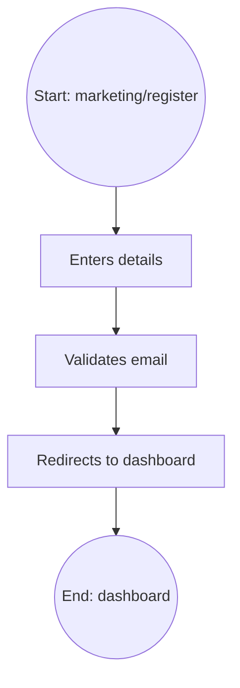

---

### Scenario 2: How does a user log in?

**Reasoning:** Users or administrators need a straightforward way to complete this action within the context of the club application flow. Based on the Authentication & User Management module requirements.

**Process Flow:**
- **Start:** The process starts when the user navigates to `marketing/login`
- **Action (Where User Went):** The user Enters credentials and then Authenticates and then Redirects to dashboard.
- **End:** The process successfully ends at `dashboard`

**Data Flow Diagram:**

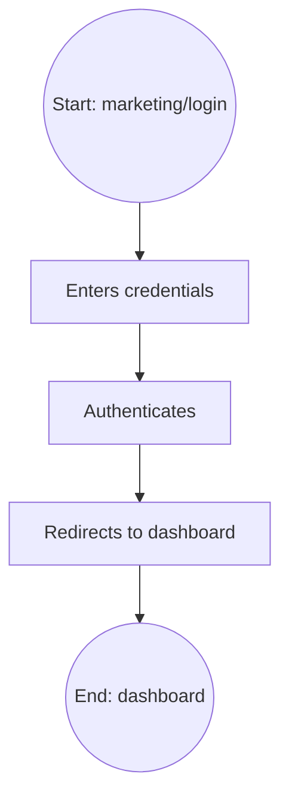

---

### Scenario 3: How does a user verify their email?

**Reasoning:** Users or administrators need a straightforward way to complete this action within the context of the club application flow. Based on the Authentication & User Management module requirements.

**Process Flow:**
- **Start:** The process starts when the user navigates to `verify/[code]`
- **Action (Where User Went):** The user Clicks link and then System checks code and then Marks emailVerified.
- **End:** The process successfully ends at `dashboard`

**Data Flow Diagram:**

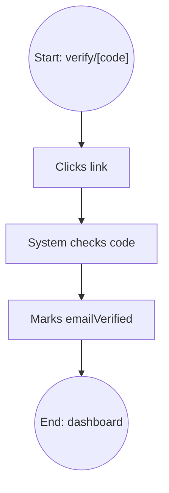

---

### Scenario 4: How does a user update their profile bio?

**Reasoning:** Users or administrators need a straightforward way to complete this action within the context of the club application flow. Based on the Authentication & User Management module requirements.

**Process Flow:**
- **Start:** The process starts when the user navigates to `dashboard`
- **Action (Where User Went):** The user Navigates to profile edit and then Updates bio and then Saves to user table.
- **End:** The process successfully ends at `dashboard`

**Data Flow Diagram:**

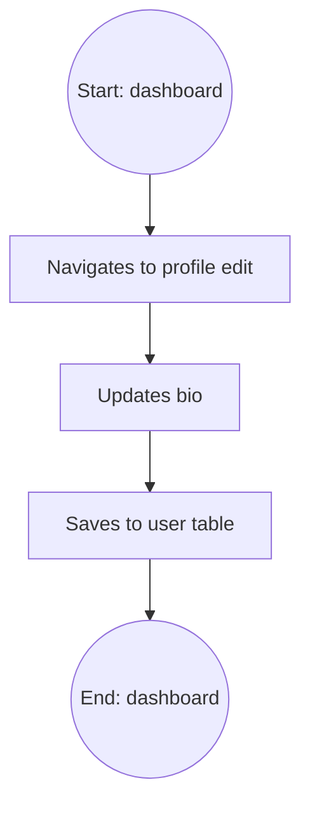

---

### Scenario 5: How does a user add skills to their profile?

**Reasoning:** Users or administrators need a straightforward way to complete this action within the context of the club application flow. Based on the Authentication & User Management module requirements.

**Process Flow:**
- **Start:** The process starts when the user navigates to `dashboard`
- **Action (Where User Went):** The user Navigates to skills section and then Selects skills and then Saves jsonb skills.
- **End:** The process successfully ends at `dashboard`

**Data Flow Diagram:**

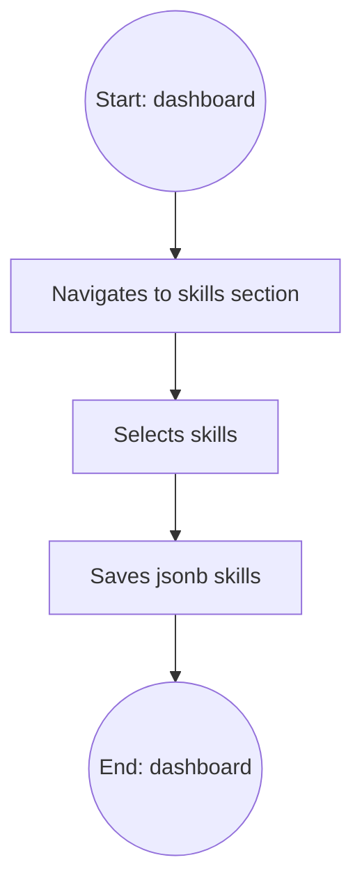

---

### Scenario 6: How does a user update their social links?

**Reasoning:** Users or administrators need a straightforward way to complete this action within the context of the club application flow. Based on the Authentication & User Management module requirements.

**Process Flow:**
- **Start:** The process starts when the user navigates to `dashboard`
- **Action (Where User Went):** The user Navigates to links and then Adds GitHub/LinkedIn and then Saves jsonb links.
- **End:** The process successfully ends at `dashboard`

**Data Flow Diagram:**

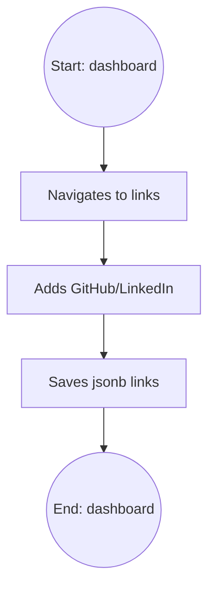

---

### Scenario 7: How does a user change privacy settings?

**Reasoning:** Users or administrators need a straightforward way to complete this action within the context of the club application flow. Based on the Authentication & User Management module requirements.

**Process Flow:**
- **Start:** The process starts when the user navigates to `settings`
- **Action (Where User Went):** The user Toggles privacy option and then Updates user privacy jsonb and then Confirms save.
- **End:** The process successfully ends at `settings`

**Data Flow Diagram:**

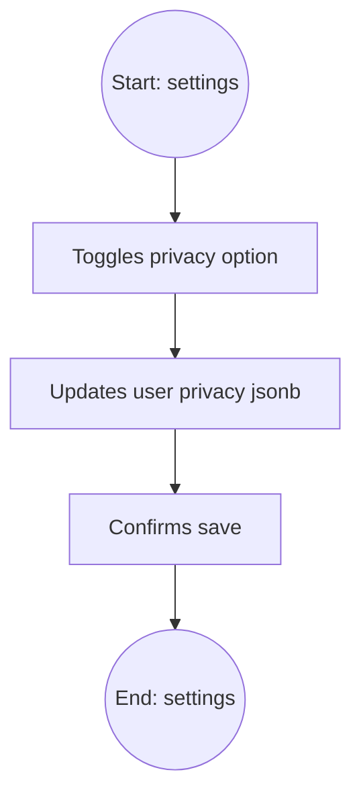

---

### Scenario 8: How does an admin ban a user?

**Reasoning:** Users or administrators need a straightforward way to complete this action within the context of the club application flow. Based on the Authentication & User Management module requirements.

**Process Flow:**
- **Start:** The process starts when the user navigates to `admin/members`
- **Action (Where User Went):** The user Selects user and then Clicks ban and then Updates user banned status & reason.
- **End:** The process successfully ends at `admin/members`

**Data Flow Diagram:**

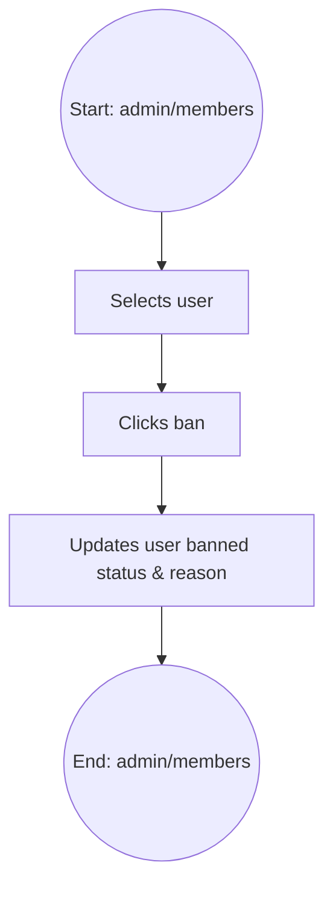

---

### Scenario 9: How does an admin view audit logs?

**Reasoning:** Users or administrators need a straightforward way to complete this action within the context of the club application flow. Based on the Authentication & User Management module requirements.

**Process Flow:**
- **Start:** The process starts when the user navigates to `admin/audit`
- **Action (Where User Went):** The user Navigates to audit page and then System fetches auditLogs and then Displays list.
- **End:** The process successfully ends at `admin/audit`

**Data Flow Diagram:**

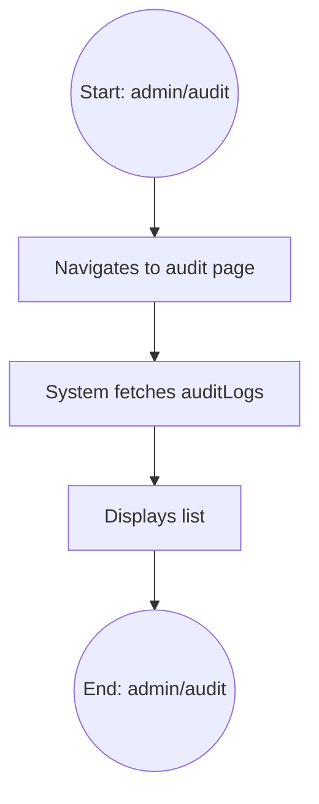

---

### Scenario 10: How does an admin unban a user?

**Reasoning:** Users or administrators need a straightforward way to complete this action within the context of the club application flow. Based on the Authentication & User Management module requirements.

**Process Flow:**
- **Start:** The process starts when the user navigates to `admin/members`
- **Action (Where User Went):** The user Selects banned user and then Clicks unban and then Clears banned status.
- **End:** The process successfully ends at `admin/members`

**Data Flow Diagram:**

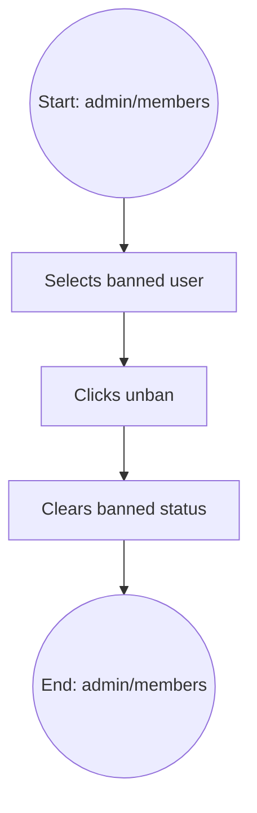

---

## 2. Event Management

### Scenario 11: How does a lead create a new event?

**Reasoning:** Users or administrators need a straightforward way to complete this action within the context of the club application flow. Based on the Event Management module requirements.

**Process Flow:**
- **Start:** The process starts when the user navigates to `events/create`
- **Action (Where User Went):** The user Fills event details and then Saves as draft and then Redirects to events list.
- **End:** The process successfully ends at `events`

**Data Flow Diagram:**

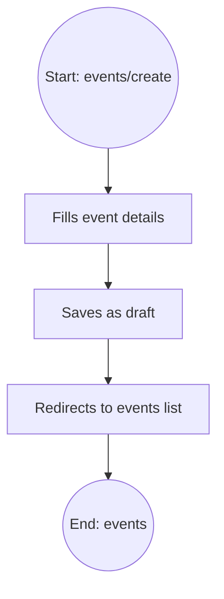

---

### Scenario 12: How does a lead publish an event?

**Reasoning:** Users or administrators need a straightforward way to complete this action within the context of the club application flow. Based on the Event Management module requirements.

**Process Flow:**
- **Start:** The process starts when the user navigates to `events/[slug]/edit`
- **Action (Where User Went):** The user Changes status to published and then Saves and then Event becomes visible.
- **End:** The process successfully ends at `events/[slug]`

**Data Flow Diagram:**

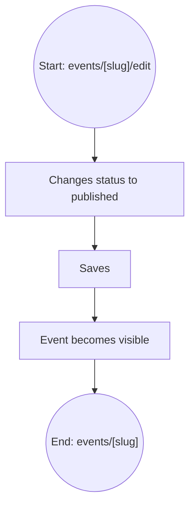

---

### Scenario 13: How does a lead edit event capacity?

**Reasoning:** Users or administrators need a straightforward way to complete this action within the context of the club application flow. Based on the Event Management module requirements.

**Process Flow:**
- **Start:** The process starts when the user navigates to `events/[slug]/edit`
- **Action (Where User Went):** The user Updates capacity integer and then Saves and then DB updates capacity.
- **End:** The process successfully ends at `events/[slug]/edit`

**Data Flow Diagram:**

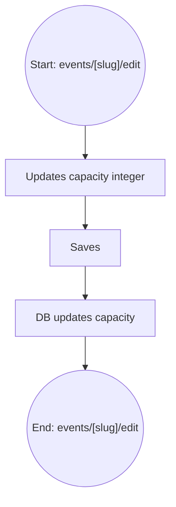

---

### Scenario 14: How does a lead add a session to an event?

**Reasoning:** Users or administrators need a straightforward way to complete this action within the context of the club application flow. Based on the Event Management module requirements.

**Process Flow:**
- **Start:** The process starts when the user navigates to `events/[slug]/edit`
- **Action (Where User Went):** The user Fills session details and then Creates eventSessions record and then Displays in schedule.
- **End:** The process successfully ends at `events/[slug]/edit`

**Data Flow Diagram:**

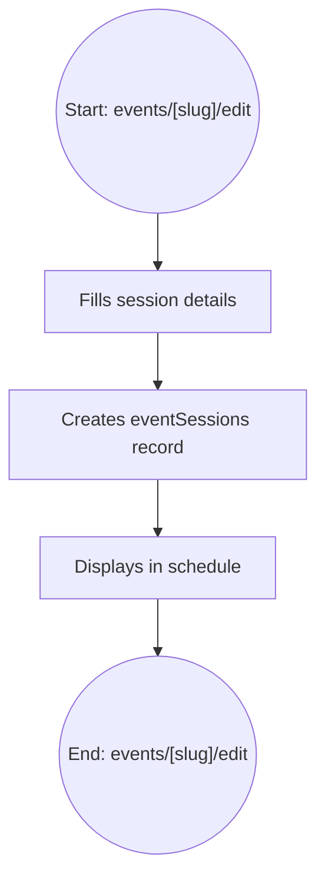

---

### Scenario 15: How does a lead set event visibility to members only?

**Reasoning:** Users or administrators need a straightforward way to complete this action within the context of the club application flow. Based on the Event Management module requirements.

**Process Flow:**
- **Start:** The process starts when the user navigates to `events/[slug]/edit`
- **Action (Where User Went):** The user Selects members_only and then Saves event and then Updates visibility enum.
- **End:** The process successfully ends at `events/[slug]/edit`

**Data Flow Diagram:**

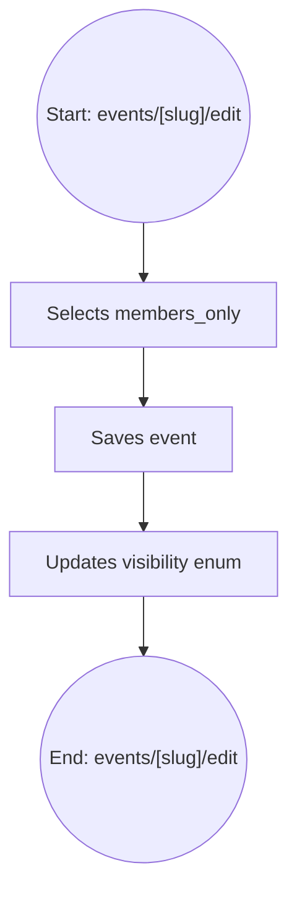

---

### Scenario 16: How does a lead cancel an event?

**Reasoning:** Users or administrators need a straightforward way to complete this action within the context of the club application flow. Based on the Event Management module requirements.

**Process Flow:**
- **Start:** The process starts when the user navigates to `events/[slug]/edit`
- **Action (Where User Went):** The user Selects cancel and then Updates status to cancelled and then Redirects to list.
- **End:** The process successfully ends at `events`

**Data Flow Diagram:**

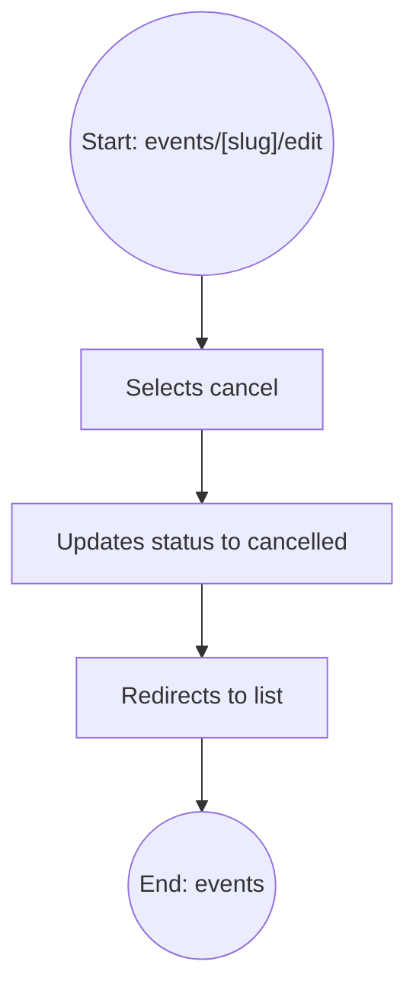

---

### Scenario 17: How does a lead set registration deadline?

**Reasoning:** Users or administrators need a straightforward way to complete this action within the context of the club application flow. Based on the Event Management module requirements.

**Process Flow:**
- **Start:** The process starts when the user navigates to `events/[slug]/edit`
- **Action (Where User Went):** The user Selects date and then Updates registrationDeadline and then Saves event.
- **End:** The process successfully ends at `events/[slug]/edit`

**Data Flow Diagram:**

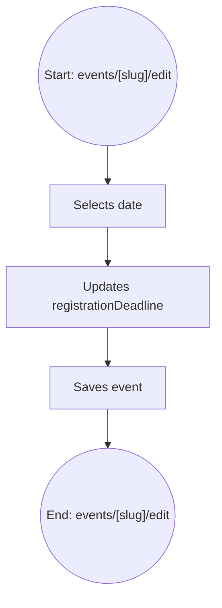

---

### Scenario 18: How does a lead upload an event cover image?

**Reasoning:** Users or administrators need a straightforward way to complete this action within the context of the club application flow. Based on the Event Management module requirements.

**Process Flow:**
- **Start:** The process starts when the user navigates to `events/[slug]/edit`
- **Action (Where User Went):** The user Uploads file and then Saves URL to coverImage and then Displays image.
- **End:** The process successfully ends at `events/[slug]/edit`

**Data Flow Diagram:**

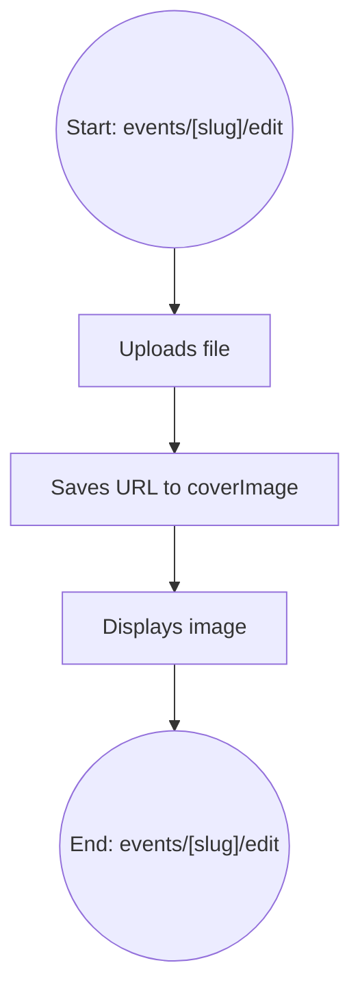

---

### Scenario 19: How does a lead mark an event as internal?

**Reasoning:** Users or administrators need a straightforward way to complete this action within the context of the club application flow. Based on the Event Management module requirements.

**Process Flow:**
- **Start:** The process starts when the user navigates to `events/[slug]/edit`
- **Action (Where User Went):** The user Toggles isInternal and then Saves boolean and then Restricts access.
- **End:** The process successfully ends at `events/[slug]/edit`

**Data Flow Diagram:**

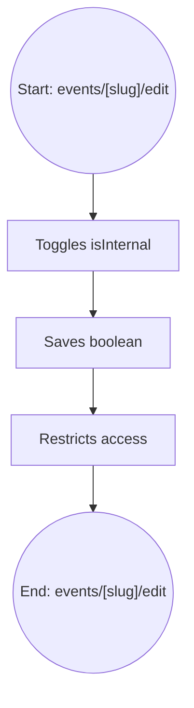

---

### Scenario 20: How does a lead set an event as paid?

**Reasoning:** Users or administrators need a straightforward way to complete this action within the context of the club application flow. Based on the Event Management module requirements.

**Process Flow:**
- **Start:** The process starts when the user navigates to `events/[slug]/edit`
- **Action (Where User Went):** The user Toggles isPaid and then Enters price and then Saves to DB.
- **End:** The process successfully ends at `events/[slug]/edit`

**Data Flow Diagram:**

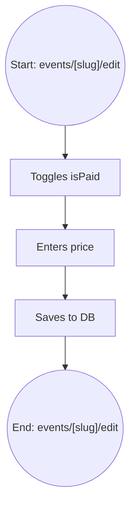

---

## 3. Event Registration & Attendance

### Scenario 21: How does a user register for an event?

**Reasoning:** Users or administrators need a straightforward way to complete this action within the context of the club application flow. Based on the Event Registration & Attendance module requirements.

**Process Flow:**
- **Start:** The process starts when the user navigates to `events/[slug]`
- **Action (Where User Went):** The user Clicks register and then Creates registrations record and then Generates passCode.
- **End:** The process successfully ends at `passes/[eventId]`

**Data Flow Diagram:**

```mermaid
graph TD
  Start(("Start: events/[slug]")) --> Step1["Clicks register"]
  Step1 --> Step2["Creates registrations record"]
  Step2 --> Step3["Generates passCode"]
  Step3 --> End(("End: passes/[eventId]"))
```

---

### Scenario 22: How does a user view their event pass?

**Reasoning:** Users or administrators need a straightforward way to complete this action within the context of the club application flow. Based on the Event Registration & Attendance module requirements.

**Process Flow:**
- **Start:** The process starts when the user navigates to `dashboard`
- **Action (Where User Went):** The user Clicks pass and then Fetches registration and then Displays QR.
- **End:** The process successfully ends at `passes/[eventId]`

**Data Flow Diagram:**

```mermaid
graph TD
  Start(("Start: dashboard")) --> Step1["Clicks pass"]
  Step1 --> Step2["Fetches registration"]
  Step2 --> Step3["Displays QR"]
  Step3 --> End(("End: passes/[eventId]"))
```

---

### Scenario 23: How does a lead check in a user with QR?

**Reasoning:** Users or administrators need a straightforward way to complete this action within the context of the club application flow. Based on the Event Registration & Attendance module requirements.

**Process Flow:**
- **Start:** The process starts when the user navigates to `scanner`
- **Action (Where User Went):** The user Scans QR and then Matches passCode and then Updates checkedInAt.
- **End:** The process successfully ends at `scanner`

**Data Flow Diagram:**

```mermaid
graph TD
  Start(("Start: scanner")) --> Step1["Scans QR"]
  Step1 --> Step2["Matches passCode"]
  Step2 --> Step3["Updates checkedInAt"]
  Step3 --> End(("End: scanner"))
```

---

### Scenario 24: How does a lead check in a user manually?

**Reasoning:** Users or administrators need a straightforward way to complete this action within the context of the club application flow. Based on the Event Registration & Attendance module requirements.

**Process Flow:**
- **Start:** The process starts when the user navigates to `events/[slug]/scanner`
- **Action (Where User Went):** The user Searches user and then Clicks check-in and then Updates checkedInAt.
- **End:** The process successfully ends at `events/[slug]/scanner`

**Data Flow Diagram:**

```mermaid
graph TD
  Start(("Start: events/[slug]/scanner")) --> Step1["Searches user"]
  Step1 --> Step2["Clicks check-in"]
  Step2 --> Step3["Updates checkedInAt"]
  Step3 --> End(("End: events/[slug]/scanner"))
```

---

### Scenario 25: How does a user check out of an event?

**Reasoning:** Users or administrators need a straightforward way to complete this action within the context of the club application flow. Based on the Event Registration & Attendance module requirements.

**Process Flow:**
- **Start:** The process starts when the user navigates to `scanner`
- **Action (Where User Went):** The user Scans QR on exit and then Updates checkedOutAt and then Confirms exit.
- **End:** The process successfully ends at `scanner`

**Data Flow Diagram:**

```mermaid
graph TD
  Start(("Start: scanner")) --> Step1["Scans QR on exit"]
  Step1 --> Step2["Updates checkedOutAt"]
  Step2 --> Step3["Confirms exit"]
  Step3 --> End(("End: scanner"))
```

---

### Scenario 26: How does a user cancel their registration?

**Reasoning:** Users or administrators need a straightforward way to complete this action within the context of the club application flow. Based on the Event Registration & Attendance module requirements.

**Process Flow:**
- **Start:** The process starts when the user navigates to `passes/[eventId]`
- **Action (Where User Went):** The user Clicks cancel and then Updates registration status and then Frees up capacity.
- **End:** The process successfully ends at `events/[slug]`

**Data Flow Diagram:**

```mermaid
graph TD
  Start(("Start: passes/[eventId]")) --> Step1["Clicks cancel"]
  Step1 --> Step2["Updates registration status"]
  Step2 --> Step3["Frees up capacity"]
  Step3 --> End(("End: events/[slug]"))
```

---

### Scenario 27: How does a lead view event attendees?

**Reasoning:** Users or administrators need a straightforward way to complete this action within the context of the club application flow. Based on the Event Registration & Attendance module requirements.

**Process Flow:**
- **Start:** The process starts when the user navigates to `events/[slug]`
- **Action (Where User Went):** The user Clicks attendees tab and then Fetches registrations and then Displays list.
- **End:** The process successfully ends at `events/[slug]`

**Data Flow Diagram:**

```mermaid
graph TD
  Start(("Start: events/[slug]")) --> Step1["Clicks attendees tab"]
  Step1 --> Step2["Fetches registrations"]
  Step2 --> Step3["Displays list"]
  Step3 --> End(("End: events/[slug]"))
```

---

### Scenario 28: How does a lead check in a user for a specific session?

**Reasoning:** Users or administrators need a straightforward way to complete this action within the context of the club application flow. Based on the Event Registration & Attendance module requirements.

**Process Flow:**
- **Start:** The process starts when the user navigates to `events/[slug]/scanner`
- **Action (Where User Went):** The user Selects session and then Scans QR and then Creates sessionAttendance record.
- **End:** The process successfully ends at `events/[slug]/scanner`

**Data Flow Diagram:**

```mermaid
graph TD
  Start(("Start: events/[slug]/scanner")) --> Step1["Selects session"]
  Step1 --> Step2["Scans QR"]
  Step2 --> Step3["Creates sessionAttendance record"]
  Step3 --> End(("End: events/[slug]/scanner"))
```

---

### Scenario 29: How does a system handle waitlist registration?

**Reasoning:** Users or administrators need a straightforward way to complete this action within the context of the club application flow. Based on the Event Registration & Attendance module requirements.

**Process Flow:**
- **Start:** The process starts when the user navigates to `events/[slug]`
- **Action (Where User Went):** The user Capacity full and then User registers and then Status set to waitlist.
- **End:** The process successfully ends at `events/[slug]`

**Data Flow Diagram:**

```mermaid
graph TD
  Start(("Start: events/[slug]")) --> Step1["Capacity full"]
  Step1 --> Step2["User registers"]
  Step2 --> Step3["Status set to waitlist"]
  Step3 --> End(("End: events/[slug]"))
```

---

### Scenario 30: How does facial recognition check-in work?

**Reasoning:** Users or administrators need a straightforward way to complete this action within the context of the club application flow. Based on the Event Registration & Attendance module requirements.

**Process Flow:**
- **Start:** The process starts when the user navigates to `scanner/face`
- **Action (Where User Went):** The user Captures face and then Matches distance and then Updates checkedInAt.
- **End:** The process successfully ends at `scanner/face`

**Data Flow Diagram:**

```mermaid
graph TD
  Start(("Start: scanner/face")) --> Step1["Captures face"]
  Step1 --> Step2["Matches distance"]
  Step2 --> Step3["Updates checkedInAt"]
  Step3 --> End(("End: scanner/face"))
```

---

## 4. Certificates Management

### Scenario 31: How does a lead create a certificate template?

**Reasoning:** Users or administrators need a straightforward way to complete this action within the context of the club application flow. Based on the Certificates Management module requirements.

**Process Flow:**
- **Start:** The process starts when the user navigates to `lead/certificates`
- **Action (Where User Went):** The user Uploads PDF base and then Defines schemas and then Creates certificateTemplates record.
- **End:** The process successfully ends at `lead/certificates`

**Data Flow Diagram:**

```mermaid
graph TD
  Start(("Start: lead/certificates")) --> Step1["Uploads PDF base"]
  Step1 --> Step2["Defines schemas"]
  Step2 --> Step3["Creates certificateTemplates record"]
  Step3 --> End(("End: lead/certificates"))
```

---

### Scenario 32: How does a lead edit a certificate template?

**Reasoning:** Users or administrators need a straightforward way to complete this action within the context of the club application flow. Based on the Certificates Management module requirements.

**Process Flow:**
- **Start:** The process starts when the user navigates to `lead/certificates/templates/[id]/edit`
- **Action (Where User Went):** The user Modifies fields and then Saves JSON schema and then Updates DB.
- **End:** The process successfully ends at `lead/certificates/templates/[id]/edit`

**Data Flow Diagram:**

```mermaid
graph TD
  Start(("Start: lead/certificates/templates/[id]/edit")) --> Step1["Modifies fields"]
  Step1 --> Step2["Saves JSON schema"]
  Step2 --> Step3["Updates DB"]
  Step3 --> End(("End: lead/certificates/templates/[id]/edit"))
```

---

### Scenario 33: How does a lead issue certificates for an event?

**Reasoning:** Users or administrators need a straightforward way to complete this action within the context of the club application flow. Based on the Certificates Management module requirements.

**Process Flow:**
- **Start:** The process starts when the user navigates to `lead/certificates`
- **Action (Where User Went):** The user Selects event attendees and then Generates PDFs and then Creates certificates records.
- **End:** The process successfully ends at `lead/certificates`

**Data Flow Diagram:**

```mermaid
graph TD
  Start(("Start: lead/certificates")) --> Step1["Selects event attendees"]
  Step1 --> Step2["Generates PDFs"]
  Step2 --> Step3["Creates certificates records"]
  Step3 --> End(("End: lead/certificates"))
```

---

### Scenario 34: How does a user view their certificate?

**Reasoning:** Users or administrators need a straightforward way to complete this action within the context of the club application flow. Based on the Certificates Management module requirements.

**Process Flow:**
- **Start:** The process starts when the user navigates to `dashboard/achievements`
- **Action (Where User Went):** The user Clicks certificate and then Fetches certificates record and then Displays PDF/Link.
- **End:** The process successfully ends at `dashboard/achievements`

**Data Flow Diagram:**

```mermaid
graph TD
  Start(("Start: dashboard/achievements")) --> Step1["Clicks certificate"]
  Step1 --> Step2["Fetches certificates record"]
  Step2 --> Step3["Displays PDF/Link"]
  Step3 --> End(("End: dashboard/achievements"))
```

---

### Scenario 35: How does a user verify a certificate?

**Reasoning:** Users or administrators need a straightforward way to complete this action within the context of the club application flow. Based on the Certificates Management module requirements.

**Process Flow:**
- **Start:** The process starts when the user navigates to `verify/[code]`
- **Action (Where User Went):** The user Enters code and then Queries certificates table and then Shows validation status.
- **End:** The process successfully ends at `verify/[code]`

**Data Flow Diagram:**

```mermaid
graph TD
  Start(("Start: verify/[code]")) --> Step1["Enters code"]
  Step1 --> Step2["Queries certificates table"]
  Step2 --> Step3["Shows validation status"]
  Step3 --> End(("End: verify/[code]"))
```

---

### Scenario 36: How does a lead revoke a certificate?

**Reasoning:** Users or administrators need a straightforward way to complete this action within the context of the club application flow. Based on the Certificates Management module requirements.

**Process Flow:**
- **Start:** The process starts when the user navigates to `lead/certificates`
- **Action (Where User Went):** The user Selects certificate and then Clicks revoke and then Sets revoked boolean.
- **End:** The process successfully ends at `lead/certificates`

**Data Flow Diagram:**

```mermaid
graph TD
  Start(("Start: lead/certificates")) --> Step1["Selects certificate"]
  Step1 --> Step2["Clicks revoke"]
  Step2 --> Step3["Sets revoked boolean"]
  Step3 --> End(("End: lead/certificates"))
```

---

### Scenario 37: How does the system ensure certificate uniqueness?

**Reasoning:** Users or administrators need a straightforward way to complete this action within the context of the club application flow. Based on the Certificates Management module requirements.

**Process Flow:**
- **Start:** The process starts when the user navigates to `lead/certificates`
- **Action (Where User Went):** The user Generates unique verifyCode and then Stores hash of PDF and then Validates before insert.
- **End:** The process successfully ends at `lead/certificates`

**Data Flow Diagram:**

```mermaid
graph TD
  Start(("Start: lead/certificates")) --> Step1["Generates unique verifyCode"]
  Step1 --> Step2["Stores hash of PDF"]
  Step2 --> Step3["Validates before insert"]
  Step3 --> End(("End: lead/certificates"))
```

---

### Scenario 38: How does a lead assign a template to an event?

**Reasoning:** Users or administrators need a straightforward way to complete this action within the context of the club application flow. Based on the Certificates Management module requirements.

**Process Flow:**
- **Start:** The process starts when the user navigates to `lead/certificates`
- **Action (Where User Went):** The user Selects template and then Links to eventId and then Saves configuration.
- **End:** The process successfully ends at `lead/certificates`

**Data Flow Diagram:**

```mermaid
graph TD
  Start(("Start: lead/certificates")) --> Step1["Selects template"]
  Step1 --> Step2["Links to eventId"]
  Step2 --> Step3["Saves configuration"]
  Step3 --> End(("End: lead/certificates"))
```

---

### Scenario 39: How does a user download their certificate?

**Reasoning:** Users or administrators need a straightforward way to complete this action within the context of the club application flow. Based on the Certificates Management module requirements.

**Process Flow:**
- **Start:** The process starts when the user navigates to `dashboard/achievements`
- **Action (Where User Went):** The user Clicks download and then Fetches pdfUrl and then Triggers download.
- **End:** The process successfully ends at `dashboard/achievements`

**Data Flow Diagram:**

```mermaid
graph TD
  Start(("Start: dashboard/achievements")) --> Step1["Clicks download"]
  Step1 --> Step2["Fetches pdfUrl"]
  Step2 --> Step3["Triggers download"]
  Step3 --> End(("End: dashboard/achievements"))
```

---

### Scenario 40: How does a lead delete a draft template?

**Reasoning:** Users or administrators need a straightforward way to complete this action within the context of the club application flow. Based on the Certificates Management module requirements.

**Process Flow:**
- **Start:** The process starts when the user navigates to `lead/certificates`
- **Action (Where User Went):** The user Selects draft and then Clicks delete and then Removes from certificateTemplates.
- **End:** The process successfully ends at `lead/certificates`

**Data Flow Diagram:**

```mermaid
graph TD
  Start(("Start: lead/certificates")) --> Step1["Selects draft"]
  Step1 --> Step2["Clicks delete"]
  Step2 --> Step3["Removes from certificateTemplates"]
  Step3 --> End(("End: lead/certificates"))
```

---

## 5. Finance & Procurement

### Scenario 41: How does a lead create an event budget?

**Reasoning:** Users or administrators need a straightforward way to complete this action within the context of the club application flow. Based on the Finance & Procurement module requirements.

**Process Flow:**
- **Start:** The process starts when the user navigates to `finance/budget`
- **Action (Where User Went):** The user Enters amount and then Selects event and then Creates budgets record.
- **End:** The process successfully ends at `finance/budget`

**Data Flow Diagram:**

```mermaid
graph TD
  Start(("Start: finance/budget")) --> Step1["Enters amount"]
  Step1 --> Step2["Selects event"]
  Step2 --> Step3["Creates budgets record"]
  Step3 --> End(("End: finance/budget"))
```

---

### Scenario 42: How does a lead submit an expense claim?

**Reasoning:** Users or administrators need a straightforward way to complete this action within the context of the club application flow. Based on the Finance & Procurement module requirements.

**Process Flow:**
- **Start:** The process starts when the user navigates to `finance/expenses`
- **Action (Where User Went):** The user Uploads receipt and then Enters amount and then Creates pending expenses record.
- **End:** The process successfully ends at `finance/expenses`

**Data Flow Diagram:**

```mermaid
graph TD
  Start(("Start: finance/expenses")) --> Step1["Uploads receipt"]
  Step1 --> Step2["Enters amount"]
  Step2 --> Step3["Creates pending expenses record"]
  Step3 --> End(("End: finance/expenses"))
```

---

### Scenario 43: How does a lead approve an expense?

**Reasoning:** Users or administrators need a straightforward way to complete this action within the context of the club application flow. Based on the Finance & Procurement module requirements.

**Process Flow:**
- **Start:** The process starts when the user navigates to `finance/expenses`
- **Action (Where User Went):** The user Reviews expense and then Clicks approve and then Updates status to approved.
- **End:** The process successfully ends at `finance/expenses`

**Data Flow Diagram:**

```mermaid
graph TD
  Start(("Start: finance/expenses")) --> Step1["Reviews expense"]
  Step1 --> Step2["Clicks approve"]
  Step2 --> Step3["Updates status to approved"]
  Step3 --> End(("End: finance/expenses"))
```

---

### Scenario 44: How does a lead log event income?

**Reasoning:** Users or administrators need a straightforward way to complete this action within the context of the club application flow. Based on the Finance & Procurement module requirements.

**Process Flow:**
- **Start:** The process starts when the user navigates to `finance/budget`
- **Action (Where User Went):** The user Enters income source and then Enters amount and then Creates incomes record.
- **End:** The process successfully ends at `finance/budget`

**Data Flow Diagram:**

```mermaid
graph TD
  Start(("Start: finance/budget")) --> Step1["Enters income source"]
  Step1 --> Step2["Enters amount"]
  Step2 --> Step3["Creates incomes record"]
  Step3 --> End(("End: finance/budget"))
```

---

### Scenario 45: How does a member request procurement?

**Reasoning:** Users or administrators need a straightforward way to complete this action within the context of the club application flow. Based on the Finance & Procurement module requirements.

**Process Flow:**
- **Start:** The process starts when the user navigates to `finance/budget`
- **Action (Where User Went):** The user Fills details and then Submits request and then Creates draft procurement_requests.
- **End:** The process successfully ends at `finance/budget`

**Data Flow Diagram:**

```mermaid
graph TD
  Start(("Start: finance/budget")) --> Step1["Fills details"]
  Step1 --> Step2["Submits request"]
  Step2 --> Step3["Creates draft procurement_requests"]
  Step3 --> End(("End: finance/budget"))
```

---

### Scenario 46: How does a lead select a vendor for procurement?

**Reasoning:** Users or administrators need a straightforward way to complete this action within the context of the club application flow. Based on the Finance & Procurement module requirements.

**Process Flow:**
- **Start:** The process starts when the user navigates to `finance/budget`
- **Action (Where User Went):** The user Reviews quotes and then Selects vendorId and then Updates procurement_requests.
- **End:** The process successfully ends at `finance/budget`

**Data Flow Diagram:**

```mermaid
graph TD
  Start(("Start: finance/budget")) --> Step1["Reviews quotes"]
  Step1 --> Step2["Selects vendorId"]
  Step2 --> Step3["Updates procurement_requests"]
  Step3 --> End(("End: finance/budget"))
```

---

### Scenario 47: How does an admin add a new vendor?

**Reasoning:** Users or administrators need a straightforward way to complete this action within the context of the club application flow. Based on the Finance & Procurement module requirements.

**Process Flow:**
- **Start:** The process starts when the user navigates to `finance/budget`
- **Action (Where User Went):** The user Enters vendor details and then Saves and then Creates vendors record.
- **End:** The process successfully ends at `finance/budget`

**Data Flow Diagram:**

```mermaid
graph TD
  Start(("Start: finance/budget")) --> Step1["Enters vendor details"]
  Step1 --> Step2["Saves"]
  Step2 --> Step3["Creates vendors record"]
  Step3 --> End(("End: finance/budget"))
```

---

### Scenario 48: How does an admin reject an expense?

**Reasoning:** Users or administrators need a straightforward way to complete this action within the context of the club application flow. Based on the Finance & Procurement module requirements.

**Process Flow:**
- **Start:** The process starts when the user navigates to `finance/expenses`
- **Action (Where User Went):** The user Reviews expense and then Clicks reject and then Updates status to rejected.
- **End:** The process successfully ends at `finance/expenses`

**Data Flow Diagram:**

```mermaid
graph TD
  Start(("Start: finance/expenses")) --> Step1["Reviews expense"]
  Step1 --> Step2["Clicks reject"]
  Step2 --> Step3["Updates status to rejected"]
  Step3 --> End(("End: finance/expenses"))
```

---

### Scenario 49: How does an admin mark procurement as completed?

**Reasoning:** Users or administrators need a straightforward way to complete this action within the context of the club application flow. Based on the Finance & Procurement module requirements.

**Process Flow:**
- **Start:** The process starts when the user navigates to `finance/budget`
- **Action (Where User Went):** The user Verifies delivery and then Updates status and then Sets to completed.
- **End:** The process successfully ends at `finance/budget`

**Data Flow Diagram:**

```mermaid
graph TD
  Start(("Start: finance/budget")) --> Step1["Verifies delivery"]
  Step1 --> Step2["Updates status"]
  Step2 --> Step3["Sets to completed"]
  Step3 --> End(("End: finance/budget"))
```

---

### Scenario 50: How does the system track total event cost?

**Reasoning:** Users or administrators need a straightforward way to complete this action within the context of the club application flow. Based on the Finance & Procurement module requirements.

**Process Flow:**
- **Start:** The process starts when the user navigates to `finance/budget`
- **Action (Where User Went):** The user Aggregates expenses and then Subtracts from budget and then Displays remaining.
- **End:** The process successfully ends at `finance/budget`

**Data Flow Diagram:**

```mermaid
graph TD
  Start(("Start: finance/budget")) --> Step1["Aggregates expenses"]
  Step1 --> Step2["Subtracts from budget"]
  Step2 --> Step3["Displays remaining"]
  Step3 --> End(("End: finance/budget"))
```

---

## 6. Inventory Management

### Scenario 51: How does a lead add a new inventory item?

**Reasoning:** Users or administrators need a straightforward way to complete this action within the context of the club application flow. Based on the Inventory Management module requirements.

**Process Flow:**
- **Start:** The process starts when the user navigates to `inventory`
- **Action (Where User Went):** The user Enters item name and then Sets qtyTotal and then Creates inventory record.
- **End:** The process successfully ends at `inventory`

**Data Flow Diagram:**

```mermaid
graph TD
  Start(("Start: inventory")) --> Step1["Enters item name"]
  Step1 --> Step2["Sets qtyTotal"]
  Step2 --> Step3["Creates inventory record"]
  Step3 --> End(("End: inventory"))
```

---

### Scenario 52: How does a member check out an item?

**Reasoning:** Users or administrators need a straightforward way to complete this action within the context of the club application flow. Based on the Inventory Management module requirements.

**Process Flow:**
- **Start:** The process starts when the user navigates to `inventory`
- **Action (Where User Went):** The user Selects item and then Clicks check-out and then Creates inventoryLogs check_out & decreases qtyAvailable.
- **End:** The process successfully ends at `inventory`

**Data Flow Diagram:**

```mermaid
graph TD
  Start(("Start: inventory")) --> Step1["Selects item"]
  Step1 --> Step2["Clicks check-out"]
  Step2 --> Step3["Creates inventoryLogs check_out & decreases qtyAvailable"]
  Step3 --> End(("End: inventory"))
```

---

### Scenario 53: How does a member return an item?

**Reasoning:** Users or administrators need a straightforward way to complete this action within the context of the club application flow. Based on the Inventory Management module requirements.

**Process Flow:**
- **Start:** The process starts when the user navigates to `inventory`
- **Action (Where User Went):** The user Selects item and then Clicks check-in and then Creates inventoryLogs check_in & increases qtyAvailable.
- **End:** The process successfully ends at `inventory`

**Data Flow Diagram:**

```mermaid
graph TD
  Start(("Start: inventory")) --> Step1["Selects item"]
  Step1 --> Step2["Clicks check-in"]
  Step2 --> Step3["Creates inventoryLogs check_in & increases qtyAvailable"]
  Step3 --> End(("End: inventory"))
```

---

### Scenario 54: How does a lead view item history?

**Reasoning:** Users or administrators need a straightforward way to complete this action within the context of the club application flow. Based on the Inventory Management module requirements.

**Process Flow:**
- **Start:** The process starts when the user navigates to `inventory`
- **Action (Where User Went):** The user Selects item and then Fetches inventoryLogs and then Displays history.
- **End:** The process successfully ends at `inventory`

**Data Flow Diagram:**

```mermaid
graph TD
  Start(("Start: inventory")) --> Step1["Selects item"]
  Step1 --> Step2["Fetches inventoryLogs"]
  Step2 --> Step3["Displays history"]
  Step3 --> End(("End: inventory"))
```

---

### Scenario 55: How does a lead update total quantity?

**Reasoning:** Users or administrators need a straightforward way to complete this action within the context of the club application flow. Based on the Inventory Management module requirements.

**Process Flow:**
- **Start:** The process starts when the user navigates to `inventory`
- **Action (Where User Went):** The user Edits item and then Updates qtyTotal and then Saves to DB.
- **End:** The process successfully ends at `inventory`

**Data Flow Diagram:**

```mermaid
graph TD
  Start(("Start: inventory")) --> Step1["Edits item"]
  Step1 --> Step2["Updates qtyTotal"]
  Step2 --> Step3["Saves to DB"]
  Step3 --> End(("End: inventory"))
```

---

### Scenario 56: How does a lead delete an inventory item?

**Reasoning:** Users or administrators need a straightforward way to complete this action within the context of the club application flow. Based on the Inventory Management module requirements.

**Process Flow:**
- **Start:** The process starts when the user navigates to `inventory`
- **Action (Where User Went):** The user Selects item and then Clicks delete and then Removes from inventory.
- **End:** The process successfully ends at `inventory`

**Data Flow Diagram:**

```mermaid
graph TD
  Start(("Start: inventory")) --> Step1["Selects item"]
  Step1 --> Step2["Clicks delete"]
  Step2 --> Step3["Removes from inventory"]
  Step3 --> End(("End: inventory"))
```

---

### Scenario 57: How does the system prevent over-checkout?

**Reasoning:** Users or administrators need a straightforward way to complete this action within the context of the club application flow. Based on the Inventory Management module requirements.

**Process Flow:**
- **Start:** The process starts when the user navigates to `inventory`
- **Action (Where User Went):** The user Checks qtyAvailable and then Rejects if 0 and then Shows error.
- **End:** The process successfully ends at `inventory`

**Data Flow Diagram:**

```mermaid
graph TD
  Start(("Start: inventory")) --> Step1["Checks qtyAvailable"]
  Step1 --> Step2["Rejects if 0"]
  Step2 --> Step3["Shows error"]
  Step3 --> End(("End: inventory"))
```

---

### Scenario 58: How does a user see what they borrowed?

**Reasoning:** Users or administrators need a straightforward way to complete this action within the context of the club application flow. Based on the Inventory Management module requirements.

**Process Flow:**
- **Start:** The process starts when the user navigates to `dashboard`
- **Action (Where User Went):** The user Navigates to borrowed and then Filters inventoryLogs and then Displays active checkouts.
- **End:** The process successfully ends at `dashboard`

**Data Flow Diagram:**

```mermaid
graph TD
  Start(("Start: dashboard")) --> Step1["Navigates to borrowed"]
  Step1 --> Step2["Filters inventoryLogs"]
  Step2 --> Step3["Displays active checkouts"]
  Step3 --> End(("End: dashboard"))
```

---

### Scenario 59: How does a lead audit inventory?

**Reasoning:** Users or administrators need a straightforward way to complete this action within the context of the club application flow. Based on the Inventory Management module requirements.

**Process Flow:**
- **Start:** The process starts when the user navigates to `inventory`
- **Action (Where User Went):** The user Reviews physical count and then Adjusts qtyAvailable and then Logs action.
- **End:** The process successfully ends at `inventory`

**Data Flow Diagram:**

```mermaid
graph TD
  Start(("Start: inventory")) --> Step1["Reviews physical count"]
  Step1 --> Step2["Adjusts qtyAvailable"]
  Step2 --> Step3["Logs action"]
  Step3 --> End(("End: inventory"))
```

---

### Scenario 60: How does a lead filter inventory by availability?

**Reasoning:** Users or administrators need a straightforward way to complete this action within the context of the club application flow. Based on the Inventory Management module requirements.

**Process Flow:**
- **Start:** The process starts when the user navigates to `inventory`
- **Action (Where User Went):** The user Selects available filter and then Queries DB and then Updates UI.
- **End:** The process successfully ends at `inventory`

**Data Flow Diagram:**

```mermaid
graph TD
  Start(("Start: inventory")) --> Step1["Selects available filter"]
  Step1 --> Step2["Queries DB"]
  Step2 --> Step3["Updates UI"]
  Step3 --> End(("End: inventory"))
```

---

## 7. Projects & Research Submissions

### Scenario 61: How does a member submit a project?

**Reasoning:** Users or administrators need a straightforward way to complete this action within the context of the club application flow. Based on the Projects & Research Submissions module requirements.

**Process Flow:**
- **Start:** The process starts when the user navigates to `projects/submit`
- **Action (Where User Went):** The user Fills project details and then Adds github URL and then Creates projects record (pending).
- **End:** The process successfully ends at `projects`

**Data Flow Diagram:**

```mermaid
graph TD
  Start(("Start: projects/submit")) --> Step1["Fills project details"]
  Step1 --> Step2["Adds github URL"]
  Step2 --> Step3["Creates projects record (pending)"]
  Step3 --> End(("End: projects"))
```

---

### Scenario 62: How does a lead approve a project?

**Reasoning:** Users or administrators need a straightforward way to complete this action within the context of the club application flow. Based on the Projects & Research Submissions module requirements.

**Process Flow:**
- **Start:** The process starts when the user navigates to `admin/projects`
- **Action (Where User Went):** The user Reviews submission and then Clicks approve and then Updates status to approved.
- **End:** The process successfully ends at `admin/projects`

**Data Flow Diagram:**

```mermaid
graph TD
  Start(("Start: admin/projects")) --> Step1["Reviews submission"]
  Step1 --> Step2["Clicks approve"]
  Step2 --> Step3["Updates status to approved"]
  Step3 --> End(("End: admin/projects"))
```

---

### Scenario 63: How does a member upvote a project?

**Reasoning:** Users or administrators need a straightforward way to complete this action within the context of the club application flow. Based on the Projects & Research Submissions module requirements.

**Process Flow:**
- **Start:** The process starts when the user navigates to `projects/[id]`
- **Action (Where User Went):** The user Clicks upvote and then Increments upvotes and then Updates DB.
- **End:** The process successfully ends at `projects/[id]`

**Data Flow Diagram:**

```mermaid
graph TD
  Start(("Start: projects/[id]")) --> Step1["Clicks upvote"]
  Step1 --> Step2["Increments upvotes"]
  Step2 --> Step3["Updates DB"]
  Step3 --> End(("End: projects/[id]"))
```

---

### Scenario 64: How does a member add team members to a project?

**Reasoning:** Users or administrators need a straightforward way to complete this action within the context of the club application flow. Based on the Projects & Research Submissions module requirements.

**Process Flow:**
- **Start:** The process starts when the user navigates to `projects/submit`
- **Action (Where User Went):** The user Adds JSON details and then Saves teamMembers and then Updates DB.
- **End:** The process successfully ends at `projects/submit`

**Data Flow Diagram:**

```mermaid
graph TD
  Start(("Start: projects/submit")) --> Step1["Adds JSON details"]
  Step1 --> Step2["Saves teamMembers"]
  Step2 --> Step3["Updates DB"]
  Step3 --> End(("End: projects/submit"))
```

---

### Scenario 65: How does a member submit a research paper?

**Reasoning:** Users or administrators need a straightforward way to complete this action within the context of the club application flow. Based on the Projects & Research Submissions module requirements.

**Process Flow:**
- **Start:** The process starts when the user navigates to `dashboard`
- **Action (Where User Went):** The user Fills paper details and then Adds URL and then Creates researchPapers record.
- **End:** The process successfully ends at `dashboard`

**Data Flow Diagram:**

```mermaid
graph TD
  Start(("Start: dashboard")) --> Step1["Fills paper details"]
  Step1 --> Step2["Adds URL"]
  Step2 --> Step3["Creates researchPapers record"]
  Step3 --> End(("End: dashboard"))
```

---

### Scenario 66: How does a member log a competition win?

**Reasoning:** Users or administrators need a straightforward way to complete this action within the context of the club application flow. Based on the Projects & Research Submissions module requirements.

**Process Flow:**
- **Start:** The process starts when the user navigates to `dashboard`
- **Action (Where User Went):** The user Fills competition details and then Adds position and then Creates competitions record.
- **End:** The process successfully ends at `dashboard`

**Data Flow Diagram:**

```mermaid
graph TD
  Start(("Start: dashboard")) --> Step1["Fills competition details"]
  Step1 --> Step2["Adds position"]
  Step2 --> Step3["Creates competitions record"]
  Step3 --> End(("End: dashboard"))
```

---

### Scenario 67: How does a lead reject a project?

**Reasoning:** Users or administrators need a straightforward way to complete this action within the context of the club application flow. Based on the Projects & Research Submissions module requirements.

**Process Flow:**
- **Start:** The process starts when the user navigates to `admin/projects`
- **Action (Where User Went):** The user Reviews submission and then Clicks reject and then Updates status to rejected.
- **End:** The process successfully ends at `admin/projects`

**Data Flow Diagram:**

```mermaid
graph TD
  Start(("Start: admin/projects")) --> Step1["Reviews submission"]
  Step1 --> Step2["Clicks reject"]
  Step2 --> Step3["Updates status to rejected"]
  Step3 --> End(("End: admin/projects"))
```

---

### Scenario 68: How does a user view a project portfolio?

**Reasoning:** Users or administrators need a straightforward way to complete this action within the context of the club application flow. Based on the Projects & Research Submissions module requirements.

**Process Flow:**
- **Start:** The process starts when the user navigates to `projects/[id]`
- **Action (Where User Went):** The user Navigates to project and then Fetches details and then Displays UI.
- **End:** The process successfully ends at `projects/[id]`

**Data Flow Diagram:**

```mermaid
graph TD
  Start(("Start: projects/[id]")) --> Step1["Navigates to project"]
  Step1 --> Step2["Fetches details"]
  Step2 --> Step3["Displays UI"]
  Step3 --> End(("End: projects/[id]"))
```

---

### Scenario 69: How does a member edit their submitted project?

**Reasoning:** Users or administrators need a straightforward way to complete this action within the context of the club application flow. Based on the Projects & Research Submissions module requirements.

**Process Flow:**
- **Start:** The process starts when the user navigates to `projects/[id]`
- **Action (Where User Went):** The user Clicks edit and then Modifies details and then Saves to projects.
- **End:** The process successfully ends at `projects/[id]`

**Data Flow Diagram:**

```mermaid
graph TD
  Start(("Start: projects/[id]")) --> Step1["Clicks edit"]
  Step1 --> Step2["Modifies details"]
  Step2 --> Step3["Saves to projects"]
  Step3 --> End(("End: projects/[id]"))
```

---

### Scenario 70: How does a lead filter pending projects?

**Reasoning:** Users or administrators need a straightforward way to complete this action within the context of the club application flow. Based on the Projects & Research Submissions module requirements.

**Process Flow:**
- **Start:** The process starts when the user navigates to `admin/projects`
- **Action (Where User Went):** The user Selects pending tab and then Queries status=pending and then Displays list.
- **End:** The process successfully ends at `admin/projects`

**Data Flow Diagram:**

```mermaid
graph TD
  Start(("Start: admin/projects")) --> Step1["Selects pending tab"]
  Step1 --> Step2["Queries status=pending"]
  Step2 --> Step3["Displays list"]
  Step3 --> End(("End: admin/projects"))
```

---

## 8. Recruitment & Applications

### Scenario 71: How does a lead create an application form?

**Reasoning:** Users or administrators need a straightforward way to complete this action within the context of the club application flow. Based on the Recruitment & Applications module requirements.

**Process Flow:**
- **Start:** The process starts when the user navigates to `admin/forms`
- **Action (Where User Went):** The user Defines fields and then Sets cycleName and then Creates form_templates record.
- **End:** The process successfully ends at `admin/forms`

**Data Flow Diagram:**

```mermaid
graph TD
  Start(("Start: admin/forms")) --> Step1["Defines fields"]
  Step1 --> Step2["Sets cycleName"]
  Step2 --> Step3["Creates form_templates record"]
  Step3 --> End(("End: admin/forms"))
```

---

### Scenario 72: How does a lead activate a recruitment cycle?

**Reasoning:** Users or administrators need a straightforward way to complete this action within the context of the club application flow. Based on the Recruitment & Applications module requirements.

**Process Flow:**
- **Start:** The process starts when the user navigates to `admin/forms`
- **Action (Where User Went):** The user Selects form and then Toggles isActive and then Updates DB.
- **End:** The process successfully ends at `admin/forms`

**Data Flow Diagram:**

```mermaid
graph TD
  Start(("Start: admin/forms")) --> Step1["Selects form"]
  Step1 --> Step2["Toggles isActive"]
  Step2 --> Step3["Updates DB"]
  Step3 --> End(("End: admin/forms"))
```

---

### Scenario 73: How does a user apply for recruitment?

**Reasoning:** Users or administrators need a straightforward way to complete this action within the context of the club application flow. Based on the Recruitment & Applications module requirements.

**Process Flow:**
- **Start:** The process starts when the user navigates to `recruitment/apply`
- **Action (Where User Went):** The user Fills answers and then Submits form and then Creates applications record.
- **End:** The process successfully ends at `recruitment/success`

**Data Flow Diagram:**

```mermaid
graph TD
  Start(("Start: recruitment/apply")) --> Step1["Fills answers"]
  Step1 --> Step2["Submits form"]
  Step2 --> Step3["Creates applications record"]
  Step3 --> End(("End: recruitment/success"))
```

---

### Scenario 74: How does AI grade an application?

**Reasoning:** Users or administrators need a straightforward way to complete this action within the context of the club application flow. Based on the Recruitment & Applications module requirements.

**Process Flow:**
- **Start:** The process starts when the user navigates to `background job`
- **Action (Where User Went):** The user Trigger AI evaluation and then Updates aiScore and then Sets status ai_graded.
- **End:** The process successfully ends at `applications list`

**Data Flow Diagram:**

```mermaid
graph TD
  Start(("Start: background job")) --> Step1["Trigger AI evaluation"]
  Step1 --> Step2["Updates aiScore"]
  Step2 --> Step3["Sets status ai_graded"]
  Step3 --> End(("End: applications list"))
```

---

### Scenario 75: How does a lead review an application?

**Reasoning:** Users or administrators need a straightforward way to complete this action within the context of the club application flow. Based on the Recruitment & Applications module requirements.

**Process Flow:**
- **Start:** The process starts when the user navigates to `applications`
- **Action (Where User Went):** The user Opens application and then Reads answers and then Updates status to needs_manual_review.
- **End:** The process successfully ends at `applications`

**Data Flow Diagram:**

```mermaid
graph TD
  Start(("Start: applications")) --> Step1["Opens application"]
  Step1 --> Step2["Reads answers"]
  Step2 --> Step3["Updates status to needs_manual_review"]
  Step3 --> End(("End: applications"))
```

---

### Scenario 76: How does a lead schedule an interview?

**Reasoning:** Users or administrators need a straightforward way to complete this action within the context of the club application flow. Based on the Recruitment & Applications module requirements.

**Process Flow:**
- **Start:** The process starts when the user navigates to `recruitment/interviews`
- **Action (Where User Went):** The user Selects applicant and then Picks time and then Creates interviews record.
- **End:** The process successfully ends at `recruitment/interviews`

**Data Flow Diagram:**

```mermaid
graph TD
  Start(("Start: recruitment/interviews")) --> Step1["Selects applicant"]
  Step1 --> Step2["Picks time"]
  Step2 --> Step3["Creates interviews record"]
  Step3 --> End(("End: recruitment/interviews"))
```

---

### Scenario 77: How does an interviewer submit feedback?

**Reasoning:** Users or administrators need a straightforward way to complete this action within the context of the club application flow. Based on the Recruitment & Applications module requirements.

**Process Flow:**
- **Start:** The process starts when the user navigates to `recruitment/interviews`
- **Action (Where User Went):** The user Fills feedback box and then Saves and then Updates interviews record.
- **End:** The process successfully ends at `recruitment/interviews`

**Data Flow Diagram:**

```mermaid
graph TD
  Start(("Start: recruitment/interviews")) --> Step1["Fills feedback box"]
  Step1 --> Step2["Saves"]
  Step2 --> Step3["Updates interviews record"]
  Step3 --> End(("End: recruitment/interviews"))
```

---

### Scenario 78: How does a lead accept an applicant?

**Reasoning:** Users or administrators need a straightforward way to complete this action within the context of the club application flow. Based on the Recruitment & Applications module requirements.

**Process Flow:**
- **Start:** The process starts when the user navigates to `applications`
- **Action (Where User Went):** The user Clicks accept and then Updates status to accepted and then Triggers notification.
- **End:** The process successfully ends at `applications`

**Data Flow Diagram:**

```mermaid
graph TD
  Start(("Start: applications")) --> Step1["Clicks accept"]
  Step1 --> Step2["Updates status to accepted"]
  Step2 --> Step3["Triggers notification"]
  Step3 --> End(("End: applications"))
```

---

### Scenario 79: How does a lead reject an applicant?

**Reasoning:** Users or administrators need a straightforward way to complete this action within the context of the club application flow. Based on the Recruitment & Applications module requirements.

**Process Flow:**
- **Start:** The process starts when the user navigates to `applications`
- **Action (Where User Went):** The user Clicks reject and then Updates status to rejected and then Triggers notification.
- **End:** The process successfully ends at `applications`

**Data Flow Diagram:**

```mermaid
graph TD
  Start(("Start: applications")) --> Step1["Clicks reject"]
  Step1 --> Step2["Updates status to rejected"]
  Step2 --> Step3["Triggers notification"]
  Step3 --> End(("End: applications"))
```

---

### Scenario 80: How does a user view their application status?

**Reasoning:** Users or administrators need a straightforward way to complete this action within the context of the club application flow. Based on the Recruitment & Applications module requirements.

**Process Flow:**
- **Start:** The process starts when the user navigates to `dashboard`
- **Action (Where User Went):** The user Checks dashboard and then Fetches applications status and then Displays status.
- **End:** The process successfully ends at `dashboard`

**Data Flow Diagram:**

```mermaid
graph TD
  Start(("Start: dashboard")) --> Step1["Checks dashboard"]
  Step1 --> Step2["Fetches applications status"]
  Step2 --> Step3["Displays status"]
  Step3 --> End(("End: dashboard"))
```

---

## 9. Points & Achievements

### Scenario 81: How does a user submit an achievement for points?

**Reasoning:** Users or administrators need a straightforward way to complete this action within the context of the club application flow. Based on the Points & Achievements module requirements.

**Process Flow:**
- **Start:** The process starts when the user navigates to `dashboard/achievements`
- **Action (Where User Went):** The user Fills achievement details and then Submits proof and then Creates achievement_submissions record.
- **End:** The process successfully ends at `dashboard/achievements`

**Data Flow Diagram:**

```mermaid
graph TD
  Start(("Start: dashboard/achievements")) --> Step1["Fills achievement details"]
  Step1 --> Step2["Submits proof"]
  Step2 --> Step3["Creates achievement_submissions record"]
  Step3 --> End(("End: dashboard/achievements"))
```

---

### Scenario 82: How does a lead approve an achievement?

**Reasoning:** Users or administrators need a straightforward way to complete this action within the context of the club application flow. Based on the Points & Achievements module requirements.

**Process Flow:**
- **Start:** The process starts when the user navigates to `dashboard/achievements`
- **Action (Where User Went):** The user Reviews proof and then Approves and then Awards points.
- **End:** The process successfully ends at `dashboard/achievements`

**Data Flow Diagram:**

```mermaid
graph TD
  Start(("Start: dashboard/achievements")) --> Step1["Reviews proof"]
  Step1 --> Step2["Approves"]
  Step2 --> Step3["Awards points"]
  Step3 --> End(("End: dashboard/achievements"))
```

---

### Scenario 83: How are points added to a user?

**Reasoning:** Users or administrators need a straightforward way to complete this action within the context of the club application flow. Based on the Points & Achievements module requirements.

**Process Flow:**
- **Start:** The process starts when the user navigates to `background/logic`
- **Action (Where User Went):** The user achievement approved and then creates pointLogs and then updates user points.
- **End:** The process successfully ends at `user profile`

**Data Flow Diagram:**

```mermaid
graph TD
  Start(("Start: background/logic")) --> Step1["achievement approved"]
  Step1 --> Step2["creates pointLogs"]
  Step2 --> Step3["updates user points"]
  Step3 --> End(("End: user profile"))
```

---

### Scenario 84: How does a user level up?

**Reasoning:** Users or administrators need a straightforward way to complete this action within the context of the club application flow. Based on the Points & Achievements module requirements.

**Process Flow:**
- **Start:** The process starts when the user navigates to `background/logic`
- **Action (Where User Went):** The user Points cross threshold and then Calculates level and then Updates user level.
- **End:** The process successfully ends at `user profile`

**Data Flow Diagram:**

```mermaid
graph TD
  Start(("Start: background/logic")) --> Step1["Points cross threshold"]
  Step1 --> Step2["Calculates level"]
  Step2 --> Step3["Updates user level"]
  Step3 --> End(("End: user profile"))
```

---

### Scenario 85: How does a user view the leaderboard?

**Reasoning:** Users or administrators need a straightforward way to complete this action within the context of the club application flow. Based on the Points & Achievements module requirements.

**Process Flow:**
- **Start:** The process starts when the user navigates to `leaderboard`
- **Action (Where User Went):** The user Navigates to leaderboard and then Fetches top users by points and then Displays rankings.
- **End:** The process successfully ends at `leaderboard`

**Data Flow Diagram:**

```mermaid
graph TD
  Start(("Start: leaderboard")) --> Step1["Navigates to leaderboard"]
  Step1 --> Step2["Fetches top users by points"]
  Step2 --> Step3["Displays rankings"]
  Step3 --> End(("End: leaderboard"))
```

---

### Scenario 86: How does a lead reject an achievement?

**Reasoning:** Users or administrators need a straightforward way to complete this action within the context of the club application flow. Based on the Points & Achievements module requirements.

**Process Flow:**
- **Start:** The process starts when the user navigates to `dashboard/achievements`
- **Action (Where User Went):** The user Reviews proof and then Clicks reject and then Updates status.
- **End:** The process successfully ends at `dashboard/achievements`

**Data Flow Diagram:**

```mermaid
graph TD
  Start(("Start: dashboard/achievements")) --> Step1["Reviews proof"]
  Step1 --> Step2["Clicks reject"]
  Step2 --> Step3["Updates status"]
  Step3 --> End(("End: dashboard/achievements"))
```

---

### Scenario 87: How does a user see point history?

**Reasoning:** Users or administrators need a straightforward way to complete this action within the context of the club application flow. Based on the Points & Achievements module requirements.

**Process Flow:**
- **Start:** The process starts when the user navigates to `dashboard`
- **Action (Where User Went):** The user Clicks points and then Fetches pointLogs and then Displays history list.
- **End:** The process successfully ends at `dashboard`

**Data Flow Diagram:**

```mermaid
graph TD
  Start(("Start: dashboard")) --> Step1["Clicks points"]
  Step1 --> Step2["Fetches pointLogs"]
  Step2 --> Step3["Displays history list"]
  Step3 --> End(("End: dashboard"))
```

---

### Scenario 88: How does the system handle point deduction?

**Reasoning:** Users or administrators need a straightforward way to complete this action within the context of the club application flow. Based on the Points & Achievements module requirements.

**Process Flow:**
- **Start:** The process starts when the user navigates to `admin`
- **Action (Where User Went):** The user Admin manually deducts and then Creates negative pointLogs and then Updates user points.
- **End:** The process successfully ends at `admin`

**Data Flow Diagram:**

```mermaid
graph TD
  Start(("Start: admin")) --> Step1["Admin manually deducts"]
  Step1 --> Step2["Creates negative pointLogs"]
  Step2 --> Step3["Updates user points"]
  Step3 --> End(("End: admin"))
```

---

### Scenario 89: How does attending an event award points?

**Reasoning:** Users or administrators need a straightforward way to complete this action within the context of the club application flow. Based on the Points & Achievements module requirements.

**Process Flow:**
- **Start:** The process starts when the user navigates to `scanner`
- **Action (Where User Went):** The user User checked in and then System logic triggers and then Awards attendance points.
- **End:** The process successfully ends at `scanner`

**Data Flow Diagram:**

```mermaid
graph TD
  Start(("Start: scanner")) --> Step1["User checked in"]
  Step1 --> Step2["System logic triggers"]
  Step2 --> Step3["Awards attendance points"]
  Step3 --> End(("End: scanner"))
```

---

### Scenario 90: How does a user filter the leaderboard by year?

**Reasoning:** Users or administrators need a straightforward way to complete this action within the context of the club application flow. Based on the Points & Achievements module requirements.

**Process Flow:**
- **Start:** The process starts when the user navigates to `leaderboard`
- **Action (Where User Went):** The user Selects year and then Queries DB and then Updates rankings.
- **End:** The process successfully ends at `leaderboard`

**Data Flow Diagram:**

```mermaid
graph TD
  Start(("Start: leaderboard")) --> Step1["Selects year"]
  Step1 --> Step2["Queries DB"]
  Step2 --> Step3["Updates rankings"]
  Step3 --> End(("End: leaderboard"))
```

---

## 10. Content & Social Media Pipeline

### Scenario 91: How does a member propose a content idea?

**Reasoning:** Users or administrators need a straightforward way to complete this action within the context of the club application flow. Based on the Content & Social Media Pipeline module requirements.

**Process Flow:**
- **Start:** The process starts when the user navigates to `dashboard`
- **Action (Where User Went):** The user Fills idea title and then Submits and then Creates content_items (idea).
- **End:** The process successfully ends at `dashboard`

**Data Flow Diagram:**

```mermaid
graph TD
  Start(("Start: dashboard")) --> Step1["Fills idea title"]
  Step1 --> Step2["Submits"]
  Step2 --> Step3["Creates content_items (idea)"]
  Step3 --> End(("End: dashboard"))
```

---

### Scenario 92: How does a lead move content to drafting?

**Reasoning:** Users or administrators need a straightforward way to complete this action within the context of the club application flow. Based on the Content & Social Media Pipeline module requirements.

**Process Flow:**
- **Start:** The process starts when the user navigates to `dashboard`
- **Action (Where User Went):** The user Reviews idea and then Updates status and then Sets drafting.
- **End:** The process successfully ends at `dashboard`

**Data Flow Diagram:**

```mermaid
graph TD
  Start(("Start: dashboard")) --> Step1["Reviews idea"]
  Step1 --> Step2["Updates status"]
  Step2 --> Step3["Sets drafting"]
  Step3 --> End(("End: dashboard"))
```

---

### Scenario 93: How does a member submit content for review?

**Reasoning:** Users or administrators need a straightforward way to complete this action within the context of the club application flow. Based on the Content & Social Media Pipeline module requirements.

**Process Flow:**
- **Start:** The process starts when the user navigates to `dashboard`
- **Action (Where User Went):** The user Adds media URLs and then Updates description and then Sets status to review.
- **End:** The process successfully ends at `dashboard`

**Data Flow Diagram:**

```mermaid
graph TD
  Start(("Start: dashboard")) --> Step1["Adds media URLs"]
  Step1 --> Step2["Updates description"]
  Step2 --> Step3["Sets status to review"]
  Step3 --> End(("End: dashboard"))
```

---

### Scenario 94: How does a lead schedule content?

**Reasoning:** Users or administrators need a straightforward way to complete this action within the context of the club application flow. Based on the Content & Social Media Pipeline module requirements.

**Process Flow:**
- **Start:** The process starts when the user navigates to `dashboard`
- **Action (Where User Went):** The user Approves content and then Selects date and then Sets scheduledFor.
- **End:** The process successfully ends at `dashboard`

**Data Flow Diagram:**

```mermaid
graph TD
  Start(("Start: dashboard")) --> Step1["Approves content"]
  Step1 --> Step2["Selects date"]
  Step2 --> Step3["Sets scheduledFor"]
  Step3 --> End(("End: dashboard"))
```

---

### Scenario 95: How does the system mark content as published?

**Reasoning:** Users or administrators need a straightforward way to complete this action within the context of the club application flow. Based on the Content & Social Media Pipeline module requirements.

**Process Flow:**
- **Start:** The process starts when the user navigates to `dashboard`
- **Action (Where User Went):** The user Manual toggle or job and then Updates status to published and then Sets publishedAt.
- **End:** The process successfully ends at `dashboard`

**Data Flow Diagram:**

```mermaid
graph TD
  Start(("Start: dashboard")) --> Step1["Manual toggle or job"]
  Step1 --> Step2["Updates status to published"]
  Step2 --> Step3["Sets publishedAt"]
  Step3 --> End(("End: dashboard"))
```

---

### Scenario 96: How does a lead reject content?

**Reasoning:** Users or administrators need a straightforward way to complete this action within the context of the club application flow. Based on the Content & Social Media Pipeline module requirements.

**Process Flow:**
- **Start:** The process starts when the user navigates to `dashboard`
- **Action (Where User Went):** The user Reviews draft and then Moves back to idea/drafting and then Adds comment.
- **End:** The process successfully ends at `dashboard`

**Data Flow Diagram:**

```mermaid
graph TD
  Start(("Start: dashboard")) --> Step1["Reviews draft"]
  Step1 --> Step2["Moves back to idea/drafting"]
  Step2 --> Step3["Adds comment"]
  Step3 --> End(("End: dashboard"))
```

---

### Scenario 97: How does a user view their content pipeline?

**Reasoning:** Users or administrators need a straightforward way to complete this action within the context of the club application flow. Based on the Content & Social Media Pipeline module requirements.

**Process Flow:**
- **Start:** The process starts when the user navigates to `dashboard`
- **Action (Where User Went):** The user Navigates to content and then Fetches authorId matches and then Displays kanban/list.
- **End:** The process successfully ends at `dashboard`

**Data Flow Diagram:**

```mermaid
graph TD
  Start(("Start: dashboard")) --> Step1["Navigates to content"]
  Step1 --> Step2["Fetches authorId matches"]
  Step2 --> Step3["Displays kanban/list"]
  Step3 --> End(("End: dashboard"))
```

---

### Scenario 98: How does a lead filter content by platform?

**Reasoning:** Users or administrators need a straightforward way to complete this action within the context of the club application flow. Based on the Content & Social Media Pipeline module requirements.

**Process Flow:**
- **Start:** The process starts when the user navigates to `dashboard`
- **Action (Where User Went):** The user Selects platform (e.g. Instagram) and then Queries DB and then Updates UI.
- **End:** The process successfully ends at `dashboard`

**Data Flow Diagram:**

```mermaid
graph TD
  Start(("Start: dashboard")) --> Step1["Selects platform (e.g. Instagram)"]
  Step1 --> Step2["Queries DB"]
  Step2 --> Step3["Updates UI"]
  Step3 --> End(("End: dashboard"))
```

---

### Scenario 99: How does a member attach an image to content?

**Reasoning:** Users or administrators need a straightforward way to complete this action within the context of the club application flow. Based on the Content & Social Media Pipeline module requirements.

**Process Flow:**
- **Start:** The process starts when the user navigates to `dashboard`
- **Action (Where User Went):** The user Uploads image and then Saves to mediaUrls JSON array and then Updates DB.
- **End:** The process successfully ends at `dashboard`

**Data Flow Diagram:**

```mermaid
graph TD
  Start(("Start: dashboard")) --> Step1["Uploads image"]
  Step1 --> Step2["Saves to mediaUrls JSON array"]
  Step2 --> Step3["Updates DB"]
  Step3 --> End(("End: dashboard"))
```

---

### Scenario 100: How does a lead delete a content idea?

**Reasoning:** Users or administrators need a straightforward way to complete this action within the context of the club application flow. Based on the Content & Social Media Pipeline module requirements.

**Process Flow:**
- **Start:** The process starts when the user navigates to `dashboard`
- **Action (Where User Went):** The user Selects idea and then Clicks delete and then Removes from content_items.
- **End:** The process successfully ends at `dashboard`

**Data Flow Diagram:**

```mermaid
graph TD
  Start(("Start: dashboard")) --> Step1["Selects idea"]
  Step1 --> Step2["Clicks delete"]
  Step2 --> Step3["Removes from content_items"]
  Step3 --> End(("End: dashboard"))
```

---

## 11. Tasks & Task Management

### Scenario 101: How does a lead assign a task to a member?

**Reasoning:** Users or administrators need a straightforward way to complete this action within the context of the club application flow. Based on the Tasks & Task Management module requirements.

**Process Flow:**
- **Start:** The process starts when the user navigates to `dashboard`
- **Action (Where User Went):** The user Creates task and then Selects assigneeId and then Creates tasks record.
- **End:** The process successfully ends at `dashboard`

**Data Flow Diagram:**

```mermaid
graph TD
  Start(("Start: dashboard")) --> Step1["Creates task"]
  Step1 --> Step2["Selects assigneeId"]
  Step2 --> Step3["Creates tasks record"]
  Step3 --> End(("End: dashboard"))
```

---

### Scenario 102: How does a member update task status?

**Reasoning:** Users or administrators need a straightforward way to complete this action within the context of the club application flow. Based on the Tasks & Task Management module requirements.

**Process Flow:**
- **Start:** The process starts when the user navigates to `dashboard`
- **Action (Where User Went):** The user Views assigned task and then Moves to in_progress and then Updates task_status.
- **End:** The process successfully ends at `dashboard`

**Data Flow Diagram:**

```mermaid
graph TD
  Start(("Start: dashboard")) --> Step1["Views assigned task"]
  Step1 --> Step2["Moves to in_progress"]
  Step2 --> Step3["Updates task_status"]
  Step3 --> End(("End: dashboard"))
```

---

### Scenario 103: How does a member mark a task as done?

**Reasoning:** Users or administrators need a straightforward way to complete this action within the context of the club application flow. Based on the Tasks & Task Management module requirements.

**Process Flow:**
- **Start:** The process starts when the user navigates to `dashboard`
- **Action (Where User Went):** The user Completes work and then Moves to done and then Updates DB.
- **End:** The process successfully ends at `dashboard`

**Data Flow Diagram:**

```mermaid
graph TD
  Start(("Start: dashboard")) --> Step1["Completes work"]
  Step1 --> Step2["Moves to done"]
  Step2 --> Step3["Updates DB"]
  Step3 --> End(("End: dashboard"))
```

---

### Scenario 104: How does a lead link a task to an event?

**Reasoning:** Users or administrators need a straightforward way to complete this action within the context of the club application flow. Based on the Tasks & Task Management module requirements.

**Process Flow:**
- **Start:** The process starts when the user navigates to `events/[slug]/edit`
- **Action (Where User Went):** The user Creates task in event context and then Sets eventId and then Saves.
- **End:** The process successfully ends at `events/[slug]/edit`

**Data Flow Diagram:**

```mermaid
graph TD
  Start(("Start: events/[slug]/edit")) --> Step1["Creates task in event context"]
  Step1 --> Step2["Sets eventId"]
  Step2 --> Step3["Saves"]
  Step3 --> End(("End: events/[slug]/edit"))
```

---

### Scenario 105: How does a member view their tasks?

**Reasoning:** Users or administrators need a straightforward way to complete this action within the context of the club application flow. Based on the Tasks & Task Management module requirements.

**Process Flow:**
- **Start:** The process starts when the user navigates to `dashboard`
- **Action (Where User Went):** The user Navigates to tasks and then Fetches by assigneeId and then Displays list.
- **End:** The process successfully ends at `dashboard`

**Data Flow Diagram:**

```mermaid
graph TD
  Start(("Start: dashboard")) --> Step1["Navigates to tasks"]
  Step1 --> Step2["Fetches by assigneeId"]
  Step2 --> Step3["Displays list"]
  Step3 --> End(("End: dashboard"))
```

---

### Scenario 106: How does a lead set a task due date?

**Reasoning:** Users or administrators need a straightforward way to complete this action within the context of the club application flow. Based on the Tasks & Task Management module requirements.

**Process Flow:**
- **Start:** The process starts when the user navigates to `dashboard`
- **Action (Where User Went):** The user Selects date picker and then Updates dueDate and then Saves.
- **End:** The process successfully ends at `dashboard`

**Data Flow Diagram:**

```mermaid
graph TD
  Start(("Start: dashboard")) --> Step1["Selects date picker"]
  Step1 --> Step2["Updates dueDate"]
  Step2 --> Step3["Saves"]
  Step3 --> End(("End: dashboard"))
```

---

### Scenario 107: How does a member block a task?

**Reasoning:** Users or administrators need a straightforward way to complete this action within the context of the club application flow. Based on the Tasks & Task Management module requirements.

**Process Flow:**
- **Start:** The process starts when the user navigates to `dashboard`
- **Action (Where User Went):** The user Encounters issue and then Moves to blocked and then Updates status.
- **End:** The process successfully ends at `dashboard`

**Data Flow Diagram:**

```mermaid
graph TD
  Start(("Start: dashboard")) --> Step1["Encounters issue"]
  Step1 --> Step2["Moves to blocked"]
  Step2 --> Step3["Updates status"]
  Step3 --> End(("End: dashboard"))
```

---

### Scenario 108: How does a lead reassign a task?

**Reasoning:** Users or administrators need a straightforward way to complete this action within the context of the club application flow. Based on the Tasks & Task Management module requirements.

**Process Flow:**
- **Start:** The process starts when the user navigates to `dashboard`
- **Action (Where User Went):** The user Selects task and then Changes assigneeId and then Updates DB.
- **End:** The process successfully ends at `dashboard`

**Data Flow Diagram:**

```mermaid
graph TD
  Start(("Start: dashboard")) --> Step1["Selects task"]
  Step1 --> Step2["Changes assigneeId"]
  Step2 --> Step3["Updates DB"]
  Step3 --> End(("End: dashboard"))
```

---

### Scenario 109: How does a lead delete a task?

**Reasoning:** Users or administrators need a straightforward way to complete this action within the context of the club application flow. Based on the Tasks & Task Management module requirements.

**Process Flow:**
- **Start:** The process starts when the user navigates to `dashboard`
- **Action (Where User Went):** The user Selects task and then Clicks delete and then Removes from tasks.
- **End:** The process successfully ends at `dashboard`

**Data Flow Diagram:**

```mermaid
graph TD
  Start(("Start: dashboard")) --> Step1["Selects task"]
  Step1 --> Step2["Clicks delete"]
  Step2 --> Step3["Removes from tasks"]
  Step3 --> End(("End: dashboard"))
```

---

### Scenario 110: How does the system show overdue tasks?

**Reasoning:** Users or administrators need a straightforward way to complete this action within the context of the club application flow. Based on the Tasks & Task Management module requirements.

**Process Flow:**
- **Start:** The process starts when the user navigates to `dashboard`
- **Action (Where User Went):** The user Queries dueDate < now and then Filters done and then Highlights red.
- **End:** The process successfully ends at `dashboard`

**Data Flow Diagram:**

```mermaid
graph TD
  Start(("Start: dashboard")) --> Step1["Queries dueDate < now"]
  Step1 --> Step2["Filters done"]
  Step2 --> Step3["Highlights red"]
  Step3 --> End(("End: dashboard"))
```

---

## 12. Notifications & Alerts

### Scenario 111: How does a user receive a notification?

**Reasoning:** Users or administrators need a straightforward way to complete this action within the context of the club application flow. Based on the Notifications & Alerts module requirements.

**Process Flow:**
- **Start:** The process starts when the user navigates to `system/event`
- **Action (Where User Went):** The user System triggers event and then Creates notifications record and then Shows badge.
- **End:** The process successfully ends at `dashboard`

**Data Flow Diagram:**

```mermaid
graph TD
  Start(("Start: system/event")) --> Step1["System triggers event"]
  Step1 --> Step2["Creates notifications record"]
  Step2 --> Step3["Shows badge"]
  Step3 --> End(("End: dashboard"))
```

---

### Scenario 112: How does a user mark a notification as read?

**Reasoning:** Users or administrators need a straightforward way to complete this action within the context of the club application flow. Based on the Notifications & Alerts module requirements.

**Process Flow:**
- **Start:** The process starts when the user navigates to `dashboard`
- **Action (Where User Went):** The user Clicks notification and then Sets read=true and then Updates DB.
- **End:** The process successfully ends at `dashboard`

**Data Flow Diagram:**

```mermaid
graph TD
  Start(("Start: dashboard")) --> Step1["Clicks notification"]
  Step1 --> Step2["Sets read=true"]
  Step2 --> Step3["Updates DB"]
  Step3 --> End(("End: dashboard"))
```

---

### Scenario 113: How does a user view all notifications?

**Reasoning:** Users or administrators need a straightforward way to complete this action within the context of the club application flow. Based on the Notifications & Alerts module requirements.

**Process Flow:**
- **Start:** The process starts when the user navigates to `dashboard`
- **Action (Where User Went):** The user Clicks bell icon and then Fetches notifications and then Displays list.
- **End:** The process successfully ends at `dashboard`

**Data Flow Diagram:**

```mermaid
graph TD
  Start(("Start: dashboard")) --> Step1["Clicks bell icon"]
  Step1 --> Step2["Fetches notifications"]
  Step2 --> Step3["Displays list"]
  Step3 --> End(("End: dashboard"))
```

---

### Scenario 114: How does the system notify a user about task assignment?

**Reasoning:** Users or administrators need a straightforward way to complete this action within the context of the club application flow. Based on the Notifications & Alerts module requirements.

**Process Flow:**
- **Start:** The process starts when the user navigates to `dashboard`
- **Action (Where User Went):** The user Lead assigns task and then Creates notification and then Saves to DB.
- **End:** The process successfully ends at `dashboard`

**Data Flow Diagram:**

```mermaid
graph TD
  Start(("Start: dashboard")) --> Step1["Lead assigns task"]
  Step1 --> Step2["Creates notification"]
  Step2 --> Step3["Saves to DB"]
  Step3 --> End(("End: dashboard"))
```

---

### Scenario 115: How does the system notify an applicant of acceptance?

**Reasoning:** Users or administrators need a straightforward way to complete this action within the context of the club application flow. Based on the Notifications & Alerts module requirements.

**Process Flow:**
- **Start:** The process starts when the user navigates to `applications`
- **Action (Where User Went):** The user Lead accepts and then Creates notification and then Sends email.
- **End:** The process successfully ends at `applications`

**Data Flow Diagram:**

```mermaid
graph TD
  Start(("Start: applications")) --> Step1["Lead accepts"]
  Step1 --> Step2["Creates notification"]
  Step2 --> Step3["Sends email"]
  Step3 --> End(("End: applications"))
```

---

### Scenario 116: How does a user navigate from a notification?

**Reasoning:** Users or administrators need a straightforward way to complete this action within the context of the club application flow. Based on the Notifications & Alerts module requirements.

**Process Flow:**
- **Start:** The process starts when the user navigates to `dashboard`
- **Action (Where User Went):** The user Clicks notification and then Reads link field and then Redirects.
- **End:** The process successfully ends at `target URL`

**Data Flow Diagram:**

```mermaid
graph TD
  Start(("Start: dashboard")) --> Step1["Clicks notification"]
  Step1 --> Step2["Reads link field"]
  Step2 --> Step3["Redirects"]
  Step3 --> End(("End: target URL"))
```

---

### Scenario 117: How does the system clean up old notifications?

**Reasoning:** Users or administrators need a straightforward way to complete this action within the context of the club application flow. Based on the Notifications & Alerts module requirements.

**Process Flow:**
- **Start:** The process starts when the user navigates to `background job`
- **Action (Where User Went):** The user Runs cron and then Deletes old read notifications and then Frees space.
- **End:** The process successfully ends at `background job`

**Data Flow Diagram:**

```mermaid
graph TD
  Start(("Start: background job")) --> Step1["Runs cron"]
  Step1 --> Step2["Deletes old read notifications"]
  Step2 --> Step3["Frees space"]
  Step3 --> End(("End: background job"))
```

---

### Scenario 118: How does a user mark all as read?

**Reasoning:** Users or administrators need a straightforward way to complete this action within the context of the club application flow. Based on the Notifications & Alerts module requirements.

**Process Flow:**
- **Start:** The process starts when the user navigates to `dashboard`
- **Action (Where User Went):** The user Clicks mark all and then Bulk updates read=true and then Clears badge.
- **End:** The process successfully ends at `dashboard`

**Data Flow Diagram:**

```mermaid
graph TD
  Start(("Start: dashboard")) --> Step1["Clicks mark all"]
  Step1 --> Step2["Bulk updates read=true"]
  Step2 --> Step3["Clears badge"]
  Step3 --> End(("End: dashboard"))
```

---

### Scenario 119: How does the system notify about a new event?

**Reasoning:** Users or administrators need a straightforward way to complete this action within the context of the club application flow. Based on the Notifications & Alerts module requirements.

**Process Flow:**
- **Start:** The process starts when the user navigates to `events/[slug]/edit`
- **Action (Where User Went):** The user Lead publishes event and then Creates bulk notifications and then Saves to DB.
- **End:** The process successfully ends at `events`

**Data Flow Diagram:**

```mermaid
graph TD
  Start(("Start: events/[slug]/edit")) --> Step1["Lead publishes event"]
  Step1 --> Step2["Creates bulk notifications"]
  Step2 --> Step3["Saves to DB"]
  Step3 --> End(("End: events"))
```

---

### Scenario 120: How does a lead broadcast a custom notification?

**Reasoning:** Users or administrators need a straightforward way to complete this action within the context of the club application flow. Based on the Notifications & Alerts module requirements.

**Process Flow:**
- **Start:** The process starts when the user navigates to `admin`
- **Action (Where User Went):** The user Fills message and then Selects users and then Inserts into notifications.
- **End:** The process successfully ends at `admin`

**Data Flow Diagram:**

```mermaid
graph TD
  Start(("Start: admin")) --> Step1["Fills message"]
  Step1 --> Step2["Selects users"]
  Step2 --> Step3["Inserts into notifications"]
  Step3 --> End(("End: admin"))
```

---

## 13. Settings & Administration

### Scenario 121: How does an admin freeze the club system?

**Reasoning:** Users or administrators need a straightforward way to complete this action within the context of the club application flow. Based on the Settings & Administration module requirements.

**Process Flow:**
- **Start:** The process starts when the user navigates to `settings`
- **Action (Where User Went):** The user Toggles freeze and then Updates club_settings isFrozen and then Blocks non-admin actions.
- **End:** The process successfully ends at `settings`

**Data Flow Diagram:**

```mermaid
graph TD
  Start(("Start: settings")) --> Step1["Toggles freeze"]
  Step1 --> Step2["Updates club_settings isFrozen"]
  Step2 --> Step3["Blocks non-admin actions"]
  Step3 --> End(("End: settings"))
```

---

### Scenario 122: How does an admin view AI logs?

**Reasoning:** Users or administrators need a straightforward way to complete this action within the context of the club application flow. Based on the Settings & Administration module requirements.

**Process Flow:**
- **Start:** The process starts when the user navigates to `admin/ai-logs`
- **Action (Where User Went):** The user Navigates to logs and then Fetches ai_logs table and then Displays usage.
- **End:** The process successfully ends at `admin/ai-logs`

**Data Flow Diagram:**

```mermaid
graph TD
  Start(("Start: admin/ai-logs")) --> Step1["Navigates to logs"]
  Step1 --> Step2["Fetches ai_logs table"]
  Step2 --> Step3["Displays usage"]
  Step3 --> End(("End: admin/ai-logs"))
```

---

### Scenario 123: How does an admin trigger a background job manually?

**Reasoning:** Users or administrators need a straightforward way to complete this action within the context of the club application flow. Based on the Settings & Administration module requirements.

**Process Flow:**
- **Start:** The process starts when the user navigates to `admin/jobs`
- **Action (Where User Went):** The user Selects job and then Clicks run and then Executes API.
- **End:** The process successfully ends at `admin/jobs`

**Data Flow Diagram:**

```mermaid
graph TD
  Start(("Start: admin/jobs")) --> Step1["Selects job"]
  Step1 --> Step2["Clicks run"]
  Step2 --> Step3["Executes API"]
  Step3 --> End(("End: admin/jobs"))
```

---

### Scenario 124: How does an admin change a users role to lead?

**Reasoning:** Users or administrators need a straightforward way to complete this action within the context of the club application flow. Based on the Settings & Administration module requirements.

**Process Flow:**
- **Start:** The process starts when the user navigates to `admin/members`
- **Action (Where User Went):** The user Selects user and then Changes role and then Updates DB.
- **End:** The process successfully ends at `admin/members`

**Data Flow Diagram:**

```mermaid
graph TD
  Start(("Start: admin/members")) --> Step1["Selects user"]
  Step1 --> Step2["Changes role"]
  Step2 --> Step3["Updates DB"]
  Step3 --> End(("End: admin/members"))
```

---

### Scenario 125: How does an admin update compliance settings?

**Reasoning:** Users or administrators need a straightforward way to complete this action within the context of the club application flow. Based on the Settings & Administration module requirements.

**Process Flow:**
- **Start:** The process starts when the user navigates to `settings/compliance`
- **Action (Where User Went):** The user Modifies text and then Saves and then Updates static/DB file.
- **End:** The process successfully ends at `settings/compliance`

**Data Flow Diagram:**

```mermaid
graph TD
  Start(("Start: settings/compliance")) --> Step1["Modifies text"]
  Step1 --> Step2["Saves"]
  Step2 --> Step3["Updates static/DB file"]
  Step3 --> End(("End: settings/compliance"))
```

---

### Scenario 126: How does the system log AI usage latency?

**Reasoning:** Users or administrators need a straightforward way to complete this action within the context of the club application flow. Based on the Settings & Administration module requirements.

**Process Flow:**
- **Start:** The process starts when the user navigates to `ai service`
- **Action (Where User Went):** The user AI call completes and then Calculates time and then Inserts to ai_logs.
- **End:** The process successfully ends at `ai_logs`

**Data Flow Diagram:**

```mermaid
graph TD
  Start(("Start: ai service")) --> Step1["AI call completes"]
  Step1 --> Step2["Calculates time"]
  Step2 --> Step3["Inserts to ai_logs"]
  Step3 --> End(("End: ai_logs"))
```

---

### Scenario 127: How does an admin view the organization profile?

**Reasoning:** Users or administrators need a straightforward way to complete this action within the context of the club application flow. Based on the Settings & Administration module requirements.

**Process Flow:**
- **Start:** The process starts when the user navigates to `settings`
- **Action (Where User Went):** The user Navigates to org settings and then Fetches organization and then Displays details.
- **End:** The process successfully ends at `settings`

**Data Flow Diagram:**

```mermaid
graph TD
  Start(("Start: settings")) --> Step1["Navigates to org settings"]
  Step1 --> Step2["Fetches organization"]
  Step2 --> Step3["Displays details"]
  Step3 --> End(("End: settings"))
```

---

### Scenario 128: How does an admin update the organization logo?

**Reasoning:** Users or administrators need a straightforward way to complete this action within the context of the club application flow. Based on the Settings & Administration module requirements.

**Process Flow:**
- **Start:** The process starts when the user navigates to `settings`
- **Action (Where User Went):** The user Uploads image and then Saves URL to logo and then Updates organization table.
- **End:** The process successfully ends at `settings`

**Data Flow Diagram:**

```mermaid
graph TD
  Start(("Start: settings")) --> Step1["Uploads image"]
  Step1 --> Step2["Saves URL to logo"]
  Step2 --> Step3["Updates organization table"]
  Step3 --> End(("End: settings"))
```

---

### Scenario 129: How does an admin revoke a session?

**Reasoning:** Users or administrators need a straightforward way to complete this action within the context of the club application flow. Based on the Settings & Administration module requirements.

**Process Flow:**
- **Start:** The process starts when the user navigates to `admin/members`
- **Action (Where User Went):** The user Selects active session and then Deletes session record and then Forces logout.
- **End:** The process successfully ends at `admin/members`

**Data Flow Diagram:**

```mermaid
graph TD
  Start(("Start: admin/members")) --> Step1["Selects active session"]
  Step1 --> Step2["Deletes session record"]
  Step2 --> Step3["Forces logout"]
  Step3 --> End(("End: admin/members"))
```

---

### Scenario 130: How does an admin send an invitation to join the org?

**Reasoning:** Users or administrators need a straightforward way to complete this action within the context of the club application flow. Based on the Settings & Administration module requirements.

**Process Flow:**
- **Start:** The process starts when the user navigates to `admin/members`
- **Action (Where User Went):** The user Enters email and then Creates invitation record and then Sends invite link.
- **End:** The process successfully ends at `admin/members`

**Data Flow Diagram:**

```mermaid
graph TD
  Start(("Start: admin/members")) --> Step1["Enters email"]
  Step1 --> Step2["Creates invitation record"]
  Step2 --> Step3["Sends invite link"]
  Step3 --> End(("End: admin/members"))
```

---

## 14. Advanced Event Scenarios

### Scenario 131: How does a lead create invite-only events?

**Reasoning:** Users or administrators need a straightforward way to complete this action within the context of the club application flow. Based on the Advanced Event Scenarios module requirements.

**Process Flow:**
- **Start:** The process starts when the user navigates to `events/create`
- **Action (Where User Went):** The user Selects invite_only and then Generates eventInvites and then Emails tokens.
- **End:** The process successfully ends at `events`

**Data Flow Diagram:**

```mermaid
graph TD
  Start(("Start: events/create")) --> Step1["Selects invite_only"]
  Step1 --> Step2["Generates eventInvites"]
  Step2 --> Step3["Emails tokens"]
  Step3 --> End(("End: events"))
```

---

### Scenario 132: How does a user accept an event invite?

**Reasoning:** Users or administrators need a straightforward way to complete this action within the context of the club application flow. Based on the Advanced Event Scenarios module requirements.

**Process Flow:**
- **Start:** The process starts when the user navigates to `verify/[code]`
- **Action (Where User Went):** The user Clicks invite link and then Validates token and then Creates registration.
- **End:** The process successfully ends at `passes/[eventId]`

**Data Flow Diagram:**

```mermaid
graph TD
  Start(("Start: verify/[code]")) --> Step1["Clicks invite link"]
  Step1 --> Step2["Validates token"]
  Step2 --> Step3["Creates registration"]
  Step3 --> End(("End: passes/[eventId]"))
```

---

### Scenario 133: How does a lead manage event seat map?

**Reasoning:** Users or administrators need a straightforward way to complete this action within the context of the club application flow. Based on the Advanced Event Scenarios module requirements.

**Process Flow:**
- **Start:** The process starts when the user navigates to `events/[slug]/edit`
- **Action (Where User Went):** The user Uploads JSON seat map and then Saves to seatMap and then Updates DB.
- **End:** The process successfully ends at `events/[slug]/edit`

**Data Flow Diagram:**

```mermaid
graph TD
  Start(("Start: events/[slug]/edit")) --> Step1["Uploads JSON seat map"]
  Step1 --> Step2["Saves to seatMap"]
  Step2 --> Step3["Updates DB"]
  Step3 --> End(("End: events/[slug]/edit"))
```

---

### Scenario 134: How does a lead use AI to draft event emails?

**Reasoning:** Users or administrators need a straightforward way to complete this action within the context of the club application flow. Based on the Advanced Event Scenarios module requirements.

**Process Flow:**
- **Start:** The process starts when the user navigates to `events/[slug]/edit`
- **Action (Where User Went):** The user Clicks draft email and then Calls AI service and then Saves to aiDraftEmail.
- **End:** The process successfully ends at `events/[slug]/edit`

**Data Flow Diagram:**

```mermaid
graph TD
  Start(("Start: events/[slug]/edit")) --> Step1["Clicks draft email"]
  Step1 --> Step2["Calls AI service"]
  Step2 --> Step3["Saves to aiDraftEmail"]
  Step3 --> End(("End: events/[slug]/edit"))
```

---

### Scenario 135: How does a lead use AI to draft event messages?

**Reasoning:** Users or administrators need a straightforward way to complete this action within the context of the club application flow. Based on the Advanced Event Scenarios module requirements.

**Process Flow:**
- **Start:** The process starts when the user navigates to `events/[slug]/edit`
- **Action (Where User Went):** The user Clicks draft msg and then Calls AI service and then Saves to aiDraftMessage.
- **End:** The process successfully ends at `events/[slug]/edit`

**Data Flow Diagram:**

```mermaid
graph TD
  Start(("Start: events/[slug]/edit")) --> Step1["Clicks draft msg"]
  Step1 --> Step2["Calls AI service"]
  Step2 --> Step3["Saves to aiDraftMessage"]
  Step3 --> End(("End: events/[slug]/edit"))
```

---

### Scenario 136: How does a lead view cancelled registrations?

**Reasoning:** Users or administrators need a straightforward way to complete this action within the context of the club application flow. Based on the Advanced Event Scenarios module requirements.

**Process Flow:**
- **Start:** The process starts when the user navigates to `events/[slug]`
- **Action (Where User Went):** The user Selects cancelled tab and then Queries status=cancelled and then Displays list.
- **End:** The process successfully ends at `events/[slug]`

**Data Flow Diagram:**

```mermaid
graph TD
  Start(("Start: events/[slug]")) --> Step1["Selects cancelled tab"]
  Step1 --> Step2["Queries status=cancelled"]
  Step2 --> Step3["Displays list"]
  Step3 --> End(("End: events/[slug]"))
```

---

### Scenario 137: How does a user enroll their face for check-in?

**Reasoning:** Users or administrators need a straightforward way to complete this action within the context of the club application flow. Based on the Advanced Event Scenarios module requirements.

**Process Flow:**
- **Start:** The process starts when the user navigates to `scanner/face`
- **Action (Where User Went):** The user Captures initial photo and then Generates embedding and then Sets needsFaceEnrollment=false.
- **End:** The process successfully ends at `scanner/face`

**Data Flow Diagram:**

```mermaid
graph TD
  Start(("Start: scanner/face")) --> Step1["Captures initial photo"]
  Step1 --> Step2["Generates embedding"]
  Step2 --> Step3["Sets needsFaceEnrollment=false"]
  Step3 --> End(("End: scanner/face"))
```

---

### Scenario 138: How does the system track who created an event?

**Reasoning:** Users or administrators need a straightforward way to complete this action within the context of the club application flow. Based on the Advanced Event Scenarios module requirements.

**Process Flow:**
- **Start:** The process starts when the user navigates to `events/create`
- **Action (Where User Went):** The user Reads session user and then Saves createdBy and then Updates DB.
- **End:** The process successfully ends at `events`

**Data Flow Diagram:**

```mermaid
graph TD
  Start(("Start: events/create")) --> Step1["Reads session user"]
  Step1 --> Step2["Saves createdBy"]
  Step2 --> Step3["Updates DB"]
  Step3 --> End(("End: events"))
```

---

### Scenario 139: How does an event update its end time automatically?

**Reasoning:** Users or administrators need a straightforward way to complete this action within the context of the club application flow. Based on the Advanced Event Scenarios module requirements.

**Process Flow:**
- **Start:** The process starts when the user navigates to `events/[slug]/edit`
- **Action (Where User Went):** The user Modifies session end and then Checks if > event endsAt and then Updates event endsAt.
- **End:** The process successfully ends at `events/[slug]/edit`

**Data Flow Diagram:**

```mermaid
graph TD
  Start(("Start: events/[slug]/edit")) --> Step1["Modifies session end"]
  Step1 --> Step2["Checks if > event endsAt"]
  Step2 --> Step3["Updates event endsAt"]
  Step3 --> End(("End: events/[slug]/edit"))
```

---

### Scenario 140: How does an admin view unlisted events?

**Reasoning:** Users or administrators need a straightforward way to complete this action within the context of the club application flow. Based on the Advanced Event Scenarios module requirements.

**Process Flow:**
- **Start:** The process starts when the user navigates to `admin`
- **Action (Where User Went):** The user Filters visibility=unlisted and then Fetches records and then Displays list.
- **End:** The process successfully ends at `events`

**Data Flow Diagram:**

```mermaid
graph TD
  Start(("Start: admin")) --> Step1["Filters visibility=unlisted"]
  Step1 --> Step2["Fetches records"]
  Step2 --> Step3["Displays list"]
  Step3 --> End(("End: events"))
```

---

## 15. Miscellaneous System Actions

### Scenario 141: How does a user view terms and conditions?

**Reasoning:** Users or administrators need a straightforward way to complete this action within the context of the club application flow. Based on the Miscellaneous System Actions module requirements.

**Process Flow:**
- **Start:** The process starts when the user navigates to `terms`
- **Action (Where User Went):** The user Navigates to /terms and then Loads static content and then Displays.
- **End:** The process successfully ends at `terms`

**Data Flow Diagram:**

```mermaid
graph TD
  Start(("Start: terms")) --> Step1["Navigates to /terms"]
  Step1 --> Step2["Loads static content"]
  Step2 --> Step3["Displays"]
  Step3 --> End(("End: terms"))
```

---

### Scenario 142: How does a user view privacy policy?

**Reasoning:** Users or administrators need a straightforward way to complete this action within the context of the club application flow. Based on the Miscellaneous System Actions module requirements.

**Process Flow:**
- **Start:** The process starts when the user navigates to `privacy`
- **Action (Where User Went):** The user Navigates to /privacy and then Loads static content and then Displays.
- **End:** The process successfully ends at `privacy`

**Data Flow Diagram:**

```mermaid
graph TD
  Start(("Start: privacy")) --> Step1["Navigates to /privacy"]
  Step1 --> Step2["Loads static content"]
  Step2 --> Step3["Displays"]
  Step3 --> End(("End: privacy"))
```

---

### Scenario 143: How does a user impersonate another user (admin)?

**Reasoning:** Users or administrators need a straightforward way to complete this action within the context of the club application flow. Based on the Miscellaneous System Actions module requirements.

**Process Flow:**
- **Start:** The process starts when the user navigates to `admin/members`
- **Action (Where User Went):** The user Clicks impersonate and then Sets impersonatedBy in session and then Reloads as user.
- **End:** The process successfully ends at `dashboard`

**Data Flow Diagram:**

```mermaid
graph TD
  Start(("Start: admin/members")) --> Step1["Clicks impersonate"]
  Step1 --> Step2["Sets impersonatedBy in session"]
  Step2 --> Step3["Reloads as user"]
  Step3 --> End(("End: dashboard"))
```

---

### Scenario 144: How does a user stop impersonation?

**Reasoning:** Users or administrators need a straightforward way to complete this action within the context of the club application flow. Based on the Miscellaneous System Actions module requirements.

**Process Flow:**
- **Start:** The process starts when the user navigates to `dashboard`
- **Action (Where User Went):** The user Clicks exit impersonation and then Clears impersonatedBy and then Reloads as admin.
- **End:** The process successfully ends at `admin/members`

**Data Flow Diagram:**

```mermaid
graph TD
  Start(("Start: dashboard")) --> Step1["Clicks exit impersonation"]
  Step1 --> Step2["Clears impersonatedBy"]
  Step2 --> Step3["Reloads as admin"]
  Step3 --> End(("End: admin/members"))
```

---

### Scenario 145: How does a user reset their password?

**Reasoning:** Users or administrators need a straightforward way to complete this action within the context of the club application flow. Based on the Miscellaneous System Actions module requirements.

**Process Flow:**
- **Start:** The process starts when the user navigates to `login`
- **Action (Where User Went):** The user Clicks forgot and then Gets verification link and then Updates password in account.
- **End:** The process successfully ends at `login`

**Data Flow Diagram:**

```mermaid
graph TD
  Start(("Start: login")) --> Step1["Clicks forgot"]
  Step1 --> Step2["Gets verification link"]
  Step2 --> Step3["Updates password in account"]
  Step3 --> End(("End: login"))
```

---

### Scenario 146: How does an admin delete an organization?

**Reasoning:** Users or administrators need a straightforward way to complete this action within the context of the club application flow. Based on the Miscellaneous System Actions module requirements.

**Process Flow:**
- **Start:** The process starts when the user navigates to `settings`
- **Action (Where User Went):** The user Clicks delete org and then Cascades deletes and then Removes organization.
- **End:** The process successfully ends at `settings`

**Data Flow Diagram:**

```mermaid
graph TD
  Start(("Start: settings")) --> Step1["Clicks delete org"]
  Step1 --> Step2["Cascades deletes"]
  Step2 --> Step3["Removes organization"]
  Step3 --> End(("End: settings"))
```

---

### Scenario 147: How does an admin view the audit log for a specific event?

**Reasoning:** Users or administrators need a straightforward way to complete this action within the context of the club application flow. Based on the Miscellaneous System Actions module requirements.

**Process Flow:**
- **Start:** The process starts when the user navigates to `admin/audit`
- **Action (Where User Went):** The user Filters by entityId and then Queries auditLogs and then Displays events.
- **End:** The process successfully ends at `admin/audit`

**Data Flow Diagram:**

```mermaid
graph TD
  Start(("Start: admin/audit")) --> Step1["Filters by entityId"]
  Step1 --> Step2["Queries auditLogs"]
  Step2 --> Step3["Displays events"]
  Step3 --> End(("End: admin/audit"))
```

---

### Scenario 148: How does the system handle an expired invitation?

**Reasoning:** Users or administrators need a straightforward way to complete this action within the context of the club application flow. Based on the Miscellaneous System Actions module requirements.

**Process Flow:**
- **Start:** The process starts when the user navigates to `verify/[code]`
- **Action (Where User Went):** The user User clicks link and then Checks expiresAt and then Shows expired error.
- **End:** The process successfully ends at `verify/[code]`

**Data Flow Diagram:**

```mermaid
graph TD
  Start(("Start: verify/[code]")) --> Step1["User clicks link"]
  Step1 --> Step2["Checks expiresAt"]
  Step2 --> Step3["Shows expired error"]
  Step3 --> End(("End: verify/[code]"))
```

---

### Scenario 149: How does a user link an OAuth provider?

**Reasoning:** Users or administrators need a straightforward way to complete this action within the context of the club application flow. Based on the Miscellaneous System Actions module requirements.

**Process Flow:**
- **Start:** The process starts when the user navigates to `settings`
- **Action (Where User Went):** The user Clicks connect Github and then Completes OAuth and then Creates account record.
- **End:** The process successfully ends at `settings`

**Data Flow Diagram:**

```mermaid
graph TD
  Start(("Start: settings")) --> Step1["Clicks connect Github"]
  Step1 --> Step2["Completes OAuth"]
  Step2 --> Step3["Creates account record"]
  Step3 --> End(("End: settings"))
```

---

### Scenario 150: How does a user delete their account?

**Reasoning:** Users or administrators need a straightforward way to complete this action within the context of the club application flow. Based on the Miscellaneous System Actions module requirements.

**Process Flow:**
- **Start:** The process starts when the user navigates to `settings`
- **Action (Where User Went):** The user Clicks delete and then Sets deletedAt timestamp and then Logs out.
- **End:** The process successfully ends at `marketing`

**Data Flow Diagram:**

```mermaid
graph TD
  Start(("Start: settings")) --> Step1["Clicks delete"]
  Step1 --> Step2["Sets deletedAt timestamp"]
  Step2 --> Step3["Logs out"]
  Step3 --> End(("End: marketing"))
```

---

