# SDC — Architecture & System Documentation

> **Last updated:** 2026-08-07  
> **Version:** 0.1.0  
> This is the single source of truth for all system architecture, data flows, features, and technology decisions in SDC.

---

### Design Language

| Property | Direction |
|----------|-----------|
| **Theme** | Space / cosmic — the logo is a blackhole |
| **Inspiration** | Comet Browser by Perplexity — cosmic visual language, planetary motifs, parabolic orbital lines, "space to Earth" visual journey |
| **Gradients** | Deep dark backgrounds with celestial gradient accents — purples, blues, warm nebula tones fading into deep black (replicate Comet's signature gradients) |
| **Aesthetic** | Dark-mode-first, restrained cosmic accents — premium-observatory feel, not sci-fi-gaudy |
| **Motion** | Subtle orbital/gravitational animations — elements with weight and trajectory |
| **Color palette** | Monochrome dark base + cosmic accent gradients (deep violet → blue → warm nebula orange as highlights) |

---

## 1. System Overview

**SDC** (Student Developer Club) is a web-based platform that enables a student club to manage its entire operational lifecycle from one system: members, events, attendance, certificates, recruitment, finance, inventory, projects, forms, communications, and gamification.

### Who uses it

| Role | Purpose |
|------|---------|
| **Owner** | Full system control — manages admins, settings, and system-wide operations |
| **Admin** | Near-full access — manages members, events, finance, inventory, certificates |
| **Lead / Vice Lead** | Domain-level control — manages team events, recruitment, content |
| **Domain Leads** (Event, Content, Marketing, Tech, Finance, Volunteer) | Scoped access to their domain's operations |
| **Co-Lead** | Assists leads — can draft events, view members |
| **Faculty Coordinator** | Oversight — read access to operations |
| **Member** | Standard authenticated user — registers for events, views certificates |
| **Alumni** | Graduated member — read-only + certificate access |
| **Applicant** | User who has applied but not yet accepted |
| **Outsider / User** | Unverified or non-member user |

### High-Level Architecture

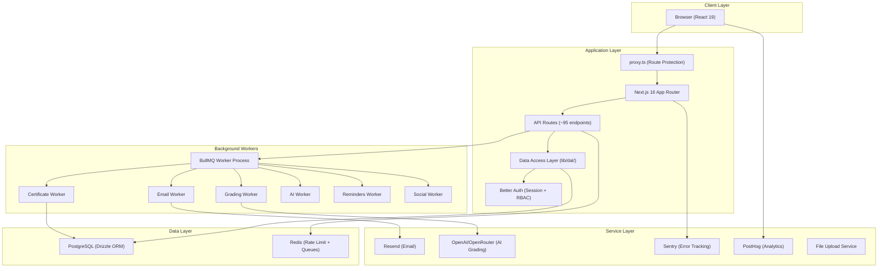

---

## 2. Technology Stack

### Core Framework

| Technology | Version | Purpose |
|-----------|---------|---------|
| **Next.js** | 16.2.10 | Full-stack React framework (App Router, API routes, proxy) |
| **React** | 19.2.4 | UI rendering |
| **TypeScript** | 5.x | Type safety across the entire codebase |
| **Node.js** | ≥22 | Runtime |

### Database & ORM

| Technology | Version | Purpose |
|-----------|---------|---------|
| **PostgreSQL** | — | Primary data store (30+ tables) |
| **Drizzle ORM** | 0.45.2 | Type-safe SQL query builder and schema manager |
| **Drizzle Kit** | 0.31.10 | Migration generation and DB studio |

### Authentication & Authorization

| Technology | Version | Purpose |
|-----------|---------|---------|
| **Better Auth** | 1.6.23 | Session management, OAuth, email/password, RBAC |
| **Admin Plugin** | (built-in) | Role-based access control with 14 custom roles |
| **Organization Plugin** | (built-in) | Multi-organization/team support |
| **Cloudflare Turnstile** | — | Bot protection on signup |

### Styling & UI

| Technology | Version | Purpose |
|-----------|---------|---------|
| **Tailwind CSS** | 4.x | Utility-first CSS framework |
| **Astryx Design** | 0.1.8 | Component library (AppShell, SideNav, TopNav) |
| **Radix UI** | various | Headless UI primitives (Dialog, Tooltip, Switch, etc.) |
| **Lucide React** | 1.24.0 | Icon library |
| **Sonner** | 2.0.7 | Toast notifications |
| **cmdk** | 1.1.1 | Command palette |
| **Vaul** | 1.1.2 | Drawer component |
| **next-themes** | 0.4.6 | Dark/light theme switching |

### Background Processing

| Technology | Version | Purpose |
|-----------|---------|---------|
| **BullMQ** | 5.80.2 | Job queue for background tasks |
| **Redis** (via ioredis) | 5.11.1 | Queue backend + rate limiting store |

### Email

| Technology | Version | Purpose |
|-----------|---------|---------|
| **Resend** | 6.17.2 | Transactional email delivery |
| **React Email** | 1.0.12 | Email template rendering |

### AI / ML

| Technology | Version | Purpose |
|-----------|---------|---------|
| **AI SDK** (@ai-sdk/openai) | 4.0.11 | AI integration for application grading |
| **Vercel AI** | 7.0.22 | AI streaming and utilities |

### Certificates & PDF

| Technology | Version | Purpose |
|-----------|---------|---------|
| **pdfme** (@pdfme/generator, /schemas, /ui) | 6.1.11 | Certificate template design and PDF generation |
| **pdf-lib** | 1.17.1 | Low-level PDF manipulation |

### QR & Scanning

| Technology | Version | Purpose |
|-----------|---------|---------|
| **html5-qrcode** | 2.3.8 | Camera-based QR code scanner |
| **qrcode** / **qrcode.react** | 1.5.4 / 4.2.0 | QR code generation |

### Data Processing

| Technology | Version | Purpose |
|-----------|---------|---------|
| **PapaParse** | 5.5.4 | CSV parsing for import/export |
| **date-fns** / **date-fns-tz** | 4.4.0 / 3.2.0 | Date formatting and timezone handling |
| **nanoid** | 6.0.0 | Short unique ID generation |
| **zod** | 4.4.3 | Runtime schema validation |

### Monitoring & Analytics

| Technology | Version | Purpose |
|-----------|---------|---------|
| **Sentry** (@sentry/nextjs) | 10.65.0 | Error tracking and performance monitoring |
| **PostHog** (posthog-js + posthog-node) | 1.399.2 / 5.21.2 | Product analytics, page views, user identification |

### Security

| Technology | Version | Purpose |
|-----------|---------|---------|
| **@upstash/ratelimit** | 2.0.8 | API rate limiting |
| **rate-limiter-flexible** | 11.2.0 | Flexible rate limiting |
| **disposable-email-domains** | 1.0.62 | Block disposable email signups |
| **jsonwebtoken** | 9.0.3 | JWT token handling |

### Forms

| Technology | Version | Purpose |
|-----------|---------|---------|
| **react-hook-form** | 7.81.0 | Form state management |
| **@hookform/resolvers** | 5.4.0 | Zod resolver for form validation |

### DevOps

| Technology | Purpose |
|-----------|---------|
| **Docker** | Containerized deployment (standalone output) |
| **Docker Compose** | Full-stack local development (web + worker + Redis + PG) |
| **Renovate** | Automated dependency updates |
| **Vitest** | Unit and integration testing |
| **ESLint** | Code linting |

---

## 3. Data Flow Diagrams (DFD)

### 3.1 — Authentication Flow

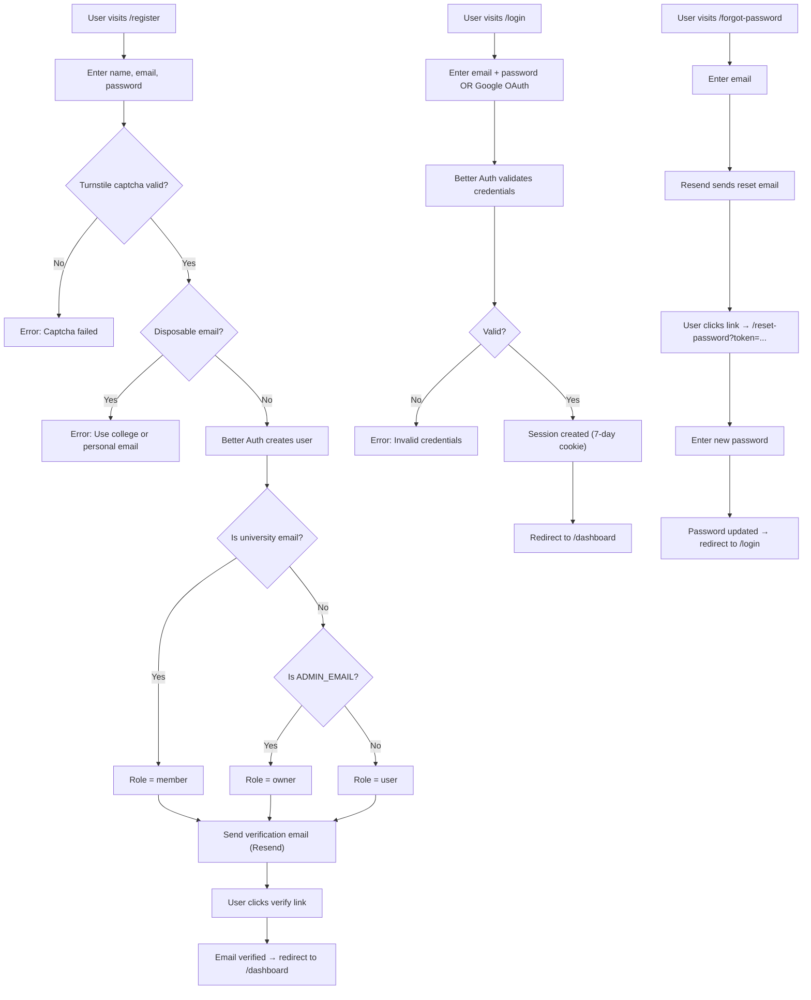

### 3.2 — Event Lifecycle

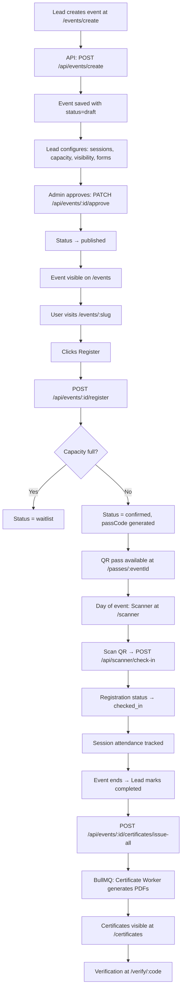

### 3.3 — Recruitment Pipeline

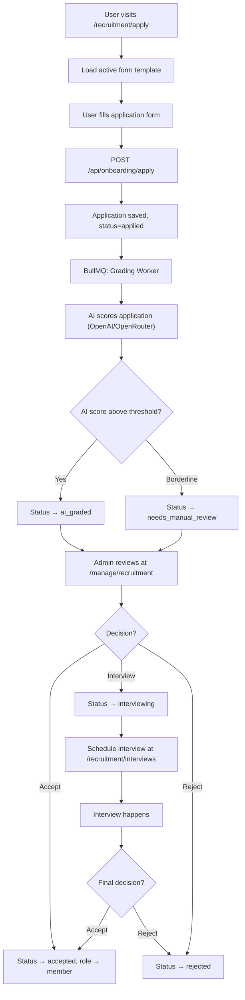

### 3.4 — Certificate Lifecycle

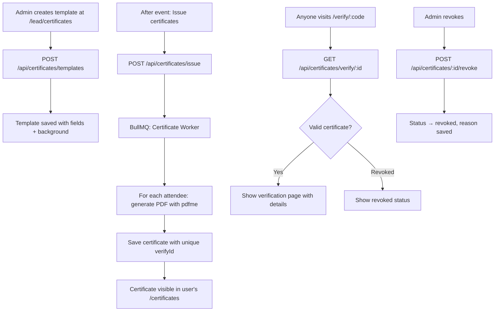

### 3.5 — Finance Flow

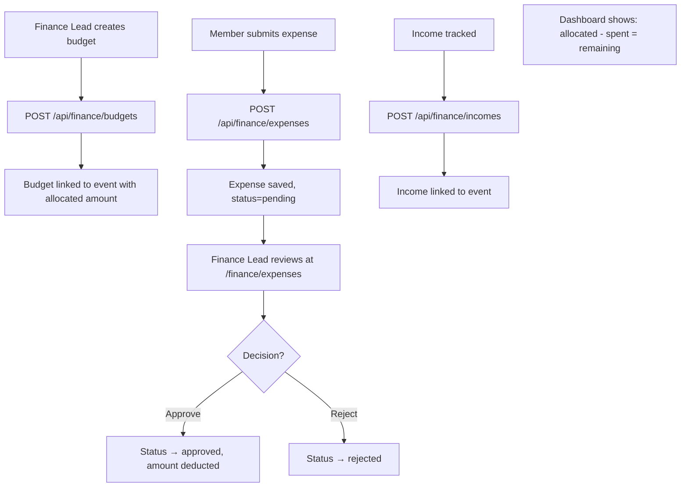

### 3.6 — Procurement Flow

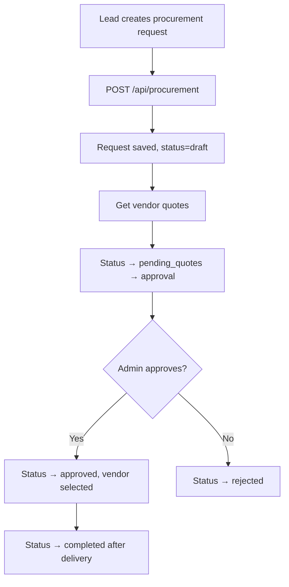

### 3.7 — QR Scanner & Check-In Flow

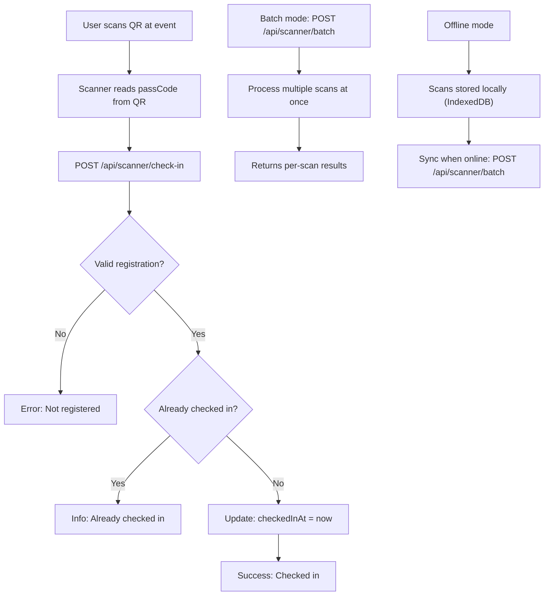

### 3.8 — Communication Flow

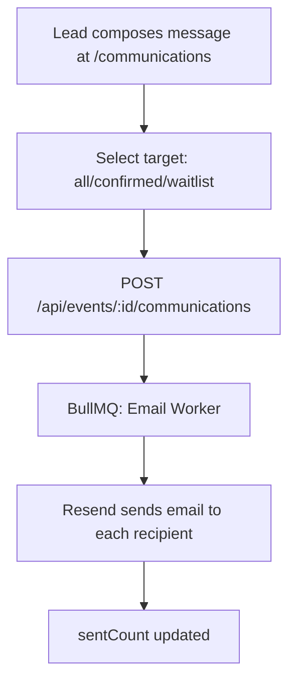

### 3.9 — Form Builder Flow

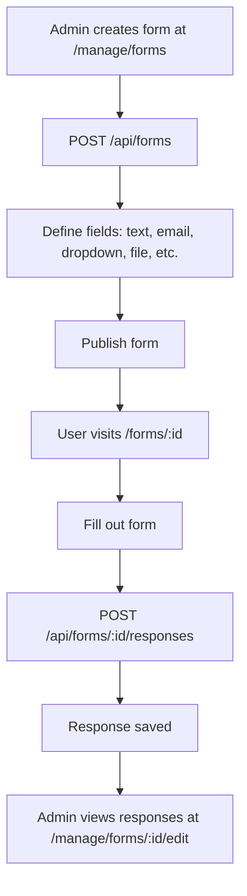

### 3.10 — Project Showcase Flow

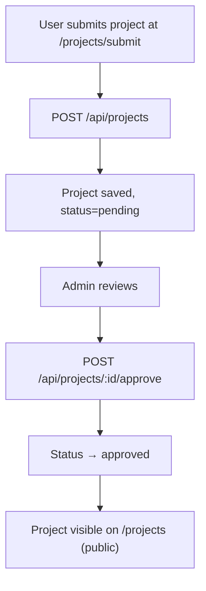

### 3.11 — Gamification & Leaderboard

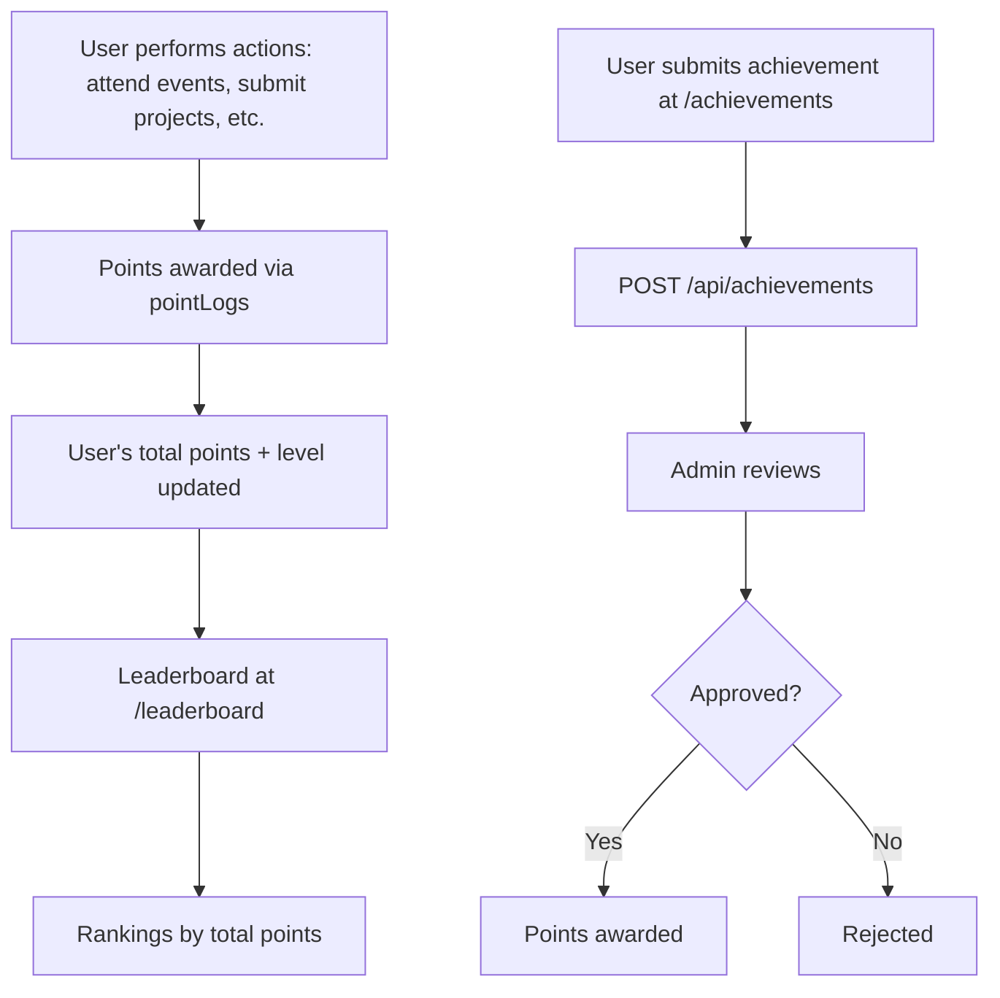

---

## 4. Database Schema Map

### Table Inventory (30+ tables)

| Table | Domain | Description |
|-------|--------|-------------|
| `user` | Auth | Users with 14-role RBAC, profile fields, points, level |
| `session` | Auth | Better Auth sessions |
| `account` | Auth | OAuth provider accounts |
| `verification` | Auth | Email verification tokens |
| `organization` | Auth | Better Auth organizations |
| `member` | Auth | Organization membership |
| `invitation` | Auth | Organization invitations |
| `events` | Events | Core event records with type, status, visibility, capacity |
| `registrations` | Events | User ↔ Event registration with passCode and check-in status |
| `event_sessions` | Events | Multi-session events (talks, workshops within an event) |
| `session_attendance` | Events | Per-session check-in records |
| `event_invites` | Events | Invitation tokens for private events |
| `tasks` | Events | Checklist tasks assigned to event staff |
| `budgets` | Finance | Allocated budgets per event |
| `expenses` | Finance | Expense submissions with approval workflow |
| `incomes` | Finance | Income tracking per event |
| `inventory` | Operations | Physical item tracking (qty total / available) |
| `inventoryLogs` | Operations | Check-in/check-out log for inventory |
| `applications` | Recruitment | Recruitment applications with AI scoring |
| `interviews` | Recruitment | Interview scheduling |
| `application_reviews` | Recruitment | Review decisions with reason codes |
| `form_templates` | Recruitment | Active recruitment form definitions |
| `forms` | Forms | Dynamic form builder definitions |
| `form_fields` | Forms | Individual form fields |
| `form_responses` | Forms | User responses to forms |
| `cert_templates` | Certificates | Certificate template designs |
| `certificates_v2` | Certificates | Issued certificates with verification IDs |
| `projects` | Projects | Submitted project showcases |
| `project_members` | Projects | Team member associations |
| `project_images` | Projects | Project gallery images |
| `pointLogs` | Gamification | Point award history |
| `achievement_submissions` | Gamification | Achievement proof submissions |
| `content_items` | Content | Social media content pipeline |
| `vendors` | Procurement | Vendor directory |
| `procurement_requests` | Procurement | Purchase requests with vendor selection |
| `research_papers` | Academic | Research paper submissions |
| `competitions` | Academic | Competition result records |
| `notifications` | System | User notification inbox |
| `communications` | System | Event email communications log |
| `audit_logs` | System | Full audit trail of all actions |
| `club_settings` | System | Global club configuration (freeze toggle) |
| `insights` | System | AI-generated engagement insights |
| `ai_logs` | System | AI API call logging |

---

## 5. API Route Map

### Authentication (via Better Auth)
| Method | Route | Purpose |
|--------|-------|---------|
| ALL | `/api/auth/[...all]` | Better Auth catch-all (login, register, verify, reset, OAuth) |

### Events (19 endpoints)
| Method | Route | Purpose |
|--------|-------|---------|
| GET | `/api/events` | List events |
| POST | `/api/events/create` | Create new event |
| GET/PATCH | `/api/events/[id]` | Get/update event |
| POST | `/api/events/[id]/approve` | Approve draft event |
| POST | `/api/events/[id]/reject` | Reject draft event |
| POST | `/api/events/[id]/archive` | Archive event |
| POST | `/api/events/[id]/register` | Register for event |
| POST | `/api/events/[id]/deregister` | Cancel registration |
| POST | `/api/events/[id]/check-in` | Check in via event route |
| POST | `/api/events/[id]/walk-in` | Walk-in registration |
| POST | `/api/events/[id]/guest-register` | Guest registration |
| POST | `/api/events/[id]/duplicate` | Duplicate event |
| POST | `/api/events/[id]/invite` | Send invitations |
| POST | `/api/events/[id]/invite-link` | Generate invite link |
| GET | `/api/events/[id]/export` | Export registrations CSV |
| POST | `/api/events/[id]/import` | Import registrations CSV |
| POST | `/api/events/[id]/scan` | Scan check-in for event |
| GET/POST | `/api/events/[id]/sessions` | Manage event sessions |
| POST | `/api/events/[id]/sessions/[sessionId]/attendance` | Session attendance |
| POST | `/api/events/[id]/communications` | Send event emails |
| GET/POST | `/api/events/[id]/budget` | Event budget |
| GET/POST | `/api/events/[id]/expenses` | Event expenses |
| GET/POST | `/api/events/[id]/inventory` | Event inventory allocation |
| POST | `/api/events/[id]/notify-colleagues` | Notify team |
| GET | `/api/events/[id]/whatsapp-template` | WhatsApp share template |
| POST | `/api/events/[id]/meetings` | Meeting management |
| POST | `/api/events/[id]/post-event` | Post-event wrap-up |
| POST | `/api/events/[id]/certificates/generate` | Generate certificates |
| POST | `/api/events/[id]/certificates/issue-all` | Issue all certificates |

### Certificates (8 endpoints)
| Method | Route | Purpose |
|--------|-------|---------|
| GET | `/api/certificates` | List certificates |
| GET | `/api/certificates/my` | My certificates |
| POST | `/api/certificates/generate` | Generate single certificate |
| POST | `/api/certificates/issue` | Issue certificates in bulk |
| POST | `/api/certificates/bulk-generate` | Bulk generation |
| GET | `/api/certificates/verify/[id]` | Verify certificate |
| POST | `/api/certificates/[id]/revoke` | Revoke certificate |
| GET/POST | `/api/certificates/templates` | Certificate templates CRUD |
| GET/PUT | `/api/certificates/templates/[id]` | Single template CRUD |

### Recruitment (5 endpoints)
| Method | Route | Purpose |
|--------|-------|---------|
| GET | `/api/applications` | List applications |
| GET | `/api/applications/[id]` | Get application |
| PATCH | `/api/applications/[id]/status` | Update application status |
| GET | `/api/applications/export` | Export applications CSV |
| POST | `/api/interviews` | Schedule interview |

### Finance (5 endpoints)
| Method | Route | Purpose |
|--------|-------|---------|
| GET/POST | `/api/finance/budgets` | Budget management |
| GET/POST | `/api/finance/expenses` | Expense management |
| PATCH | `/api/finance/expenses/[id]` | Approve/reject expense |
| GET/POST | `/api/finance/incomes` | Income tracking |
| GET/POST | `/api/procurement` | Procurement requests |

### Admin (3 endpoints)
| Method | Route | Purpose |
|--------|-------|---------|
| GET | `/api/admin/members` | Member directory |
| GET | `/api/admin/audit` | Audit log viewer |
| GET/POST | `/api/admin/certificates/templates` | Admin certificate templates |

### User Management (5 endpoints)
| Method | Route | Purpose |
|--------|-------|---------|
| GET | `/api/users` | User search |
| PATCH | `/api/users/[id]/role` | Change user role |
| GET/PATCH | `/api/users/me/username` | Username management |
| GET | `/api/username/check` | Check username availability |
| POST | `/api/username/reserve` | Reserve username |

### Content & Communication (5 endpoints)
| Method | Route | Purpose |
|--------|-------|---------|
| GET/POST | `/api/content` | Content pipeline |
| GET | `/api/content/calendar` | Content calendar view |
| POST | `/api/content/import` | Import content |
| GET/POST | `/api/announcements` | Announcements |
| GET/POST | `/api/notifications` | User notifications |

### Forms (4 endpoints)
| Method | Route | Purpose |
|--------|-------|---------|
| GET/POST | `/api/forms` | Form CRUD |
| GET/PATCH/DELETE | `/api/forms/[id]` | Single form |
| GET/POST | `/api/forms/[id]/responses` | Form responses |

### Other (14 endpoints)
| Method | Route | Purpose |
|--------|-------|---------|
| GET/POST | `/api/achievements` | Achievement submissions |
| POST | `/api/achievements/scan` | Scan achievement QR |
| GET/POST | `/api/engagement` | Engagement metrics |
| GET | `/api/engagement/leaderboard` | Leaderboard data |
| GET | `/api/engagement/pending-approvals` | Pending approvals count |
| GET/POST | `/api/inventory` | Inventory management |
| GET | `/api/inventory/log` | Inventory audit log |
| GET | `/api/members/directory` | Member directory |
| POST | `/api/scanner/check-in` | QR check-in |
| POST | `/api/scanner/batch` | Batch check-in |
| GET | `/api/scanner/qr` | Generate QR |
| POST | `/api/sessions/[id]/check-in` | Session check-in |
| POST | `/api/sessions/[id]/scan` | Session scan |
| GET/POST | `/api/vendors` | Vendor management |
| POST | `/api/vendors/[id]/rate` | Rate vendor |
| POST | `/api/onboarding/apply` | Submit application |
| POST | `/api/onboarding/approve` | Approve application |
| GET/POST | `/api/projects` | Project showcase |
| GET/PATCH | `/api/projects/[id]` | Single project |
| POST | `/api/projects/[id]/approve` | Approve project |
| POST | `/api/research` | Research paper submission |
| POST | `/api/research/[id]/approve` | Approve research |
| POST | `/api/ai/generate-rejection` | AI rejection message |
| POST | `/api/upload` | File upload |
| POST | `/api/setup` | Initial setup |
| GET | `/api/health` | Health check |
| GET | `/api/ready` | Readiness check |
| POST | `/api/compliance/delete` | GDPR data deletion |
| GET | `/api/compliance/export` | GDPR data export |
| GET | `/api/cron/insights` | Insights generation cron |
| GET | `/api/cron/github-stars` | GitHub stars sync cron |
| POST | `/api/faculty/freeze` | Faculty freeze toggle |
| GET | `/api/faculty/settings` | Faculty settings |

---

## 6. Role Hierarchy & Access Control

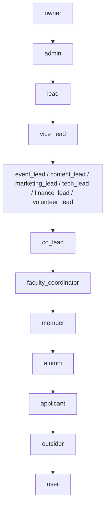

### Permission Matrix (high-level)

| Capability | Owner | Admin | Lead | Vice Lead | Domain Leads | Co-Lead | Member |
|-----------|-------|-------|------|-----------|-------------|---------|--------|
| Manage all users | ✅ | ✅ | ✅ | ✅ | ❌ | ❌ | ❌ |
| Create events | ✅ | ✅ | ✅ | ✅ | ✅ | Draft | ❌ |
| Approve events | ✅ | ✅ | ✅ | ❌ | ❌ | ❌ | ❌ |
| Manage finance | ✅ | ✅ | ❌ | ❌ | finance_lead | ❌ | ❌ |
| Issue certificates | ✅ | ✅ | ✅ | ❌ | ❌ | ❌ | ❌ |
| Review applications | ✅ | ✅ | ✅ | ✅ | ❌ | ❌ | ❌ |
| Register for events | ✅ | ✅ | ✅ | ✅ | ✅ | ✅ | ✅ |
| View own certificates | ✅ | ✅ | ✅ | ✅ | ✅ | ✅ | ✅ |

---

## 7. Feature Registry

### Status Legend
- ✅ **Working** — Feature is implemented with real data and functions end-to-end
- ⚠️ **Partial** — Feature exists but has known issues or incomplete flows
- 🔲 **Stub** — Code exists but functionality is not implemented

| # | Feature | Status | Notes |
|---|---------|--------|-------|
| 1 | Email/password registration | ✅ | With Turnstile captcha, disposable email blocking |
| 2 | Google OAuth login | ✅ | Conditional on env vars |
| 3 | Email verification | ✅ | Via Resend |
| 4 | Password reset | ✅ | Full flow: forgot → email → reset |
| 5 | Role-based access control | ✅ | 14 roles, enforced in DAL |
| 6 | Event creation | ✅ | Full form with sessions, capacity, visibility |
| 7 | Event approval workflow | ✅ | Draft → approve/reject → published |
| 8 | Event registration | ✅ | With capacity limits and waitlist |
| 9 | QR code generation | ✅ | Per-registration unique pass codes |
| 10 | QR scanner check-in | ✅ | Camera-based scanning + batch mode |
| 11 | Offline scan sync | ⚠️ | IndexedDB storage exists, sync needs testing |
| 12 | Event sessions & attendance | ✅ | Multi-session events with per-session check-in |
| 13 | Certificate template design | ✅ | pdfme-based template builder |
| 14 | Certificate generation | ✅ | BullMQ worker generates PDFs |
| 15 | Certificate verification | ✅ | Public /verify/:code page |
| 16 | Certificate revocation | ✅ | With reason tracking |
| 17 | Recruitment application form | ✅ | Dynamic form templates |
| 18 | AI application grading | ⚠️ | Worker exists, requires OpenAI/OpenRouter API key |
| 19 | Manual application review | ✅ | With approve/reject/interview actions |
| 20 | Interview scheduling | ✅ | With meeting link support |
| 21 | Budget management | ✅ | Per-event budget allocation |
| 22 | Expense tracking | ✅ | Submit/approve/reject workflow |
| 23 | Income tracking | ✅ | Per-event income records |
| 24 | Inventory management | ✅ | Item tracking with check-in/check-out logs |
| 25 | Procurement requests | ✅ | Full workflow with vendor selection |
| 26 | Vendor directory | ✅ | With rating system |
| 27 | Dynamic form builder | ✅ | 9 field types, publish/close lifecycle |
| 28 | Project showcase | ✅ | Submit/approve with team members and images |
| 29 | Announcements | ✅ | System-wide announcements |
| 30 | Notifications | ✅ | In-app notification inbox |
| 31 | Event communications | ✅ | Email blasts to registrants |
| 32 | Leaderboard | ✅ | Points-based ranking |
| 33 | Achievement submissions | ✅ | With proof upload and review |
| 34 | Content pipeline | ⚠️ | Content items tracked, social posting not connected |
| 35 | Research papers | ⚠️ | CRUD exists, approval works, no display page |
| 36 | Competition tracking | ⚠️ | CRUD exists, no dedicated UI |
| 37 | CSV export | ✅ | Events, applications, compliance |
| 38 | CSV import | ⚠️ | Events import exists, needs error handling review |
| 39 | Audit logging | ✅ | Full trail in audit_logs table |
| 40 | GDPR compliance | ✅ | Data export and deletion endpoints |
| 41 | Faculty freeze | ✅ | Global operations freeze toggle |
| 42 | Weekly report generation | 🔲 | Worker skeleton exists, no implementation |
| 43 | Dark mode | ✅ | Via next-themes |
| 44 | File upload | ✅ | Generic upload endpoint |
| 45 | Health check | ✅ | /api/health and /api/ready |
| 46 | Rate limiting | ✅ | Redis-backed via Upstash |
| 47 | Error tracking | ✅ | Sentry integration |
| 48 | Product analytics | ✅ | PostHog with page views + user ID |

---

## 8. Infrastructure & Deployment

### Docker Setup

```
docker-compose.yml
├── web (Next.js app, port 3000)
├── worker (BullMQ worker process)
├── postgres (database)
└── redis (queues + rate limiting)
```

### Environment Variables (see .env.example)

| Variable | Required | Purpose |
|----------|----------|---------|
| `DATABASE_URL` | ✅ | PostgreSQL connection string |
| `REDIS_URL` | ✅ | Redis connection string |
| `BETTER_AUTH_SECRET` | ✅ | Session encryption key |
| `BETTER_AUTH_URL` | ✅ | Application base URL |
| `RESEND_API_KEY` | ✅ | Email delivery |
| `ADMIN_EMAIL` | ✅ | Auto-promotes this email to owner role |
| `GOOGLE_CLIENT_ID` | Optional | Google OAuth |
| `GOOGLE_CLIENT_SECRET` | Optional | Google OAuth |
| `OPENAI_API_KEY` | Optional | AI grading |
| `NEXT_PUBLIC_SENTRY_DSN` | Optional | Error tracking |
| `NEXT_PUBLIC_POSTHOG_KEY` | Optional | Analytics |
| `TURNSTILE_SECRET_KEY` | Optional | Bot protection |

### Background Workers

| Worker | Queue | Purpose |
|--------|-------|---------|
| `emailWorker` | `email-queue` | Sends transactional emails via Resend |
| `certificateWorker` | `certificate-queue` | Generates PDF certificates |
| `gradingWorker` | `grading-queue` | AI application grading |
| `aiWorker` | `ai-queue` | General AI tasks |
| `remindersWorker` | `reminders-queue` | Scheduled reminders |
| `reportsWorker` | `reports-queue` | Report generation (not yet implemented) |
| `socialWorker` | `social-queue` | Content reminder emails |

### Scripts

| Script | Command | Purpose |
|--------|---------|---------|
| `migrate.ts` | `npm run db:migrate` | Run database migrations |
| `set-owner.ts` | `npm run db:set-owner` | Set system owner by email |
| `seed-dev.ts` | `npm run db:seed` | Seed development data |
| `seed.ts` | — | Production seeding |
| `clean-dummy.ts` | `npm run db:clean` | Clean test data |
| `init-form-template.ts` | — | Initialize recruitment form |
| `backup-db.sh` | — | Database backup script |

---

## 9. Security Measures

1. **Route protection:** `proxy.ts` redirects unauthenticated users; DAL enforces authorization close to data
2. **RBAC:** 14-role hierarchy with Better Auth admin plugin
3. **Rate limiting:** Redis-backed rate limiting on all mutating API routes
4. **Input validation:** Zod schemas on all API endpoints
5. **CSRF protection:** Better Auth built-in CSRF tokens
6. **Disposable email blocking:** Checked at signup
7. **Security headers:** X-Frame-Options: DENY, HSTS, X-Content-Type-Options: nosniff
8. **Audit trail:** All mutations logged to `audit_logs` table
9. **GDPR compliance:** Data export and deletion endpoints
10. **Turnstile captcha:** Cloudflare bot protection on registration
