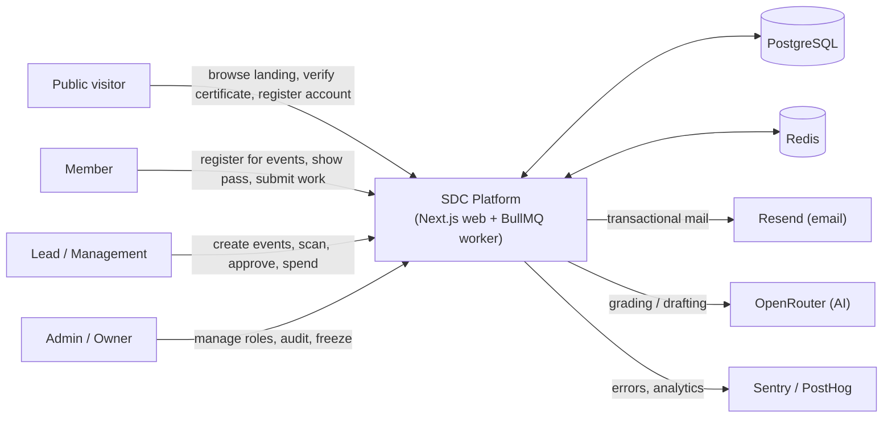
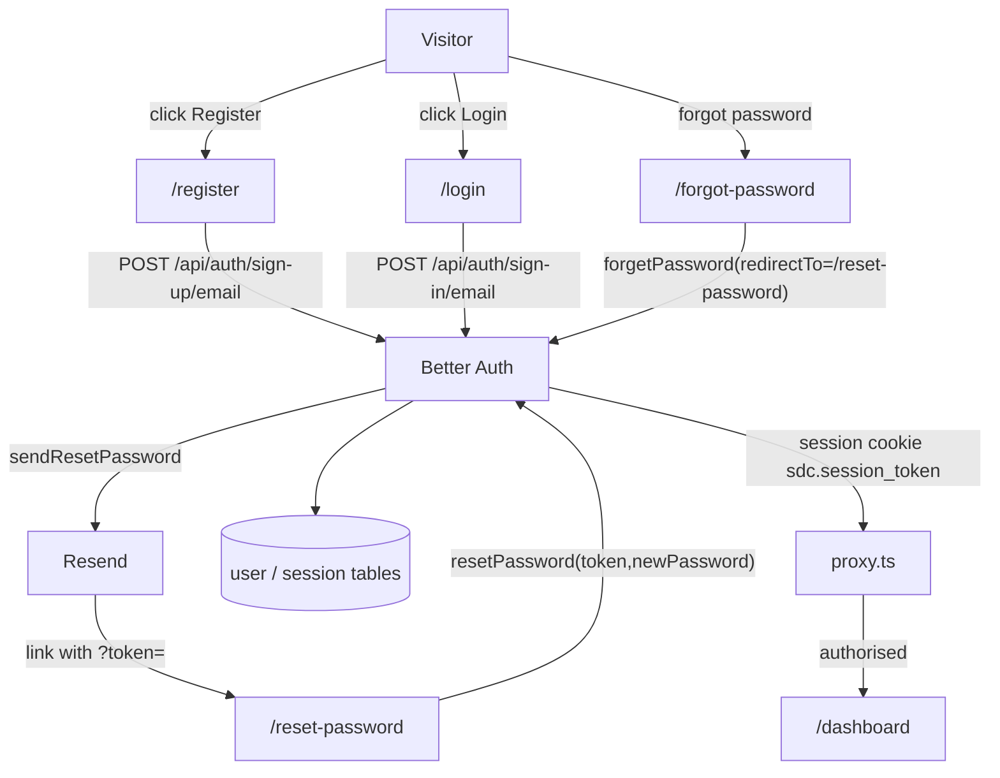
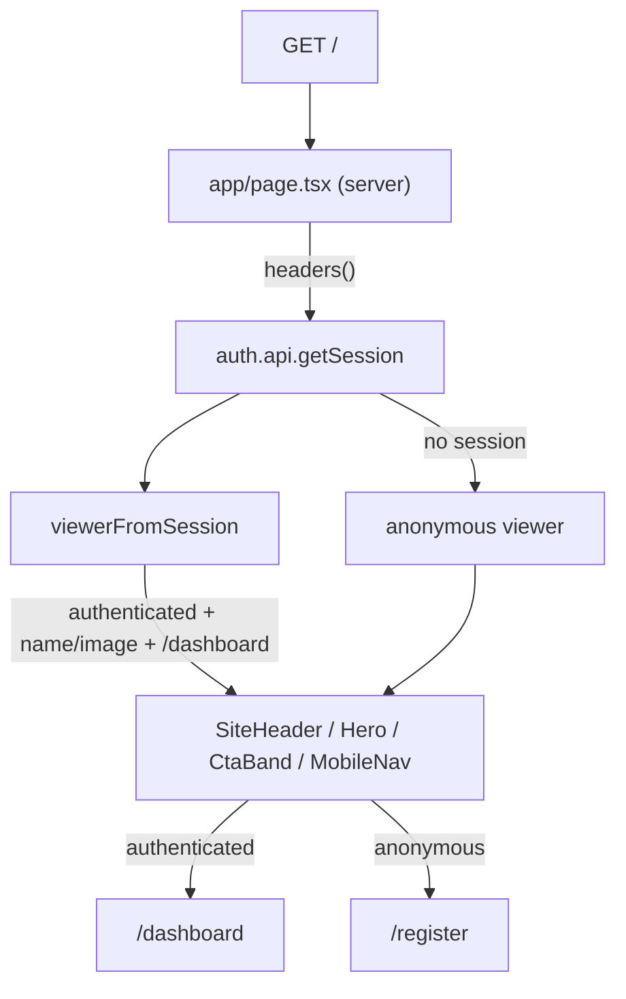
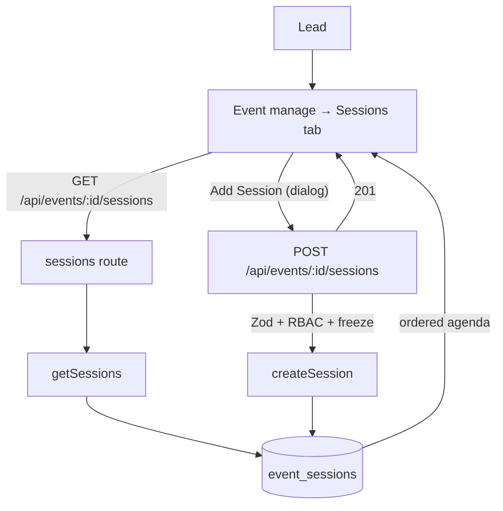
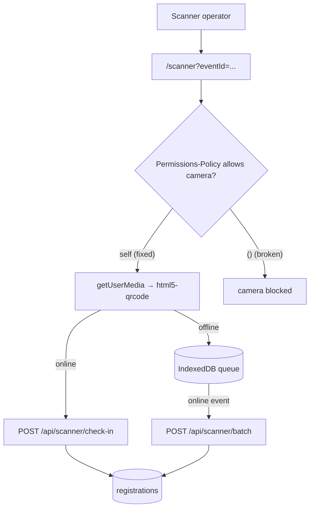

# SDC Platform — Completion Plan

Baseline: audit of 2026-08-19 against the current working tree.
Gates at baseline: lint pass, `tsc --noEmit` pass, `next build` pass, 53 unit tests pass,
15 integration suites skipped (no test DB), 2 Playwright tests failing, `next dev` failing to compile `/`.

This plan covers planning artifacts (context, DFDs, contracts), then a sequenced roadmap,
then implementation, then verification.

---

## 1. Scope decisions

| ID | Decision | Rationale |
|---|---|---|
| D-1 | Canonical registration route is `/register` | Route exists and builds; `/signup` does not exist anywhere |
| D-2 | Canonical dashboard entry is `/dashboard` | `/dashboard/admin`, `/dashboard/volunteer`, `/dashboard/user` do not exist |
| D-3 | Landing viewer state must come from the real session | Currently hardcoded to anonymous |
| D-4 | Password reset must be completable in-app | Reset mail links to a nonexistent page |
| D-5 | Camera must be allowed on same-origin | Global `camera=()` disables the scanner the product requires |
| D-6 | Operational dashboards stay authenticated for v1 | Public event/project marketing site is a separate product decision, not a bug fix |
| D-7 | Remove non-functional controls rather than fake them | A dead "Save" button is worse than an honest absence |
| D-8 | Landing copy must be SDC, not the template's festival copy | Leftover "GSF 2026" / "Goa Startup Festival" strings |

D-6 is deliberately conservative: moving `/events` and `/projects` out of the authenticated
route group is a product/IA change, not a defect fix, and is tracked in section 6 as deferred.

---

## 2. Context diagram (Level 0)

---

## 3. Data flow diagrams for the flows being fixed

### DFD 1 — Identity and account recovery (P0)

Defects closed here: missing `/reset-password` (dead recovery loop), all `/signup` links 404.

### DFD 2 — Landing viewer resolution (P0)

Defect closed: viewer was hardcoded anonymous, so signed-in users saw guest CTAs.

### DFD 3 — Event sessions (agenda) management (P1)

Defect closed: the tab never called the API and its buttons only raised `alert("Coming Soon")`.

### DFD 4 — Scanner check-in with camera policy (P0)

Defect closed: `camera=()` in `next.config.ts` disabled the camera for every route.

---

## 4. Development protocols applied

- **Layering**: UI → API route (`withApiHandler`, Zod) → DAL/service → Drizzle. New code adds no inline SQL in components.
- **Authorization**: enforced in API/DAL, not by hiding UI. UI gating is cosmetic only.
- **No fake affordances**: any control that cannot complete its action is removed or replaced with an honest empty state.
- **Mobile-first contract**: multi-column form rows must be `grid-cols-1` then `sm:`/`md:` up. No fixed pixel widths wider than 320px. No hover-only essential actions.
- **Accessibility**: keep focus-visible styles, keep reduced-motion handling, label all new controls, keep 44px touch targets.
- **Verification order**: `lint` → `tsc --noEmit` → `build` → `vitest` → Playwright.
- **Change hygiene**: no schema drop/reset, no destructive git operations, no production credentials touched.

---

## 5. Roadmap (sequenced)

### Phase 0 — Restore local runtime
- [x] 0.1 Diagnose `next dev` `Cannot find module 'lucide-react'`
- [x] 0.2 Clear the stale Turbopack dev artifacts and confirm `/` compiles

### Phase 1 — P0 flow repair
- [x] 1.1 Replace every `/signup` link with `/register` (header, mobile nav, hero, CTA band, footer)
- [x] 1.2 Add `/reset-password` page + `ResetPasswordForm` (token from query, validation, error/success states)
- [x] 1.3 Resolve real session on the landing page and map SDC roles to `/dashboard`
- [x] 1.4 Remove `/dashboard/user` fallbacks
- [x] 1.5 Allow same-origin camera in `Permissions-Policy`
- [x] 1.6 Remove the dead `/projects` public-path entry; keep operational routes authenticated (D-6)

### Phase 2 — Finish stubbed features
- [x] 2.1 Wire the event Sessions tab to its API and add a working Add Session dialog
- [x] 2.2 Remove `alert()` placeholders from event session management
- [x] 2.3 Replace the `/manage/settings` "Coming Soon" card with an honest empty state
- [x] 2.4 Remove the non-functional Club Settings inputs and dead Save button
- [x] 2.5 Replace `alert()` in the certificate designer with toasts

### Phase 3 — Mobile and content correctness
- [x] 3.1 Make the notification panel width responsive
- [x] 3.2 Make event-wizard and expense-dialog form rows single-column on phones
- [x] 3.3 Make task-board actions reachable without hover
- [x] 3.4 Make Kanban column widths phone-safe
- [x] 3.5 Replace leftover festival copy with SDC copy

### Phase 4 — Verification
- [x] 4.1 `npm run lint`
- [x] 4.2 `npx tsc --noEmit`
- [x] 4.3 `npm run build`
- [x] 4.4 `npm test`
- [x] 4.5 Playwright desktop + Pixel 5
- [x] 4.6 Refresh `docs/MAINTENANCE_STATUS.md` with real results

---

## 6. Deferred — needs owner input or infrastructure

These are not silently dropped; they remain launch blockers in `MAINTENANCE_STATUS.md`.

| ID | Item | Blocked on |
|---|---|---|
| F-1 | Run the 15 integration suites | An isolated PostgreSQL whose name contains `test` |
| F-2 | Public marketing surface for events/projects/recruitment (D-6) | Product decision on IA + SEO ownership |
| F-3 | Biometric face matching in v1 | Consent, retention, deletion policy, institutional approval |
| F-4 | Queue retry/failure and backup-restore rehearsal | Redis + staging environment |
| F-5 | Accessibility and visual-regression suites in CI | CI decision to run Playwright |
| F-6 | Astryx/Shadcn consolidation across remaining screens | Sequenced UI work, not a defect |
| F-7 | Signed release record | Real SHA, migration revision, faculty approval |
