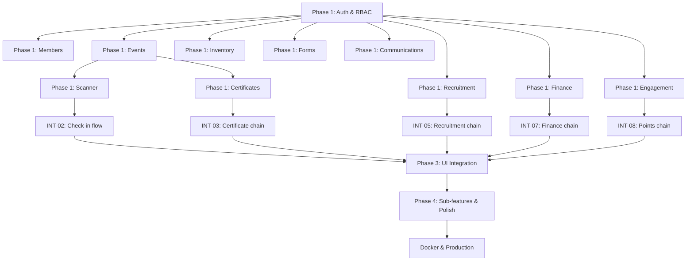

# SDC Platform — Master Development Specification

> **Version:** 1.0.0  
> **Last updated:** 2026-08-09  
> **Audience:** AI agents and human developers working on this codebase  
> **Status:** Active — this document governs all implementation decisions

---

## 0. How to Use This Document

This is the **authoritative development specification** for the Student Developer Club (SDC) platform — an all-in-one management solution for college-level educational institute clubs. It supersedes ad-hoc feature requests when they conflict with stated principles.

### Related documents (read in this order)

| Order | Document | Purpose |
|-------|----------|---------|
| 1 | `docs/ai/00-project-brief.md` | What the product is, who it serves, design direction |
| 2 | **`docs/SPECIFICATION.md`** (this file) | What to build, how to build it, in what order |
| 3 | `docs/ARCHITECTURE.md` | Technical reference: stack, DFDs, schema, API inventory |
| 4 | `docs/EXECUTION_ROADMAP.md` | Step-by-step verification checklist for QA |
| 5 | `docs/ai/02-active-context.md` | Current session focus (update after each work block) |
| 6 | `docs/ai/03-progress.md` | Chronological progress log |

### Development cycle (mandatory sequence)

Every feature MUST pass through these four phases in order. Do not wire UI before core logic exists. Do not add sub-features before core integration is verified.

```
Phase 1 ──► Phase 2 ──► Phase 3 ──► Phase 4
 Core        Connect      Connect       Sub-features
 features    cores        cores ↔ UI    & polish
```

| Phase | Goal | Exit criterion |
|-------|------|----------------|
| **1 — Core features** | Each domain has correct schema, DAL functions, API routes, and workers where needed | Unit/integration tests pass; API returns real DB data |
| **2 — Connect cores** | Cross-domain workflows work end-to-end (e.g., check-in → certificate issue) | DFD paths in ARCHITECTURE.md execute without manual DB edits |
| **3 — Connect UI** | Every authenticated route renders real data; role gates enforced in UI and API | EXECUTION_ROADMAP step for that domain passes |
| **4 — Sub-features & polish** | Partial/stub features completed; design system unified; edge cases handled | Feature registry shows ✅ for that item |

### Decision framework (three directions)

Before implementing anything, evaluate it against all three:

1. **Should be there** — Universally improves club operations for any college-level institute club. Documented in Section 2.
2. **Should NOT be there** — Out of scope, adds complexity without universal value, or violates security. Documented in Section 3.
3. **Might be missing** — Gaps discovered during audit. Documented in Section 4. Promote to Phase 1–4 only after confirming universal value.

---

## 1. Product Definition

### 1.1 Mission

Provide a single, secure, professional-grade web platform that lets a student developer club (and structurally similar clubs) manage their full operational lifecycle: public presence, membership, events, attendance, certificates, recruitment, finance, inventory, projects, forms, communications, and engagement — without relying on disconnected spreadsheets, WhatsApp groups, or manual processes.

### 1.2 Dual purpose

| Surface | Audience | Purpose |
|---------|----------|---------|
| **Public website** | Prospective members, faculty, certificate verifiers, general public | Club promotion: landing page, events, projects, certificate verification |
| **Authenticated operations** | Members, leads, admins, faculty coordinators | Day-to-day club management behind login |

### 1.3 Multi-level institute scaling model

The platform is designed for **hierarchical institute structures**, not flat single-tenant SaaS:

```
Institute (University)
 └── Club (SDC — primary tenant today)
      └── Domains / Teams (Event, Content, Marketing, Tech, Finance, Volunteer)
           └── Members (with role + optional domain assignment)
```

**Current deployment:** Single-club (Parul University SDC).  
**Scaling path:** Better Auth `organization` plugin + `member.domain` field are already in schema. Future multi-club support adds `organizationId` scoping to queries without rewriting domains.

| Level | Entity | Scoping mechanism |
|-------|--------|-------------------|
| Institute | Implicit (one deployment per university) | Environment config, `club_settings` |
| Club | `organization` table | Better Auth organization plugin |
| Domain/Team | `member.domain`, domain lead roles | Role + domain filter in DAL |
| Member | `user` + role enum | RBAC via Better Auth admin plugin |

**Rule:** All new DAL queries MUST accept an optional organization/domain filter parameter even if unused today, so multi-club migration does not require rewriting every query.

### 1.4 Design language (non-negotiable for UI work)

| Property | Requirement |
|----------|-------------|
| Theme | Space / cosmic — blackhole logo, premium observatory feel |
| Inspiration | Comet Browser (Perplexity) — celestial gradients, orbital motion |
| Mode | Dark-first; light mode secondary |
| Component library | `@astryxdesign/core` for all new and migrated UI |
| Anti-patterns | Generic white SaaS dashboards, neon sci-fi, cluttered card grids |
| Accessibility | WCAG AA contrast; `prefers-reduced-motion` respected |

Reference: `PRODUCT.md`, `docs/ARCHITECTURE.md` § Design Language.

---

## 2. What SHOULD Be There (Core Feature Registry)

These features are **in scope** because they address universal club operations. Each entry maps to a Phase 1 core module.

### 2.1 Identity & Access (Core Module: `auth`)

| ID | Feature | Key files | Phase 1 status |
|----|---------|-----------|----------------|
| AUTH-01 | Email/password registration with Turnstile captcha | `lib/auth.ts`, `components/auth/register-form.tsx` | ✅ Complete |
| AUTH-02 | Disposable email blocking | `lib/auth.ts` | ✅ Complete |
| AUTH-03 | University email auto-promotion to `member` | `lib/auth.ts` | ✅ Complete |
| AUTH-04 | Admin email auto-promotion to `owner` | `lib/auth.ts`, `ADMIN_EMAIL` env | ✅ Complete |
| AUTH-05 | Email verification via Resend | `lib/services/mailer.ts` | ✅ Complete |
| AUTH-06 | Password reset flow | `app/(marketing)/forgot-password/` | ✅ Complete |
| AUTH-07 | Google OAuth (conditional on env) | `lib/auth.ts` | ✅ Complete |
| AUTH-08 | 14-role RBAC hierarchy | `lib/dal/auth.ts`, `lib/auth.ts` | ✅ Complete |
| AUTH-09 | Session management (7-day cookie, prefix `sdc`) | `lib/auth.ts` | ✅ Complete |
| AUTH-10 | Route protection via `proxy.ts` | `proxy.ts` | ✅ Complete |
| AUTH-11 | Role demotion constraints (leads cannot demote executives) | `app/api/users/[id]/role/route.ts` | ✅ Complete |
| AUTH-12 | Faculty emergency freeze | `club_settings.isFrozen`, `checkEmergencyFreeze()` | ✅ Complete |
| AUTH-13 | GDPR data export & deletion | `app/api/compliance/` | ✅ Complete |

**Phase 1 acceptance criteria (auth):**
- Unauthenticated users cannot reach `/dashboard/*`
- Every mutating API route validates session + role in DAL (not just route handler)
- Role changes are audit-logged
- Banned users cannot authenticate

### 2.2 Members & Directory (Core Module: `members`)

| ID | Feature | Key files | Phase 1 status |
|----|---------|-----------|----------------|
| MEM-01 | Member directory with search | `app/api/members/directory`, `app/api/admin/members` | ✅ Complete |
| MEM-02 | Role management UI | `app/(dashboard)/admin/members/` | ✅ Complete |
| MEM-03 | Org chart visualization | `components/admin/org-chart.tsx` | ✅ Complete |
| MEM-04 | Username reservation & uniqueness | `app/api/username/` | ✅ Complete |
| MEM-05 | Profile fields (year, branch, bio, skills, links) | `lib/db/schema.ts` → `user` | ✅ Complete |
| MEM-06 | Points & level (gamification base) | `user.points`, `user.level` | ✅ Complete |
| MEM-07 | Alumni role with read-only access | RBAC in `lib/dal/auth.ts` | ✅ Complete |

### 2.3 Events (Core Module: `events`)

| ID | Feature | Key files | Phase 1 status |
|----|---------|-----------|----------------|
| EVT-01 | Event CRUD with draft/published/cancelled/completed lifecycle | `app/api/events/`, `lib/services/events.ts` | ✅ Complete |
| EVT-02 | Event approval workflow (draft → approve/reject → published) | `app/api/events/[id]/approve` | ✅ Complete |
| EVT-03 | Visibility levels (public, private, unlisted, members_only, invite_only) | `events.visibility` enum | ✅ Complete |
| EVT-04 | Registration with capacity & waitlist | `lib/services/waitlist.ts` | ✅ Complete |
| EVT-05 | Unique passCode per registration | `registrations.passCode` | ✅ Complete |
| EVT-06 | Multi-session events | `event_sessions`, `session_attendance` | ✅ Complete |
| EVT-07 | Event duplication | `app/api/events/[id]/duplicate` | ✅ Complete |
| EVT-08 | CSV export of registrations | `app/api/events/[id]/export` | ✅ Complete |
| EVT-09 | Guest & walk-in registration | `guest-register`, `walk-in` routes | ✅ Complete |
| EVT-10 | Event-scoped budget/expense/inventory links | `events.budgetId`, event finance routes | ✅ Complete |
| EVT-11 | Sub-events (parentId self-reference) | `events.parentId` | ✅ Schema; ⚠️ UI partial |
| EVT-12 | Event staff assignment & checklist | `events.staff`, `events.checklist` | ✅ Schema; ⚠️ UI partial |

### 2.4 Attendance & Scanner (Core Module: `scanner`)

| ID | Feature | Key files | Phase 1 status |
|----|---------|-----------|----------------|
| SCN-01 | QR code generation for passes | `lib/passes/qr.ts`, `components/passes/rotating-qr.tsx` | ✅ Complete |
| SCN-02 | Camera-based QR scanner | `components/scanner/qr-scanner.tsx` | ✅ Complete |
| SCN-03 | Check-in API with duplicate detection | `app/api/scanner/check-in` | ✅ Complete |
| SCN-04 | Batch check-in | `app/api/scanner/batch` | ✅ Complete |
| SCN-05 | Session-level check-in | `app/api/sessions/[id]/check-in` | ✅ Complete |
| SCN-06 | Offline scan queue (IndexedDB) | `lib/offline/db.ts` | ⚠️ Partial — sync untested |
| SCN-07 | Event-specific scanner page | `app/(dashboard)/events/[slug]/manage/` | ✅ Complete |

### 2.5 Certificates (Core Module: `certificates`)

| ID | Feature | Key files | Phase 1 status |
|----|---------|-----------|----------------|
| CERT-01 | Template designer (pdfme) | `components/certificates/designer.tsx` | ✅ Complete |
| CERT-02 | Template CRUD | `app/api/certificates/templates/` | ✅ Complete |
| CERT-03 | Bulk certificate generation via BullMQ worker | `lib/workers/certificates.ts` | ✅ Complete |
| CERT-04 | Public verification page | `app/verify/[code]/` | ✅ Complete |
| CERT-05 | Certificate revocation with reason | `app/api/certificates/[id]/revoke` | ✅ Complete |
| CERT-06 | Issue-all for event attendees | `app/api/events/[id]/certificates/issue-all` | ✅ Complete |

### 2.6 Recruitment (Core Module: `recruitment`)

| ID | Feature | Key files | Phase 1 status |
|----|---------|-----------|----------------|
| REC-01 | Dynamic application form (form template) | `form_templates`, `app/recruitment/apply/` | ✅ Complete |
| REC-02 | Application submission | `app/api/onboarding/apply` | ✅ Complete |
| REC-03 | AI application grading (BullMQ worker) | `lib/workers/grading.ts` | ⚠️ Partial — requires API key |
| REC-04 | Manual review (accept/reject/interview) | `app/(dashboard)/manage/recruitment/` | ✅ Complete |
| REC-05 | Interview scheduling | `app/api/interviews`, `app/(dashboard)/recruitment/interviews/` | ✅ Complete |
| REC-06 | Role promotion on acceptance (applicant → member) | `app/api/onboarding/approve` | ✅ Complete |
| REC-07 | CSV export of applications | `app/api/applications/export` | ✅ Complete |
| REC-08 | AI-generated rejection messages | `app/api/ai/generate-rejection` | ✅ Complete |

### 2.7 Finance & Procurement (Core Module: `finance`)

| ID | Feature | Key files | Phase 1 status |
|----|---------|-----------|----------------|
| FIN-01 | Per-event budget allocation | `app/api/finance/budgets` | ✅ Complete |
| FIN-02 | Expense submission & approval workflow | `app/api/finance/expenses/` | ✅ Complete |
| FIN-03 | Income tracking | `app/api/finance/incomes` | ✅ Complete |
| FIN-04 | Procurement request lifecycle | `app/api/procurement` | ✅ Complete |
| FIN-05 | Vendor directory with ratings | `app/api/vendors/` | ✅ Complete |
| FIN-06 | Finance dashboard (allocated vs spent vs remaining) | `app/(dashboard)/finance/` | ✅ Complete |

### 2.8 Inventory (Core Module: `inventory`)

| ID | Feature | Key files | Phase 1 status |
|----|---------|-----------|----------------|
| INV-01 | Item CRUD (qty total / available) | `app/api/inventory` | ✅ Complete |
| INV-02 | Check-in/check-out with audit log | `inventoryLogs` table | ✅ Complete |
| INV-03 | Low-stock alerts on admin dashboard | `lib/dal/dashboard.ts` | ✅ Complete |
| INV-04 | Event-scoped inventory allocation | `app/api/events/[id]/inventory` | ✅ Complete |

### 2.9 Forms (Core Module: `forms`)

| ID | Feature | Key files | Phase 1 status |
|----|---------|-----------|----------------|
| FRM-01 | Dynamic form builder (9+ field types) | `components/forms/advanced-form-builder.tsx` | ✅ Complete |
| FRM-02 | Visibility logic (show/hide conditions) | Form builder logic engine | ✅ Complete |
| FRM-03 | Multi-page forms (section breaks) | Form builder | ✅ Complete |
| FRM-04 | Publish/close lifecycle | `app/api/forms/` | ✅ Complete |
| FRM-05 | Response collection & admin view | `app/api/forms/[id]/responses` | ✅ Complete |
| FRM-06 | Settings: allowExternal, requireLogin, quotaPerUser | Form schema | ✅ Complete |
| FRM-07 | Auto-fill from user profile | `lib/forms/autoFill.ts` | ✅ Complete |

### 2.10 Projects & Engagement (Core Module: `engagement`)

| ID | Feature | Key files | Phase 1 status |
|----|---------|-----------|----------------|
| ENG-01 | Project submission with team & images | `app/projects/submit/` | ✅ Complete |
| ENG-02 | Project approval workflow | `app/api/projects/[id]/approve` | ✅ Complete |
| ENG-03 | Public project showcase | `app/projects/` | ✅ Complete |
| ENG-04 | Achievement submissions with proof | `app/(dashboard)/achievements/` | ✅ Complete |
| ENG-05 | Achievement review & point awards | `app/(dashboard)/lead/achievements/` | ✅ Complete |
| ENG-06 | Leaderboard with podium UI | `app/(dashboard)/leaderboard/` | ✅ Complete |
| ENG-07 | Point logs (audit trail for points) | `pointLogs` table | ✅ Complete |

### 2.11 Communications (Core Module: `communications`)

| ID | Feature | Key files | Phase 1 status |
|----|---------|-----------|----------------|
| COM-01 | Event email blasts (target audience filter) | `app/api/events/[id]/communications` | ✅ Complete |
| COM-02 | Email worker (BullMQ → Resend) | `lib/workers/email.ts` | ✅ Complete |
| COM-03 | System announcements | `app/api/announcements` | ✅ Complete |
| COM-04 | In-app notification inbox | `app/api/notifications`, `components/notifications/` | ✅ Complete |
| COM-05 | Content pipeline (scheduled content items) | `app/(dashboard)/lead/content/` | ⚠️ Partial — no social posting |
| COM-06 | React Email templates | `emails/` directory | ✅ Complete |

### 2.12 System & Infrastructure (Core Module: `system`)

| ID | Feature | Key files | Phase 1 status |
|----|---------|-----------|----------------|
| SYS-01 | Audit logging (all mutations) | `lib/services/audit.ts`, `audit_logs` | ✅ Complete |
| SYS-02 | Rate limiting (Redis-backed) | `lib/rate-limit.ts`, `withApiHandler` | ✅ Complete |
| SYS-03 | Input validation (Zod on all API routes) | `lib/validators/`, route handlers | ✅ Complete |
| SYS-04 | Error tracking (Sentry) | `sentry.*.config.ts` | ✅ Complete |
| SYS-05 | Product analytics (PostHog) | `lib/posthog.ts`, providers | ✅ Complete |
| SYS-06 | Health & readiness checks | `app/api/health`, `app/api/ready` | ✅ Complete |
| SYS-07 | File upload service | `app/api/upload`, `lib/services/storage.ts` | ✅ Complete |
| SYS-08 | Background worker process | `worker.ts`, `lib/workers/` | ✅ Complete |
| SYS-09 | Docker deployment | `Dockerfile`, `docker-compose.yml` | ✅ Complete |
| SYS-10 | AI operation logging | `ai_logs` table, `lib/services/ai.ts` | ✅ Complete |
| SYS-11 | AI operational insights | `lib/actions/insights.ts` | ✅ Complete |
| SYS-12 | Initial setup flow | `app/setup/`, `app/api/setup` | ✅ Complete |

---

## 3. What Should NOT Be There

These are **explicitly out of scope**. Do not implement unless the project brief is formally amended.

| ID | Exclusion | Rationale |
|----|-----------|-----------|
| OUT-01 | **Payment processing / Stripe integration** | Club finance is tracking-only; payments happen offline |
| OUT-02 | **WhatsApp / SMS integration** | External messaging platforms add maintenance burden; email is sufficient |
| OUT-03 | **Calendar sync (Google Calendar, Outlook)** | Nice-to-have, not universal; clubs use existing calendars |
| OUT-04 | **Microservices architecture** | Monolith with worker process is correct scale for ~200 members |
| OUT-05 | **Face recognition / biometrics as primary attendance** | Privacy, consent, and accuracy concerns; QR is the canonical method. Existing `faceDescriptor` fields are legacy — do not expand |
| OUT-06 | **Native mobile apps** | Responsive web covers all use cases including scanner |
| OUT-07 | **Real-time chat / messaging** | Discord/WhatsApp already serve this; in-app notifications are sufficient |
| OUT-08 | **Multi-language i18n** | Single-language (English) for v1; institute-specific |
| OUT-09 | **Custom CMS / blog engine** | Content pipeline covers social scheduling; no blog needed |
| OUT-10 | **Hardcoded mock data in production paths** | All UI must render real DB data or proper empty states |
| OUT-11 | **Direct DB access from UI components** | All data access through DAL or API routes |
| OUT-12 | **Business logic in route handlers** | Route → DAL → DB; handlers only validate input and call DAL |
| OUT-13 | **Feature flags for incomplete features in production** | Complete or remove; no half-shipped features behind flags |
| OUT-14 | **Social media auto-posting (Postiz, etc.)** | Content pipeline tracks items; manual posting is acceptable for v1 |

### Anti-patterns in code

| Anti-pattern | Correct approach |
|--------------|------------------|
| `fetch('/api/...')` without error handling in UI | Use toast notifications + empty states |
| Role check only in UI (hiding buttons) | Role check in DAL **and** UI |
| Inline SQL in route handlers | Drizzle queries in `lib/dal/` or `lib/services/` |
| Hardcoded role strings | Use `SDC_ROLES`, `MANAGEMENT_ROLES`, `ADMIN_ROLES` from `lib/dal/auth.ts` |
| Shadcn components in new code | Use `@astryxdesign/core` equivalents |
| Skipping audit log on mutations | Call `logAuditEvent()` in every write operation |
| Skipping rate limit on new POST routes | Wrap with `withApiHandler()` |

---

## 4. What Might Be Missing (Gap Analysis)

Items identified during codebase audit that are **not yet implemented** or **partially implemented**. Each must be evaluated for universal value before promotion to a phase.

### 4.1 Confirmed gaps (promote to implementation)

| ID | Gap | Current state | Recommended phase | Priority |
|----|-----|---------------|-------------------|----------|
| GAP-01 | Weekly report generation | Worker skeleton in `lib/workers/reports.ts` | Phase 4 | Medium |
| GAP-02 | Offline scan sync reliability | IndexedDB in `lib/offline/db.ts`, untested | Phase 4 | Medium |
| GAP-03 | Research papers public display | API CRUD exists, no display page | Phase 4 | Low |
| GAP-04 | Competition tracking UI | API CRUD exists, no dedicated page | Phase 4 | Low |
| GAP-05 | CSV import error handling | Events import exists, needs review | Phase 4 | Medium |
| GAP-06 | Shadcn → Astryx UI migration | ~40 files still on Shadcn (see component-audit) | Phase 3–4 | High |
| GAP-07 | Sub-event & checklist UI | Schema fields exist, no management UI | Phase 4 | Medium |
| GAP-08 | Event staff assignment UI | `events.staff` JSONB, no editor | Phase 4 | Medium |
| GAP-09 | DAL layer consolidation | Business logic split between `lib/dal/` (2 files) and route handlers | Phase 2 | High |
| GAP-10 | Test coverage | Only `tests/auth.test.ts` and `tests/smoke.test.ts` | Phase 4 | High |

### 4.2 Deferred (do not implement without explicit approval)

| ID | Gap | Reason for deferral |
|----|-----|---------------------|
| DEF-01 | Multi-club / multi-chapter tenant isolation | Schema ready; no second club to validate against |
| DEF-02 | Paid events with payment gateway | OUT-01 |
| DEF-03 | Social media auto-posting | OUT-14 |
| DEF-04 | Face recognition check-in | OUT-05 |
| DEF-05 | Mobile PWA with push notifications | OUT-06; web responsive is sufficient |
| DEF-06 | Advanced analytics dashboard (cohort analysis) | AI insights cover operational needs for now |

### 4.3 Architectural debt (address during Phase 2)

| ID | Debt | Impact | Remediation |
|----|------|--------|-------------|
| DEBT-01 | DAL has only `auth.ts` and `dashboard.ts`; most logic lives in route handlers | Hard to test, duplicate auth checks | Extract domain DAL modules: `events.ts`, `finance.ts`, `certificates.ts`, etc. |
| DEBT-02 | `faceDescriptor` column and face enrollment pages exist despite OUT-05 | Confusing scope, privacy risk | Deprecate UI routes; keep column for existing data; document as legacy |
| DEBT-03 | Organization plugin configured but not used for domain scoping | Missed multi-level scaling opportunity | Wire domain leads to organization membership when multi-club is needed |
| DEBT-04 | Some API routes bypass `withApiHandler` | Inconsistent rate limiting and error handling | Audit with `scripts/audit-routes.ts`; wrap all routes |

---

## 5. Phase 1 — Build Core Features

Phase 1 is **largely complete** for SDC v1. The remaining Phase 1 work is consolidation and gap-filling.

### 5.1 Layered architecture (mandatory for all new code)

```
┌─────────────────────────────────────────────────┐
│  UI Layer                                        │
│  app/(dashboard)/*, app/(marketing)/*, components│
├─────────────────────────────────────────────────┤
│  API Layer                                       │
│  app/api/* — withApiHandler, Zod validation      │
├─────────────────────────────────────────────────┤
│  DAL Layer                                       │
│  lib/dal/* — auth checks, business logic, queries│
├─────────────────────────────────────────────────┤
│  Service Layer                                   │
│  lib/services/* — mailer, audit, storage, AI     │
├─────────────────────────────────────────────────┤
│  Worker Layer                                    │
│  lib/workers/* — async jobs via BullMQ           │
├─────────────────────────────────────────────────┤
│  Data Layer                                      │
│  lib/db/schema.ts — Drizzle ORM + PostgreSQL     │
└─────────────────────────────────────────────────┘
```

### 5.2 DAL module plan (Phase 1 consolidation)

Extract the following DAL modules from inline route handler logic. Each module exports typed functions that accept `(session, input)` and throw `AuthorizationError` on failure.

| Module file | Responsibilities | Source routes to refactor |
|-------------|------------------|---------------------------|
| `lib/dal/events.ts` | CRUD, approval, registration, sessions | `app/api/events/**` |
| `lib/dal/certificates.ts` | Templates, issue, revoke, verify | `app/api/certificates/**` |
| `lib/dal/recruitment.ts` | Applications, interviews, onboarding | `app/api/applications/**`, `app/api/onboarding/**` |
| `lib/dal/finance.ts` | Budgets, expenses, incomes, procurement | `app/api/finance/**`, `app/api/procurement/**` |
| `lib/dal/inventory.ts` | Items, check-in/out, logs | `app/api/inventory/**` |
| `lib/dal/forms.ts` | Form CRUD, responses | `app/api/forms/**` |
| `lib/dal/engagement.ts` | Projects, achievements, points, leaderboard | `app/api/projects/**`, `app/api/achievements/**`, `app/api/engagement/**` |
| `lib/dal/communications.ts` | Event emails, announcements, notifications | `app/api/events/[id]/communications`, `app/api/announcements`, `app/api/notifications` |
| `lib/dal/scanner.ts` | Check-in, batch, session attendance | `app/api/scanner/**`, `app/api/sessions/**` |
| `lib/dal/members.ts` | Directory, role changes, username | `app/api/users/**`, `app/api/admin/members`, `app/api/members/**` |

**Phase 1 exit gate:** Each domain has a DAL module; route handlers are thin wrappers (< 30 lines of logic).

### 5.3 API handler contract (every route MUST follow)

```typescript
// Pattern for all app/api/* routes
export const POST = withApiHandler(async (req, ctx) => {
  const session = await requireRole(MANAGEMENT_ROLES); // or appropriate roles
  await checkEmergencyFreeze();                         // if mutating club ops
  const body = schema.parse(await req.json());          // Zod validation
  const result = await dalFunction(session, body);      // DAL call
  await logAuditEvent({ ... });                        // audit trail
  return NextResponse.json(result);
});
```

### 5.4 Worker contract (every background job MUST follow)

```typescript
// Pattern for all lib/workers/*
export const worker = new Worker("queue-name", async (job) => {
  logger.info({ jobId: job.id, type: job.data.type }, "Processing job");
  try {
    // 1. Fetch data from DB
    // 2. Perform operation
    // 3. Update DB status
    // 4. Enqueue follow-up jobs if needed (e.g., email after certificate)
  } catch (err) {
    logger.error({ err, jobId: job.id }, "Job failed");
    throw err; // BullMQ retry
  }
}, getWorkerConfig());
```

### 5.5 Database conventions

| Rule | Detail |
|------|--------|
| Primary keys | `crypto.randomUUID()` via Drizzle `$defaultFn` |
| Soft delete | `deletedAt` timestamp where applicable (`user`, `events`) |
| Timestamps | `createdAt` required; `updatedAt` with `$onUpdateFn` |
| Enums | Use `pgEnum` for status fields, not free-text |
| Indexes | Add index on all foreign keys and frequently filtered columns |
| JSONB | Use for flexible metadata (`events.metadata`, `events.staff`); validate shape in Zod |
| Migrations | Generate via `npm run db:generate`; apply via `npm run db:migrate` |

---

## 6. Phase 2 — Connect Core Features

Phase 2 ensures cross-domain workflows execute as documented in `docs/ARCHITECTURE.md` DFDs.

### 6.1 Integration map

Each row is a workflow that MUST work end-to-end without manual intervention.

| Workflow ID | Trigger | Chain | Verification |
|-------------|---------|-------|--------------|
| INT-01 | User registers for event | Register API → passCode generated → pass page renders QR | Step 4.6–4.7 in EXECUTION_ROADMAP |
| INT-02 | QR scanned at event | Scanner API → registration.status = checked_in → session attendance updated | Step 5.1–5.3 |
| INT-03 | Event completed | Admin issues certificates → BullMQ job → PDF generated → user sees in /certificates | Step 6.4–6.6 |
| INT-04 | Certificate issued | verifyId generated → /verify/:code returns valid | Step 6.7 |
| INT-05 | Application submitted | Save → grading worker (if API key) → status updated → admin sees in recruitment | Step 7.3–7.5 |
| INT-06 | Application accepted | Status → accepted → user.role → member → notification sent | Step 7.6 |
| INT-07 | Expense approved | Status → approved → budget remaining recalculated → dashboard reflects | Step 8.3–8.5 |
| INT-08 | Achievement approved | Points awarded → pointLog created → leaderboard updated | Step 11.5–11.6 |
| INT-09 | Event communication sent | Compose → BullMQ email worker → Resend → sentCount updated | Step 12.1–12.2 |
| INT-10 | Faculty freeze activated | `club_settings.isFrozen = true` → all mutating ops blocked → UI shows freeze banner | Step 13.5 |
| INT-11 | GDPR deletion requested | Export data → delete user records → audit logged | Step 13.4 |
| INT-12 | Form published | Form accessible at /forms/:id → responses saved → admin views in editor | Step 9.1–9.4 |
| INT-13 | Project approved | Status → approved → visible on public /projects | Step 11.2 |
| INT-14 | Procurement completed | Status lifecycle → vendor linked → expense optionally created | Step 8.6–8.9 |
| INT-15 | Inventory checked out | qtyAvailable decremented → log entry created → low-stock alert if threshold | Step 10.2–10.5 |

### 6.2 Cross-domain data consistency rules

| Rule | Enforcement |
|------|-------------|
| Registration count ≤ event capacity (unless waitlist) | Check in `registerForEvent()` DAL |
| Certificate issued only for checked-in attendees | Filter in issue-all endpoint |
| Points awarded only once per achievement | Unique constraint or idempotency check |
| Expense cannot exceed remaining budget | Validate in expense approval DAL |
| Role change on acceptance is atomic | Transaction wrapping status update + role update |
| Audit log written in same transaction as mutation | Where possible; otherwise immediately after |
| Email jobs are idempotent | Job ID includes entity ID to prevent duplicate sends |

### 6.3 Queue integration map

| Producer | Queue | Consumer | Trigger |
|----------|-------|----------|---------|
| Certificate issue API | `certificate-queue` | `certificateWorker` | Bulk or single issue |
| Event communication API | `email-queue` | `emailWorker` | Email blast |
| Application submit API | `grading-queue` | `gradingWorker` | AI scoring |
| AI insights cron | `ai-queue` | `aiWorker` | Scheduled insights |
| Reminder cron | `reminders-queue` | `remindersWorker` | Event reminders |
| Content schedule | `social-queue` | `socialWorker` | Content reminder emails |
| Weekly report cron | `reports-queue` | `reportsWorker` | ⚠️ Not yet implemented |

### 6.4 Phase 2 remaining work

| Task | Description | Priority |
|------|-------------|----------|
| P2-01 | Extract DAL modules (see §5.2) | High |
| P2-02 | Verify all 15 integration workflows (INT-01 to INT-15) | High |
| P2-03 | Add integration tests for top 5 workflows | High |
| P2-04 | Implement weekly report worker (GAP-01) | Medium |
| P2-05 | Test and fix offline scan sync (GAP-02) | Medium |
| P2-06 | Audit all routes for `withApiHandler` compliance (DEBT-04) | Medium |

**Phase 2 exit gate:** All INT-* workflows pass EXECUTION_ROADMAP verification steps.

---

## 7. Phase 3 — Connect Core Features with UI

Phase 3 ensures every authenticated and public route renders real data with correct role gating and design system compliance.

### 7.1 Route inventory

#### Public routes (no auth required)

| Route | Page file | Data source | Status |
|-------|-----------|-------------|--------|
| `/` | `app/page.tsx` | Static + featured events/projects | ✅ |
| `/login` | `app/(marketing)/login/page.tsx` | Auth form | ✅ |
| `/register` | `app/(marketing)/register/page.tsx` | Auth form | ✅ |
| `/forgot-password` | `app/(marketing)/forgot-password/page.tsx` | Auth form | ✅ |
| `/reset-password` | `app/(marketing)/reset-password/page.tsx` | Auth form | ✅ |
| `/events` | `app/(dashboard)/events/page.tsx` | `GET /api/events` | ✅ |
| `/events/:slug` | `app/(dashboard)/events/[slug]/page.tsx` | Event DAL | ✅ |
| `/projects` | `app/projects/page.tsx` | `GET /api/projects` | ✅ |
| `/projects/:id` | `app/projects/[id]/page.tsx` | Project DAL | ✅ |
| `/projects/submit` | `app/projects/submit/page.tsx` | Auth required | ✅ |
| `/verify/:code` | `app/verify/[code]/page.tsx` | `GET /api/certificates/verify/:id` | ✅ |
| `/recruitment/apply` | `app/recruitment/apply/page.tsx` | Form template | ✅ |
| `/privacy` | `app/privacy/page.tsx` | Static | ✅ |
| `/terms` | `app/terms/page.tsx` | Static | ✅ |

#### Authenticated routes (by nav section)

**Main navigation** (`lib/config/nav.ts` → `navItems`):

| Route | Roles | Dashboard component | Status |
|-------|-------|---------------------|--------|
| `/dashboard` | All authenticated | Role-specific: Admin/Lead/Student | ✅ |
| `/events` | All | Event listing with filters | ✅ |
| `/leaderboard` | All | Podium + ranked list | ✅ |
| `/achievements` | All | Submit + view achievements | ✅ |
| `/recruitment/apply` | applicant+ | Application form | ✅ |
| `/settings` | All | Tabbed: Profile, Security, Club | ✅ |

**Management navigation** (`managementNavItems`):

| Route | Roles | Status |
|-------|-------|--------|
| `/applications` | vice_lead, lead, admin, owner | ✅ |
| `/scanner` | event_lead, volunteer_lead, co_lead, lead, admin, owner | ✅ |
| `/lead/certificates` | event_lead, lead, admin, owner | ✅ |
| `/lead/achievements` | event_lead, lead, admin, owner | ✅ |
| `/lead/content` | content_lead, lead, admin, owner | ⚠️ Partial |
| `/recruitment/interviews` | vice_lead, lead, admin, owner | ✅ |
| `/inventory` | tech_lead, co_lead, finance_lead, lead, admin, owner | ✅ |
| `/finance/budget` | finance_lead, lead, admin, owner, faculty_coordinator | ✅ |
| `/finance/procurement` | finance_lead, lead, admin, owner, faculty_coordinator | ✅ |
| `/admin/audit` | admin, owner, faculty_coordinator | ✅ |
| `/admin/members` | lead, admin, owner | ✅ |

### 7.2 Dashboard role matrix

| Role | Dashboard variant | Key widgets |
|------|-------------------|-------------|
| owner, admin | `AdminDashboard` | Metrics, charts, AI insights, pending approvals, low stock |
| lead, vice_lead, domain leads | `LeadDashboard` | Domain-specific quick actions, team metrics |
| member, alumni | `StudentDashboard` | Upcoming events, certificates, points, notifications |
| applicant | Redirect to `/recruitment/apply` or limited dashboard | Application status |
| faculty_coordinator | AdminDashboard (read-only variant) | Audit, finance overview, freeze toggle |

### 7.3 UI component standards

| Rule | Detail |
|------|--------|
| Shell | `AstryxProvider` + `AppShell` + `SideNav` + `TopNav` from `@astryxdesign/core` |
| Page header | `PageHeader` component with title, description, actions slot |
| Data tables | `DataTable` from Astryx or `components/astryx/data-table.tsx` |
| Empty states | `EmptyState` from Astryx — never blank pages |
| Loading | `dashboard-skeleton.tsx` pattern — skeleton matching final layout |
| Dialogs | `ConfirmDialog` from Astryx for destructive actions |
| Toasts | Sonner via `ToastProvider` |
| Status indicators | `StatusBadge` from Astryx |
| Metrics | `MetricCard` from Astryx |
| Forms | React Hook Form + Zod resolver |
| Breadcrumbs | `components/app/breadcrumbs.tsx` — truncate UUIDs/CUIDs |

### 7.4 Shadcn → Astryx migration plan (Phase 3)

Priority order based on `docs/ai/component-audit.md`:

| Priority | Files | Shadcn components to replace |
|----------|-------|------------------------------|
| P0 | Auth forms (`login-form`, `register-form`) | Button, Input, Label |
| P0 | `manage/approvals/page.tsx` | Card, Tabs, Badge, Button |
| P1 | Finance dialogs (`add-expense-dialog`) | Dialog, Input, Select, Label |
| P1 | Inventory dialogs | Dialog, Input, Label |
| P1 | Certificate pages (`lead/certificates/*`) | Card, Button |
| P2 | Event management tabs | Input, Textarea, Select |
| P2 | Form builder edit page | Card, Switch, Select |
| P3 | Shared components (command-menu, data-table, theme-toggle) | Various |
| P3 | Error pages (`error.tsx`, `global-error.tsx`) | Alert, Button |

**Phase 3 exit gate:** Zero Shadcn imports in P0/P1 files; all routes render real data; role gates verified.

---

## 8. Phase 4 — Sub-Features & Outstanding Items

Phase 4 completes partial features, adds polish, and raises test coverage.

### 8.1 Sub-feature backlog (ordered by priority)

#### Priority: Critical

| ID | Sub-feature | Description | Files to modify | Acceptance criteria |
|----|-------------|-------------|-----------------|---------------------|
| SUB-01 | DAL extraction | Move business logic from route handlers to `lib/dal/*` | All `app/api/**` routes | Route handlers < 30 lines; DAL functions unit-testable |
| SUB-02 | Integration tests | Cover INT-01 through INT-05 | `tests/integration/` | `npm test` passes with ≥ 5 integration tests |
| SUB-03 | Shadcn migration P0/P1 | Auth, approvals, finance, inventory, certificates | See §7.4 | Component audit shows ✅ for P0/P1 files |

#### Priority: High

| ID | Sub-feature | Description | Acceptance criteria |
|----|-------------|-------------|---------------------|
| SUB-04 | Weekly report worker | Implement `reportsWorker` — fetch metrics, generate HTML email, send via email queue | Owner receives weekly email with member growth, event attendance, pending items |
| SUB-05 | Offline scan sync | Test IndexedDB queue → batch API sync on reconnect | Scanner works offline; syncs within 30s of reconnect |
| SUB-06 | CSV import hardening | Validate rows, report errors per-row, skip invalid | Import 100 rows with 5 invalid → 95 imported, 5 errors shown |
| SUB-07 | Event sub-event UI | Manage parent/child events in event wizard | Create hackathon with workshops as sub-events |
| SUB-08 | Event checklist UI | Manage `events.checklist` in event manage page | Add/complete/check off tasks per event |
| SUB-09 | Event staff assignment UI | Manage `events.staff` in event manage page | Assign members to event roles |

#### Priority: Medium

| ID | Sub-feature | Description | Acceptance criteria |
|----|-------------|-------------|---------------------|
| SUB-10 | Research papers page | Public display of approved papers | `/research` page lists approved papers |
| SUB-11 | Competition tracking page | UI for competition CRUD | `/competitions` page for admin CRUD |
| SUB-12 | Shadcn migration P2/P3 | Remaining files from component audit | Component audit shows ✅ for all files |
| SUB-13 | Space theme polish | Apply cosmic design to remaining pages | EXECUTION_ROADMAP Step 15 passes |
| SUB-14 | Deprecate face enrollment | Remove/hide face enrollment routes per OUT-05 | Routes return 404 or redirect; docs updated |

#### Priority: Low

| ID | Sub-feature | Description | Acceptance criteria |
|----|-------------|-------------|---------------------|
| SUB-15 | Content pipeline social reminders | Email reminder when content item is due (not auto-post) | Lead receives email on scheduled date |
| SUB-16 | Command palette enhancements | Add navigation to all management routes | Cmd+K finds any page |
| SUB-17 | Activity timeline component | Migrate to Astryx; wire to audit logs | Dashboard shows recent activity feed |

### 8.2 Quality gates (Definition of Done)

A feature is **done** when ALL of the following are true:

- [ ] Core logic in DAL module with typed inputs/outputs
- [ ] API route uses `withApiHandler` + Zod validation + role check
- [ ] Mutation is audit-logged
- [ ] UI renders real DB data (no mocks, no hardcoded arrays)
- [ ] Empty state shown when no data
- [ ] Error state shown on API failure (toast + message)
- [ ] Role gate enforced in both API and UI
- [ ] Mobile responsive (tested at 375px width)
- [ ] Uses Astryx components (no new Shadcn imports)
- [ ] `npm run build` passes with zero errors
- [ ] Relevant EXECUTION_ROADMAP step marked complete
- [ ] Feature registry in ARCHITECTURE.md updated to ✅

---

## 9. Security & Safety Framework

### 9.1 Authentication security

| Control | Implementation |
|---------|----------------|
| Session encryption | Better Auth with `BETTER_AUTH_SECRET` |
| Cookie security | `useSecureCookies` in production; prefix `sdc` |
| CSRF protection | Better Auth built-in |
| Email verification required | `withApiHandler` blocks unverified sessions |
| Bot protection | Cloudflare Turnstile on registration |
| Disposable email blocking | Checked at signup |
| Password requirements | Better Auth defaults |

### 9.2 Authorization security

| Control | Implementation |
|---------|----------------|
| 14-role RBAC | Better Auth admin plugin + `requireRole()` |
| DAL-level enforcement | Every DAL function checks role before query |
| Role demotion constraints | Leads cannot modify executives or peer leads |
| Faculty freeze | `checkEmergencyFreeze()` on all mutating club operations |
| Ban enforcement | Banned users blocked at auth layer |

### 9.3 API security

| Control | Implementation |
|---------|----------------|
| Rate limiting | Redis-backed via `checkRateLimit()` on all mutating routes |
| Input validation | Zod schemas on all request bodies and query params |
| Error sanitization | `withApiHandler` catches errors; no stack traces in responses |
| Security headers | HSTS, X-Frame-Options: DENY, X-Content-Type-Options in `next.config.ts` |
| File upload validation | MIME type check via `file-type` library |

### 9.4 Data security

| Control | Implementation |
|---------|----------------|
| Audit trail | `audit_logs` table; `logAuditEvent()` on all mutations |
| Soft delete | `deletedAt` on user and events |
| GDPR compliance | Export and deletion endpoints |
| SQL injection prevention | Drizzle ORM parameterized queries only |
| Secrets management | `.env.local` in `.gitignore`; no keys in source |

### 9.5 Operational safety

| Control | Implementation |
|---------|----------------|
| Health checks | `/api/health` (liveness), `/api/ready` (readiness) |
| Error tracking | Sentry with source maps |
| Worker retry | BullMQ default retry with exponential backoff |
| Database migrations | Versioned via Drizzle Kit; never manual schema changes |
| Background job idempotency | Job IDs include entity identifiers |

---

## 10. Implementation Order & Dependencies

### 10.1 Dependency graph



### 10.2 Recommended work order for next AI session

Based on current state (Phase 1 largely complete, Phase 2–4 remaining):

| Order | Task | Phase | Est. effort |
|-------|------|-------|-------------|
| 1 | Extract `lib/dal/events.ts` and refactor event routes | Phase 2 | Medium |
| 2 | Extract remaining DAL modules (§5.2) | Phase 2 | Large |
| 3 | Verify INT-01 through INT-15 against EXECUTION_ROADMAP | Phase 2 | Medium |
| 4 | Shadcn → Astryx migration P0/P1 (§7.4) | Phase 3 | Medium |
| 5 | Add integration tests for top 5 workflows | Phase 4 | Medium |
| 6 | Implement weekly report worker (SUB-04) | Phase 4 | Small |
| 7 | Test/fix offline scan sync (SUB-05) | Phase 4 | Small |
| 8 | Event sub-event/checklist/staff UI (SUB-07–09) | Phase 4 | Medium |
| 9 | Shadcn migration P2/P3 | Phase 3–4 | Medium |
| 10 | Space theme polish (EXECUTION_ROADMAP Step 15) | Phase 4 | Large |

---

## 11. Current State Assessment (2026-08-09)

> This section is a historical implementation snapshot. Use `docs/MAINTENANCE_STATUS.md` for the latest validated build/test evidence and release decision; implementation presence alone does not satisfy launch acceptance.

### 11.1 Summary

| Phase | Completion | Notes |
|-------|------------|-------|
| Phase 1 — Core features | ~92% | All major domains implemented; DAL consolidation needed |
| Phase 2 — Connect cores | ~85% | Workflows exist but need verification; DAL debt |
| Phase 3 — Connect UI | ~80% | Dashboard overhaul complete; ~40 files need Astryx migration |
| Phase 4 — Sub-features | ~60% | AI insights done; reports stub; research/competition UI missing |

### 11.2 Feature registry snapshot

| Status | Count | Examples |
|--------|-------|---------|
| ✅ Working | 42 | Auth, events, certificates, recruitment, finance, forms, gamification |
| ⚠️ Partial | 6 | Offline sync, AI grading, content pipeline, research, competitions, CSV import |
| 🔲 Stub | 1 | Weekly report generation |

### 11.3 Known conflicts to resolve

| Conflict | Resolution |
|----------|------------|
| Face enrollment exists but OUT-05 excludes biometrics | Deprecate face enrollment UI (SUB-14); QR remains canonical |
| Organization plugin configured but unused | Document as future multi-club path; no action until second club |
| `docs/ai/02-active-context.md` says "stable, deployed" but EXECUTION_ROADMAP unchecked | Use EXECUTION_ROADMAP for verification; update active-context after each work block |

---

## 12. Appendix A — Role Permission Matrix (Detailed)

| Capability | owner | admin | lead | vice_lead | domain_leads | co_lead | faculty | member | alumni | applicant |
|------------|-------|-------|------|-----------|-------------|---------|---------|--------|--------|-----------|
| System settings | ✅ | ✅ | ❌ | ❌ | ❌ | ❌ | ❌ | ❌ | ❌ | ❌ |
| Member role changes | ✅ | ✅* | ✅* | ❌ | ❌ | ❌ | ❌ | ❌ | ❌ | ❌ |
| Emergency freeze | ✅ | ✅ | ❌ | ❌ | ❌ | ❌ | ✅ | ❌ | ❌ | ❌ |
| Create events | ✅ | ✅ | ✅ | ✅ | ✅ | draft | ❌ | ❌ | ❌ | ❌ |
| Approve events | ✅ | ✅ | ✅ | ❌ | ❌ | ❌ | ❌ | ❌ | ❌ | ❌ |
| Manage finance | ✅ | ✅ | ❌ | ❌ | finance_lead | ❌ | read | ❌ | ❌ | ❌ |
| Issue certificates | ✅ | ✅ | ✅ | ❌ | event_lead | ❌ | ❌ | ❌ | ❌ | ❌ |
| Review applications | ✅ | ✅ | ✅ | ✅ | ❌ | ❌ | ❌ | ❌ | ❌ | ❌ |
| QR scanner | ✅ | ✅ | ✅ | ✅ | event/volunteer | ✅ | ❌ | ❌ | ❌ | ❌ |
| Register for events | ✅ | ✅ | ✅ | ✅ | ✅ | ✅ | ❌ | ✅ | ❌ | ❌ |
| View own certificates | ✅ | ✅ | ✅ | ✅ | ✅ | ✅ | ❌ | ✅ | ✅ | ❌ |
| Submit projects | ✅ | ✅ | ✅ | ✅ | ✅ | ✅ | ❌ | ✅ | ❌ | ❌ |
| View audit logs | ✅ | ✅ | ❌ | ❌ | ❌ | ❌ | ✅ | ❌ | ❌ | ❌ |
| Apply for membership | ❌ | ❌ | ❌ | ❌ | ❌ | ❌ | ❌ | ❌ | ❌ | ✅ |

*Subject to demotion constraints (§2.1 AUTH-11)

---

## 13. Appendix B — Environment Variables

See `.env.example` and `docs/ARCHITECTURE.md` §8 for full list.

| Variable | Required | Phase needed |
|----------|----------|--------------|
| `DATABASE_URL` | ✅ | Phase 1 |
| `REDIS_URL` | ✅ | Phase 1 |
| `BETTER_AUTH_SECRET` | ✅ | Phase 1 |
| `BETTER_AUTH_URL` | ✅ | Phase 1 |
| `RESEND_API_KEY` | ✅ | Phase 1 |
| `ADMIN_EMAIL` | ✅ | Phase 1 |
| `GOOGLE_CLIENT_ID/SECRET` | Optional | Phase 1 |
| `OPENAI_API_KEY` | Optional | Phase 1 (AI grading) |
| `TURNSTILE_SECRET_KEY` | Optional | Phase 1 |
| `NEXT_PUBLIC_SENTRY_DSN` | Optional | Phase 4 |
| `NEXT_PUBLIC_POSTHOG_KEY` | Optional | Phase 4 |

---

## 14. Appendix C — Document Maintenance

| Event | Action |
|-------|--------|
| New feature implemented | Update §2 registry, §11 assessment, `docs/ARCHITECTURE.md` §7 |
| Feature removed | Update §3 exclusions, remove from §2 |
| Phase completed | Update §11 assessment, `docs/ai/03-progress.md` |
| New gap discovered | Add to §4 gap analysis with priority |
| Architecture decision | Add ADR in `docs/adr/` |
| Session start | Read this file + `docs/ai/02-active-context.md` |
| Session end | Update `docs/ai/02-active-context.md` and `docs/ai/03-progress.md` |

---

*End of specification. All implementation work MUST trace back to a section in this document.*
