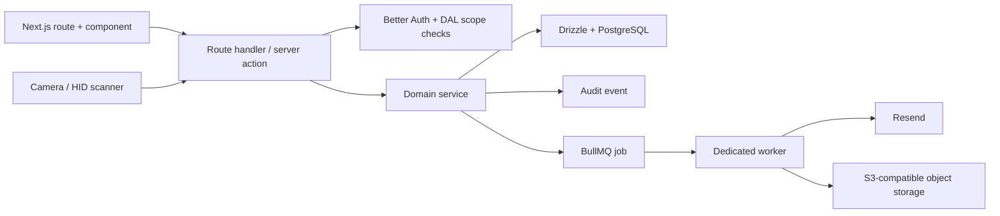
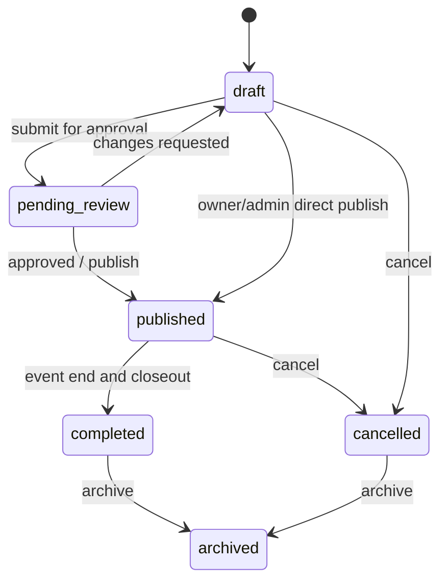
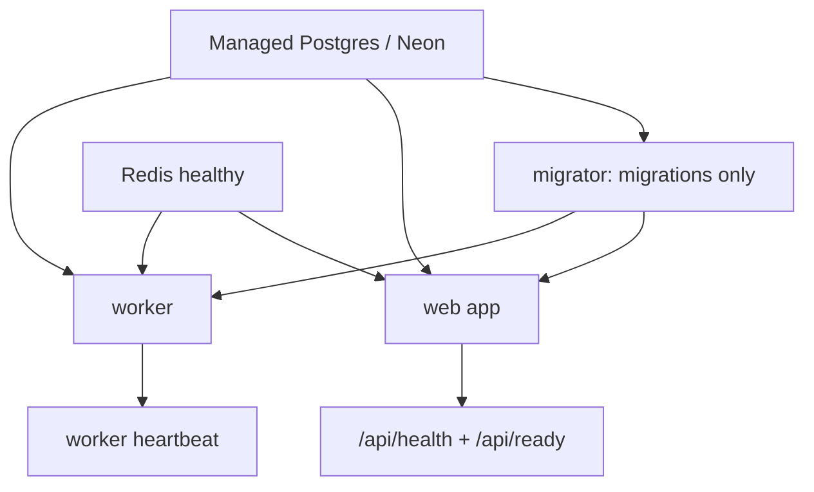

# SDC OS Flagship Platform — implementation blueprint for Gemini Pro 3.1

## 0. Mission and operating rules

Turn this repository into a production-quality, pre-launch **Club Operations Platform**. The product must enable a club to run members, events, attendance, certificates, communications, recruitment, finance, forms, projects, and operational records from one coherent system. The most important outcomes in this implementation cycle are:

1. A dependable certificate system that creates, delivers, verifies, revokes, and audits certificates.
2. A renamed and properly designed **Communications** feature (not an ambiguous “Jobs” feature) for announcements, targeted distributions, and delivery tracking.
3. A complete event lifecycle with public event pages, registrations, waitlists, invitations, sessions, attendance, communications, CSV operations, and certificate issuance.
4. Robust CSV import/export and QR/linear-barcode scanning, including reliable offline reconciliation.
5. A clean authentication/email experience, especially password reset, verification, and transactional email delivery.
6. A build, test, and Docker deployment pipeline that is demonstrably correct for Dokploy on the VPS.

Treat this document as an executable specification, not as a collection of optional ideas. Implement in the stated order, make focused improvements where code reality requires it, and do not create a parallel “v3” feature alongside the existing implementation. Consolidate to one canonical path per domain.

### Non-negotiable engineering rules

- Preserve the product’s existing Next.js/TypeScript/Drizzle/Postgres/Better Auth/BullMQ foundation. This is a targeted consolidation and completion, **not** a framework rewrite.
- Inspect the working tree before changing it. The repository currently contains uncommitted, partially implemented event and approval work. Retain correct intent only after making it parse, type-check, authorize correctly, and pass tests; do not blindly delete it.
- Do not expose, commit, log, or place secrets in code, test fixtures, documentation, Dockerfiles, or client bundles.
- All domain records must be scoped to an organization/club before any list, mutation, export, email audience, or scanner lookup. Never rely on a client-supplied organization ID without server-side membership authorization.
- Every mutating API route must use `withApiHandler`, Zod validation, the authorization helpers in `lib/dal/auth.ts`, audit logging, and transactional writes where multiple records must stay consistent.
- Use the existing `crypto.randomUUID()` convention for primary IDs. Do not introduce a new ID strategy unless an existing foreign key requires the retained `nanoid` value.
- All user-facing timestamps are stored as timezone-aware UTC timestamps and rendered in the event/club timezone. Never store a local date string as the source of truth.
- Use idempotency for imports, scan submissions, certificate issuance, and campaign delivery. Retries must not create duplicates.
- Data may be reset because the application is pre-launch, but reset only through an explicit, environment-gated reset command. Never leave a script that can silently wipe a database on ordinary deployment.
- Do not add speculative AI features, face recognition, payments, WhatsApp, calendar integrations, or a new microservice unless this blueprint explicitly calls for them. These are not needed for the flagship operational launch.

### Definition of done

Completion means all items below are true, not merely that pages render.

- `npm run lint`, `npm test`, a production build, and database migration verification pass from a clean checkout using documented non-secret test configuration.
- A fresh Docker Compose deployment can migrate, start the web app and worker, expose a healthy `/api/health`, and report worker readiness.
- Every feature below has API tests for authorization and validation plus end-to-end coverage for the main user journey.
- No duplicate certificate table/path, duplicate scanner path, or vague “job” feature remains as an active production route.
- All exports are safe against spreadsheet formula injection; imports give users a preview and row-level errors instead of mutating blindly.
- A user can reset a password from the visible login link, receive a real provider-delivered email in production, choose a new password, and sign in.

## 1. Repository reality: preserve, repair, and consolidate

### 1.1 Existing platform

This is a Next.js 16.2.10 App Router application using React 19, TypeScript, Tailwind/shadcn UI, Drizzle/PostgreSQL, Better Auth, BullMQ/Redis, Resend, Sentry, and PostHog. Key operational files are:

| Responsibility | Existing source of truth | Required direction |
| --- | --- | --- |
| Database schema | `lib/db/schema.ts` | Keep Drizzle; consolidate legacy/v2 duplicate tables and add explicit relations/indexes. |
| Authorization | `lib/auth.ts`, `lib/dal/auth.ts`, `lib/api-wrapper.ts` | Keep Better Auth and centralized guards; close route-level inconsistencies. |
| Web API convention | `lib/api-wrapper.ts` | Apply it to every mutation, including old routes. |
| Event logic | `lib/services/events.ts`, `lib/repositories/drizzle/*`, `app/api/events/**` | Consolidate onto one lifecycle/service and canonical route layout. |
| Certificates | `components/certificates/**`, `app/api/certificates/**`, `lib/workers/certificates.ts` | Keep pdfme and BullMQ; replace the three incompatible persistence models with one. |
| Emails | `lib/services/mailer.ts`, `lib/queues/email.ts`, `lib/workers/email.ts` | Keep Resend/BullMQ; add campaign recipients, delivery states, and production failure policy. |
| Scanning | `components/scanner/qr-scanner.tsx`, `app/(dashboard)/events/[slug]/scanner/page.tsx`, `lib/offline/db.ts` | Replace duplicate QR flows with one scanner that supports QR, barcode, HID scanners, and offline sync. |
| Deployment | `Dockerfile`, `docker-compose.yml`, `worker.ts` | Keep Docker Compose and Dokploy; make migration/worker startup and health reliable. |

The architecture already has useful seams: `lib/dal` for authenticated reads, `lib/services` for workflow logic, `lib/repositories` for persistence, `lib/queues` and `lib/workers` for async work, and API routes as transport. Strengthen these seams rather than putting new domain logic in client components.

### 1.2 Current implementation risks that must be fixed first

The following are evidence-based blockers. Treat them as Phase 0 work before feature expansion.

1. `npm run lint` currently fails with parsing errors in uncommitted event/approval code, including `app/(dashboard)/events/create/create-event-wizard.tsx`, `app/(dashboard)/manage/approvals/**`, `app/api/events/[id]/duplicate/route.ts`, `app/api/events/[id]/reject/route.ts`, `app/api/events/[slug]/check-in/route.ts`, and `components/events/register-button.tsx`. Resolve malformed escaping/characters rather than suppressing ESLint.
2. `npm run lint` also reports hooks declared after their initial use in `app/(dashboard)/manage/forms/page.tsx` and `components/notifications/notification-bell.tsx`, and an impure `Math.random()` render in `components/ui/sidebar.tsx`. Refactor to stable functions/state; do not disable the rules.
3. `npm test` currently has three passing tests but `tests/auth.test.ts` cannot import because `DATABASE_URL`, `BETTER_AUTH_SECRET`, `BETTER_AUTH_URL`, and `PASS_SECRET` are absent. Add a safe test environment/setup before importing modules that validate environment variables.
4. The visible “Forgot password?” link in `components/auth/login-form.tsx` points to `/forgot-password`, but no corresponding route is present. The backend does configure Better Auth’s `sendResetPassword` hook in `lib/auth.ts`; the user path is simply missing.
5. `lib/services/mailer.ts` logs and returns when Resend configuration is absent. That is acceptable only in explicitly labeled local development. It is not an acceptable successful delivery state for production jobs.
6. The event model is richer than the UI, but it is split across an event page, a create wizard, separate management pages, both `/api/scanner/check-in` and `/api/events/[slug]/check-in`, and a second session-attendance route. Consolidate rather than adding another UI.
7. Certificate code has three incompatible representations: `certificateTemplates` + `certificates` near `lib/db/schema.ts:204`, `certTemplates` + `certificatesV2` near `lib/db/schema.ts:600`, and worker code that expects the latter while parts of the UI/API use the former. This is the primary certificate defect.
8. `LocalMockStorageService` in `lib/services/storage.ts` writes PDF assets into `public/uploads`. Containers and production server filesystems are not durable object storage; replace it before enabling certificate distribution.
9. CSV exists but is not a finished integration. `app/api/events/[id]/import/route.ts` creates users/registrations row by row without a preview, mapping, scoped event check, import record, idempotency report, or robust field policy. Exports use `Papa.unparse` without formula neutralization.
10. The compose configuration has Redis, migrator, app, and worker but no local Postgres service despite README language implying one. The worker does not depend on the migrator, has no health check, and runs from the `builder` stage, carrying development tooling into production.

### 1.3 Existing data structures to retain or deliberately replace

Do not pretend these tables do not exist. Migrate/rebuild them deliberately.

- `events` already has title, slug, type, domain, capacity, visibility, schedule, creator, `metadata`, v2 payment fields, forms, staff/checklist JSON, and certificate/budget IDs. The table’s current event status enum is only `draft | published | cancelled | completed`.
- `registrations` already has a unique `(eventId, userId)` constraint, pass code, status, check-in timestamps, attendance method, face fields, and response JSON. Keep the unique registration invariant.
- `event_sessions` and `session_attendance` already exist. The latter has a unique `(sessionId, userId)` constraint; retain it.
- `notifications` is a usable per-user in-app inbox. The present `/api/announcements` route only fan-outs in-app notifications; it does not represent an email campaign or delivery log.
- Better Auth’s user, session, account, organization/member/invitation tables are the identity base. Use them rather than creating a competing membership system.
- The platform already contains forms, applications, finance, content, projects, inventory, audits, and task tables. Scope them to an organization as part of the tenancy hardening pass, but do not destabilize unrelated working modules.

## 2. Architectural decision: custom completion, not a replacement product

Research established open-source options before implementation, then make the following decisions.

| Evaluated project | What it can teach us | Decision |
| --- | --- | --- |
| [Eventyay / Open Event](https://github.com/fossasia/open-event) | Mature events support: attendee lists, check-in, sessions, exports, invitations, and event operations. | Do **not** integrate or fork. It is a separate Python/event platform with its own identity, ticketing, data model, and deployment. Use its feature taxonomy as a completeness checklist for our native event module. |
| [pretix](https://docs.pretix.eu/dev/api/resources/checkin.html) | Explicit ticket redemption/check-in APIs and offline scanner concepts. | Do **not** add it. SDC needs club operations, not a second commerce/ticketing installation. Borrow the idea of idempotent check-in outcomes and scanner-ready token validation. |
| [pdfme](https://github.com/pdfme/pdfme) | TypeScript/React template designer and Node/browser PDF generation with JSON templates. | Retain and complete the existing pdfme integration. It directly matches the stack and eliminates the need for a certificate SaaS. |
| [ZXing Browser](https://github.com/zxing-js/browser) | Browser camera decoding of multiple 1D/2D formats, including a hardware-camera workflow. | Add `@zxing/browser` as the barcode-capable scanning engine. Retain HMAC pass generation/validation server-side. |
| [Formbricks](https://github.com/formbricks/formbricks) | A self-hosted TypeScript/Next.js form/survey product and a reference for field builders. | Do **not** deploy it alongside SDC OS. It introduces another auth/database/AGPL operational surface. Extend the repository’s existing forms feature for event registration. |
| [listmonk](https://github.com/knadh/listmonk) | Campaign/list/delivery concepts for self-hosted newsletters. | Do **not** deploy it for launch. The existing Resend + BullMQ stack is the correct transport. Build a native Communications domain with campaign recipient snapshots and delivery records. Reconsider listmonk only if newsletter-scale requirements exceed Resend/BullMQ later. |

The resulting architecture is a **modular monolith**:



## 3. Tenancy, roles, and cross-cutting invariants

### 3.1 Organization scope

The product vision is a platform for clubs, not a single hard-coded club. Better Auth already has organization capability, but business tables are mostly unscoped. Add a non-null `organizationId` foreign key (with a safe pre-launch migration/reset strategy) to every operationally owned table: events, registrations via event, sessions via event, certificates, templates, campaigns, imports, forms, applications, finance, inventory, content, projects, tasks, audit events, and settings.

For tables whose parent already has organization scope, avoid redundant IDs unless they materially improve query/index performance. For example, `event_sessions` can scope through `eventId`; `session_attendance` through session/event. Add `organizationId` to audit and delivery records because they must be filterable without an expensive chain.

Implement these helpers in the DAL/service layer:

- `requireActiveOrganization()` — resolves the current organization and membership from the server session, never from client input.
- `requireOrganizationRole(roles)` — rejects unauthenticated/non-member/insufficient-role access.
- `assertEventAccess(eventId, allowedRoles)` — retrieves an event scoped to the active organization and checks event ownership/domain policy.
- `assertResourceOrganization(record.organizationId)` — a defensive guard used before mutation of records resolved by primary ID.

Add composite indexes that match the dashboard’s queries, e.g. `(organization_id, status, starts_at)` for events, `(organization_id, user_id, created_at)` for notifications, `(organization_id, status, created_at)` for campaigns, and `(organization_id, event_id, user_id)` for registrations where appropriate.

### 3.2 Role policy

Keep existing Better Auth roles (`owner`, `admin`, `lead`, `co_lead`, `event_lead`, domain leads, `member`, `applicant`, `outsider`) but define policy in one place. Do not scatter raw role arrays through new UI code.

| Capability | Owner/admin | Lead/event lead | Member | Applicant/outsider |
| --- | --- | --- | --- | --- |
| Club settings, roles, global exports | Full | No | No | No |
| Create/edit own-domain event drafts | Full | Allowed when assigned/domain-authorized | No | No |
| Publish/cancel events | Full; optional approval bypass | Allowed only after approval policy permits | No | No |
| View/scan event attendees | Full | Assigned/domain event only | Own pass only | No |
| Issue/revoke certificates | Full | Assigned event/template only | View/download own valid certificates | Verify public certificate only |
| Send campaigns | Full | Audience limited to assigned event/domain | No | No |
| Import/export attendee CSV | Full | Assigned/domain event only | No | No |

Expose a named policy function for every permission so tests can assert it. UI hiding is only a convenience; API authorization is mandatory.

### 3.3 Audit and privacy rules

Use `logAuditEvent` for every meaningful administrative action: event status changes, imports, campaign scheduling/cancellation, certificate issue/revoke/reissue, user role change, and attendance override. Audit payloads must contain stable resource IDs and safe before/after summaries, never passwords, raw reset tokens, QR secrets, or whole unredacted CSV files.

Add communication preferences (email opt-out by non-essential campaign category), an immutable suppression/bounce representation, and role-limited PII exports. Certificate verification must expose only certificate metadata required to prove validity (recipient name, issuer/club, event title, issued date, status), never email or internal IDs.

## 4. Canonical target data model and migration policy

### 4.1 Migration/reset policy

Because launch has not occurred, normalize the schema now. Do not edit Drizzle’s old migration files or snapshot history in place. Create a forward migration for the canonical schema and an explicit `scripts/reset-prelaunch.ts` only if a fresh data reset is desired.

The reset script must require all of the following before it touches data:

1. `NODE_ENV` is not a normal production environment, **or** a separately supplied pre-launch acknowledgement is present.
2. `CONFIRM_PRELAUNCH_RESET` exactly equals a documented, non-default confirmation value.
3. The target database identity is printed without credentials and logged as an audit/deployment event.
4. The command is never called by normal application startup or `docker compose up`.

For the VPS/Dokploy pre-launch reset, document an operator-only runbook and take a backup first. A clean schema is acceptable; an accidental post-launch deletion is not.

### 4.2 Event domain

Make `events` canonical. Move unstructured planning-only JSON into normalized tables when it needs querying/auditing; retain `metadata` only for rare extensibility.

Use these tables/fields:

- `events`: `organizationId`, title, unique per-organization slug, summary/description, type, domain, cover asset, physical/online location, timezone, starts/ends, registration opens/closes, capacity, visibility, lifecycle status, creator, certificate policy/template version, and timestamps.
- `event_staff`: event/member/role, one row per assignment. Replace JSON `staff` where it drives permissions or displays.
- `event_sessions`: event ID, title, description, location, schedule, capacity, optional session check-in requirement, and sort order.
- `event_registrations`: event/user, lifecycle status, pass ID/code, registration answers, source (`self`, `invite`, `csv_import`, `admin`), attendance fields, and timestamps. Retain a unique `(event_id, user_id)` invariant.
- `event_waitlist_entries`: event/user, ordered position, invited/promoted timestamps, expiry. Do not overload a generic status with all waitlist workflow state.
- `event_invitations`: event, recipient email/user, unique opaque token hash, sent/accepted/expired/revoked timestamps, inviter, and role/audience metadata.
- `attendance_scans`: organization/event/session optional, registration, scanner actor/device ID, source (`qr_camera`, `barcode_camera`, `hid`, `manual`, `offline_sync`), idempotency key, raw-token hash only, outcome, and timestamp. This is the immutable attendance ledger; `checkedInAt` remains a fast current-state projection.

Adopt one explicit lifecycle:



Use `draft | pending_review | published | cancelled | completed | archived` as persisted lifecycle values. Registration availability is computed from `published`, registration open/close time, capacity, invitation/visibility policy, and cancellation—not a separate ambiguous event status. Add database constraints and service checks that `endsAt > startsAt`, close time is valid, capacity/price are non-negative, and `isPaid` agrees with price.

### 4.3 Certificates: one model only

The target is one versioned certificate model. Remove active production reads/writes of all three current paths after migration:

- Legacy: `certificateTemplates` and `certificates` (`basePdf`, `schemas`, `verifyCode`, `hash`).
- Alternate: `certTemplates` and `certificatesV2` (`backgroundUrl`, `fields`, `verifyId`).
- Worker path: `lib/workers/certificates.ts`, which currently reads `certTemplates` and writes `certificatesV2`.

Use these canonical tables (choose snake/camel naming consistent with the final Drizzle convention, but do not mix conventions within the domain):

- `certificate_templates`: organization, stable template ID, name, description, active flag, creator, current version ID, timestamps.
- `certificate_template_versions`: template, immutable version number, pdfme `Template` JSON, background asset key, field schema, checksum, creator, published timestamp. Never mutate a published version used by issued certificates.
- `certificates`: organization, certificate UUID, template version, recipient user nullable only for explicitly allowed external recipients, event/session optional, immutable render input JSON, object key, SHA-256 content hash, public random verification code/hash, status (`issued`, `revoked`, `superseded`), issued/revoked/reissued metadata, and unique idempotency key.
- `certificate_deliveries`: certificate, channel, recipient address snapshot, provider message ID, job ID, attempt count, state (`queued`, `sent`, `delivered`, `bounced`, `failed`), timestamps, and safe failure reason.

Do not encode certificate state in filename, temporary local disk, or a client-only preview. The sole verification endpoint finds a certificate by a high-entropy public code, validates active status, and returns an intentionally minimal public DTO.

### 4.4 Communications domain

Rename “Jobs” to **Communications**. In the UI, call the main surface “Communications” and its unit of work a “Campaign” or “Announcement,” never “job.” BullMQ jobs remain internal implementation detail.

Add:

- `communication_templates`: reusable subject/body/channel templates, organization, version, author, active flag.
- `campaigns`: organization, name, category (`announcement`, `event_invitation`, `event_update`, `event_reminder`, `certificate_delivery`, `operational`), channel selection (`in_app`, `email`), content snapshot, audience definition snapshot, schedule, status (`draft`, `scheduled`, `sending`, `sent`, `cancelled`, `failed`), creator, event optional, timestamps.
- `campaign_recipients`: campaign, user optional, email snapshot, dedupe key, eligibility/suppression reason, in-app state, email state, provider message ID, attempt count, timestamps. Unique `(campaign_id, normalized_recipient)`.
- `communication_preferences` and `email_suppressions`: per-user preference/suppression data. Transactional password reset, verification, security, and certificate issuance are never disabled by marketing-style preferences.

Snapshot recipients at send/schedule time. Do not re-evaluate “all members” after a campaign begins, because results become non-reproducible. A campaign must have a deterministic audience count, preview recipient sample, and test-send mode before it can be scheduled.

### 4.5 Import/export domain

Create `data_imports` and `data_import_rows` for high-value imports. The import record stores organization/event scope, type, source filename/hash, column mapping, actor, state, totals, created/processed timestamps, error report object key, and idempotency hash. Row records or a compressed error artifact store row number, normalized status, safe error codes, matched user/registration IDs, and action outcome.

Retain Papa Parse. It is already installed and used; the missing piece is a safe workflow, not another parsing library.

## 5. Feature specification: events

### 5.1 Route and information architecture

Use the existing `/events` base route and preserve old valid URLs with redirects where names are changed. The following is the canonical UI map:

| Route | User | Required behavior |
| --- | --- | --- |
| `app/(dashboard)/events/page.tsx` | Signed-in user | Upcoming/past filters, search, status badges, role-aware create/manage actions. No duplicate decorative controls. |
| `app/(dashboard)/events/create/page.tsx` | Authorized lead/admin | Validated event wizard. Save draft at any point; no accidental publication. |
| `app/(dashboard)/events/[slug]/page.tsx` | Member/public according to visibility | Event landing page, registration state, schedule, capacity, accessibility and share metadata. |
| `app/(dashboard)/events/[slug]/manage/page.tsx` | Authorized organizer | Tabs: Overview, Registrations, Sessions, Scanner, Communications, Certificates, Settings, Audit. This replaces scattered management destinations. |
| `app/(dashboard)/events/[slug]/scanner/page.tsx` | Authorized staff | Canonical scanner page only. |
| `app/(dashboard)/events/[slug]/certificates/page.tsx` | Authorized organizer | Eligibility, template version, issue/reissue/revoke, delivery status. |
| `app/(dashboard)/events/[slug]/imports/page.tsx` | Authorized organizer | Import wizard and export history; may also appear as a Registrations tab. |

The existing `app/(dashboard)/events/[slug]/page.tsx` is a useful starting page, but it currently loads the first certificate template without event/template-version selection and checks only basic published/role visibility. Correct this as part of the rebuild.

### 5.2 Create/edit workflow

Replace the client-owned ad hoc state in `create-event-wizard.tsx` with a React Hook Form + Zod schema shared with the server. The existing `lib/validators/event.ts` is the starting location. The browser must never be the only enforcer of slug uniqueness, status validity, dates, capacity, or prices.

Wizard stages:

1. Basics: title, generated editable slug, type, domain, description, cover image, visibility.
2. Schedule and place: timezone, starts/ends, registration opens/closes, location/online URL, sessions optional.
3. Registration: capacity, waitlist rule, custom registration form, invitation policy, consent text.
4. Operations: staff assignments, checklist, budget linkage, communications defaults.
5. Certificates and review: template version, eligibility rule, preview summary, save draft or submit for approval.

Server behavior:

- Create defaults to `draft`; only an explicit authorized transition publishes.
- Slugs are unique within the organization and safe for URLs; retry a deterministic suffix on collision only if user accepts it.
- Creating/editing an event emits audit events.
- Editing published events with registered attendees must surface a confirmation for material schedule/location/cancellation changes and can trigger a drafted event-update campaign, never automatic bulk email without user confirmation.
- Cancellation requires a reason, disables new registrations, preserves attendance/certificates/audit history, and prepares an explicit audience preview before communication.
- Archive is a view/lifecycle operation; do not hard-delete an event that has registrations or certificates.

### 5.3 Registration, capacity, invitations, and sessions

Move capacity decisions into a transaction/service. `EventService.registerForEvent` currently checks count then inserts through repositories; strengthen it so concurrent registrations cannot overbook a limited event. Lock/select or atomically reserve capacity in PostgreSQL and return one of `confirmed`, `waitlisted`, `already_registered`, `registration_closed`, `invite_required`, or `forbidden`.

Rules:

- Confirmed count includes only active confirmed/checked-in registrations as defined by policy, never cancelled entries.
- Waitlist promotion is an explicit transactional action that generates a deadline and an invitation/notification. Do not silently convert every waitlist row.
- Invite-only events verify a single-use, hashed invitation token against email/user, expiry, and event organization before registration.
- A user cannot self-register twice; preserve the unique event/user database constraint.
- Registration responses are validated against the versioned event form schema and stored with that schema version.
- Sessions are created/edited within the event management page. Their times must remain inside the event’s window unless an authorized admin overrides with an audit reason.
- Session attendance uses the same scan service with an optional `sessionId`, not a separate implementation.

### 5.4 Event API contract

Prefer resources under the existing `/api/events` namespace. Exact filenames may follow App Router dynamic route conventions, but behavior must be stable.

- `GET /api/events` — scoped, paginated/filterable event list. Public listings return only published public/member-visible records.
- `POST /api/events` — create draft with server-resolved organization/creator.
- `GET/PATCH /api/events/[id]` — read/update after `assertEventAccess`; PATCH supports explicit safe fields only.
- `POST /api/events/[id]/transitions` — body `{ action, reason? }`; performs allowed lifecycle transition atomically. Replace one-off approve/reject/archive endpoints after adding compatibility redirects where appropriate.
- `POST /api/events/[id]/registrations` and `DELETE /api/events/[id]/registrations/me` — self-service registration/deregistration.
- `GET /api/events/[id]/registrations` — organizer-only paginated roster. `PATCH /api/events/[id]/registrations/[registrationId]` handles explicit staff override with audit reason.
- `POST /api/events/[id]/sessions`, `PATCH/DELETE /api/events/[id]/sessions/[sessionId]` — organizer-only session management.
- `POST /api/events/[id]/attendance` — canonical staff-only scan/manual endpoint; described in Section 8.
- `POST /api/events/[id]/invitations` and `POST /api/events/invitations/[token]/accept` — invite workflow.
- `POST /api/events/[id]/imports` and `GET /api/events/[id]/exports/registrations` — CSV workflow, described in Section 7.

Return typed, user-safe error codes. Never make client UI infer an error from an English sentence.

## 6. Feature specification: certificates

### 6.1 Template designer and storage

Keep the existing pdfme Designer integration in `components/certificates/designer.tsx`/`designer-wrapper.tsx`, but reconnect it exclusively to the canonical template-version API. A template is valid only when server-side pdfme validation succeeds and every required field key is described in the version schema.

Implement an `ObjectStorage` interface in `lib/services/storage.ts` with:

- `putObject({ key, body, contentType, checksum })`
- `getSignedReadUrl({ key, expiresIn })`
- `deleteObject({ key })` only for unused/unreferenced draft artifacts

Use an S3-compatible provider such as Cloudflare R2, S3, or MinIO. The deployment variables must be validated server-side and never be `NEXT_PUBLIC_*` secrets. Replace `LocalMockStorageService` for all production code. A strictly local storage adapter is permitted only in development/test behind an explicit adapter selection; no `public/uploads` certificate output in production.

Template workflow:

1. Upload background/base PDF through a size/type-validated signed upload flow or server endpoint.
2. Create a draft version and open the pdfme designer.
3. Save structured template JSON and field definitions.
4. Server validates template, renders a deterministic preview using fixture values, and stores a preview object.
5. Publish an immutable version. Events reference the published version, never a mutable draft.

### 6.2 Issue, render, deliver, verify, revoke

Certificate issue operation requirements:

- Eligibility is server-calculated from event registration/session attendance/status. An organizer may override only with a reason that is audited.
- On request, calculate an idempotency key from organization, template version, recipient, event/session, and explicit issue type. A retry returns the existing certificate rather than rendering another one.
- Insert a queued certificate row and BullMQ job in a transaction/outbox pattern. Use a stable BullMQ job ID to resist duplicate enqueueing.
- The worker loads only canonical template/certificate data, renders with `PdfmeRenderer`, hashes the completed bytes, stores the immutable PDF object, updates status, creates a delivery record, and queues/sends its email.
- On render/email failure, keep visible failed state and retry metadata; do not mark a certificate delivered.
- Reissue creates a new certificate/audit relationship or a clearly recorded revision policy; it must never overwrite an immutable historical object without an audit trail.
- Revoke changes public verification state immediately and records actor, timestamp, reason, and replacement reference if any.

Public surfaces:

- `GET /api/certificates/[publicCode]/verify` returns non-sensitive verification data and 404/invalid equivalently where privacy demands it.
- `app/verify/[code]/page.tsx` renders valid/revoked/unknown state with no account requirement.
- Signed user downloads are through a server-authorized endpoint that issues a short-lived storage URL only for the recipient or a permitted organizer.

### 6.3 Certificate UI

Provide:

- `/admin/certificates`: templates and organization-wide issued certificate search.
- `/admin/certificates/create`: template creation/versions, replacing duplicate legacy create paths.
- `/certificates`: member’s own issued/revoked certificate list and downloads.
- Event management Certificates tab: template selection, eligibility counts, recipient preview, issue selected/all, progress, delivery failures, revoke/reissue controls.

Do not use an iframe that points at a filesystem path. All previews and downloads use a generated blob or authenticated signed storage URL.

## 7. Feature specification: communications and CSV

### 7.1 Communications (the renamed Jobs feature)

The current `app/api/announcements/route.ts` does only bulk insertion into `notifications`. Preserve the underlying inbox behavior but move it behind campaign creation so notifications, email, auditing, recipient selection, preview, scheduling, retries, and status agree.

Communications UI requirements:

- Organization Communications page lists campaigns with state, sender, category, scheduled/sent times, recipient count, delivery summary, and filters.
- Compose page supports title, subject, rich/safe body, CTA link, event context, channel choice, template, audience builder, test recipient, and schedule.
- Audience presets: all active members, selected roles, a named domain, event confirmed registrants, event waitlist, non-checked-in registrants, selected CSV/import rows, and manually selected members. All must be server-resolved and organization-scoped.
- Preview displays the exact recipient count, de-duplicated sample, excluded/suppressed count, and both email and in-app render.
- Send now, schedule, cancel-before-send, test-send, and duplicate-as-draft are explicit actions. Require a confirmation phrase for organization-wide sends over a configurable threshold.
- The event management communications tab prefilters to that event and provides attendee update, invitation, reminder, cancellation, and certificate-related campaign starters.

Worker behavior:

- Generate recipient records before enqueueing delivery jobs.
- Enqueue one idempotent delivery job per recipient/channel, respecting concurrency and provider rate limits.
- Persist provider message IDs and status transitions. Add a verified Resend webhook endpoint for delivered/bounced/complained data if the selected plan/provider supports it.
- A campaign is `sent` only when all eligible recipients are terminal (`sent`, `delivered`, suppressed, or a visible failure state); show partial failures honestly.
- Password reset, email verification, login/security notices, and certificate mail remain transactional flows. They can reuse delivery infrastructure but must not be represented as mass announcements.

### 7.2 CSV import workflow

Replace direct “upload then mutate” behavior with this wizard:

1. Choose import type and scoped target (for example Event registrations for one authorized event).
2. Upload CSV, enforce MIME/extension/size/row-limit rules, calculate file hash, parse in memory with Papa Parse, and reject parser errors early.
3. Display headers and require explicit mapping to canonical fields. For event registrations: `email` required, `name`, `status`, `phone`, `branch`, `year`, custom answers optional.
4. Normalize (trim, lower-case email, Unicode/whitespace handling), validate schema, detect duplicate rows, duplicate existing registrations, invalid status values, and foreign-organization conflicts.
5. Show a non-mutating preview: total, valid, invalid, duplicate/skip, update, and create counts, with row-level errors. The user chooses allowed conflict policy (`skip`, `update permitted fields`, or `fail entire import`); never implicit overwrite.
6. Confirm with an idempotency key/file hash. Small imports may process transactionally; large imports enqueue a worker job that records progress and is safe to retry.
7. Provide a downloadable error CSV/report and an import history with actor/audit event.

Do not automatically create an active member account for an arbitrary email without an explicit import policy. For external event attendees, create a safe invite/guest representation or an unverified user state that cannot gain member privileges. Only an approved club workflow may promote a user to member.

### 7.3 CSV export workflow

Keep Papa Parse’s `unparse`, but centralize export serialization in `lib/services/csv.ts`.

- Exports are limited to authorized organization scope and a documented column allowlist.
- Include an export audit record with actor, filters, dataset count, and request ID.
- Normalize filenames; set `text/csv; charset=utf-8` and a content disposition attachment filename.
- Guard against formula injection: for human-targeted spreadsheet CSVs, prefix any user-controlled cell beginning with `=`, `+`, `-`, or `@` with a tab or otherwise follow the selected documented mitigation. Apply this recursively to flattened answer fields. This is necessary because spreadsheet programs interpret formula-leading cells as executable formulas; see [OWASP CSV Injection](https://owasp.org/www-community/attacks/CSV_Injection).
- Use a separate API or explicit header option for machine-oriented raw exports if needed; never silently give an unsafe raw export to a human download button.

## 8. Feature specification: attendance and barcode scanning

### 8.1 One scanner, three input modes

Replace the overlapping `QrScanner`, `QrScannerFixed`, global scanner endpoint, and event-slug scanner flow with a single reusable `AttendanceScanner` component plus a single canonical attendance service/API.

Inputs supported by the same component:

1. Camera QR scanner.
2. Camera barcode scanner using dynamically loaded `@zxing/browser`; support the agreed formats at minimum QR Code, Code 128, Code 39, EAN-13, EAN-8, UPC-A, and UPC-E.
3. USB/Bluetooth HID barcode scanners. These behave as keyboards, so collect focused keystrokes until Enter/Tab (with a short inter-key timeout), then submit the complete token through the same validation path. Include a visible “scanner input ready” focus target and manual paste fallback.

Remove duplicate `useEffect` cleanup and stop/start race behavior currently present in `components/scanner/qr-scanner.tsx`. The component must stop camera tracks on unmount/tab change, avoid duplicate submission while a request is pending, handle permission errors visibly, and allow camera switching/uploaded-image decoding only when useful.

### 8.2 Token and scan contract

Continue using server-verified signed pass data from `lib/passes/qr.ts`; never trust a client-side event ID or decoded payload as authorization. Standardize a token payload/version containing at least pass/registration identifier, event identifier, issuance/version, nonce, issued/expiry timestamps, and signature. Hash raw token material before storing attendance history.

Canonical endpoint: `POST /api/events/[id]/attendance`.

Request:

```json
{
  "token": "scanned-value",
  "sessionId": "optional-session-id",
  "source": "qr_camera",
  "idempotencyKey": "uuid-generated-per-scan"
}
```

Response must distinguish `checked_in`, `already_checked_in`, `invalid_token`, `wrong_event`, `registration_not_confirmed`, `waitlisted`, `cancelled`, `expired`, `forbidden`, and `offline_queued`. Do not return raw internal exception text.

The service verifies scanner staff scope, resolves the event by organization-scoped ID, validates the token/event/registration match, and atomically creates an attendance scan/projection update. Replaying the same idempotency key returns the original outcome. A second valid scan should report “already checked in” without mutating again.

### 8.3 Offline mode

Retain IndexedDB (`lib/offline/db.ts`) but revise its stored record to include a locally generated ID/idempotency key, event/session ID, token, source, scan time, and local status. Queue only after basic local syntax/signature validation if feasible; server remains authoritative.

When online returns:

- Sync sequentially/bounded-concurrently to the canonical endpoint.
- Remove a pending record only after a terminal server result is stored locally.
- Retain records for transient network failure; show retry count and user-readable resolution guidance for conflicts.
- Do not delete `wrong_event`, invalid, or failed records invisibly. Show an import-like reconciliation list to staff.

Session scanning calls the same endpoint with `sessionId`; no second auth model, token model, or offline store.

## 9. Authentication, password reset, verification, and email correctness

### 9.1 Complete the visible password-reset flow

The existing auth configuration already calls `Mailer.sendPasswordReset(user.email, url)`. Implement the missing UI routes with Better Auth client APIs appropriate to the installed Better Auth version; inspect its installed types/docs before coding rather than inventing endpoints.

- Add `app/(marketing)/forgot-password/page.tsx` (or retain the exact linked `/forgot-password` route) with email input, client-side validation, non-enumerating success message, loading and retry behavior.
- Request a reset using Better Auth’s supported client/server mechanism; do not directly manipulate account/password tables or mint a home-grown reset token.
- Add the reset destination route expected by Better Auth, read/validate its token through Better Auth, enforce the same password policy as registration, confirm password, and return users to sign-in after success.
- Make reset requests rate-limited independently by IP and normalized email, and audit only aggregate/safe security events.
- Test valid, expired, used, malformed, and rate-limited reset paths. The response for an unknown email must be indistinguishable from a known one.

### 9.2 Verification and mail policy

`lib/auth.ts` has `requireEmailVerification: false` while `withApiHandler` rejects sessions that are not verified. Resolve this policy contradiction explicitly.

Recommended policy: users may register and receive a verification email, but verification must be complete before protected state-changing operations. Permit only an allowlisted set of unauthenticated/verification/reset/auth routes through the wrapper. Add a resend-verification UI with rate limiting. If the chosen Better Auth setup requires `requireEmailVerification: true`, confirm sign-up/sign-in behavior in integration tests and adopt it consistently.

For production:

- Validate `RESEND_API_KEY`, `EMAIL_FROM_ADDRESS`, `BETTER_AUTH_URL`, and `NEXT_PUBLIC_APP_URL` as a readiness condition when email features are enabled.
- `Mailer.sendEmail` must throw/return a typed non-delivery result in production when configuration is absent; queued jobs must fail visibly and retry according to policy, not appear successful.
- Replace hand-built strings incrementally with React Email templates where this improves consistency. Escape/render untrusted values safely and test links.
- Configure a verified sending domain, reply-to policy, bounce/complaint webhook verification, and from-name from server env.

## 10. Deployment, environment, and background worker plan

### 10.1 Environment contract

Update `.env.example` with every required key, category comments, and no real values. At minimum document database, Redis, Better Auth, app URL, HMAC/QR secret, email, object storage, Sentry, PostHog, and optional integrations. Validate server-only variables in `lib/env.ts`; client-safe values must use `NEXT_PUBLIC_` only when truly public.

Add `.env.test.example` or a `tests/setup.ts` that supplies safe placeholder URLs/secrets before imports. Tests must never read `.env.local` or production credentials. Use a disposable test database or mocks by test type.

### 10.2 Docker Compose/Dokploy

Keep the Dokploy deployment model but correct the operational graph:



- The worker must depend on successful migrations as well as Redis health. It currently does not.
- Keep managed Neon/Postgres as the production database. If local Compose needs a database, add a `postgres` service only in a documented local-development profile; never accidentally start a separate empty database in production.
- Split web and worker runtime images/commands deliberately. Do not rely on a builder image with all development dependencies as the permanent worker runtime. Add a reproducible worker build step (for example an esbuild/tsup compilation) and a minimal runtime image with only required production dependencies.
- Make migrations idempotent and run exactly once per deployment. Do not use `db:push` in production.
- Add explicit app health/readiness checks: `/api/health` can report DB/Redis; add `/api/ready` that is suitable for routing only when dependencies are ready. Add a worker heartbeat in Redis/database and include it in administrative/system health—not necessarily the public web readiness endpoint.
- Make `REDIS_URL`/password configuration consistent. The compose Redis service currently requires a password while URLs must encode it; verify this in Docker integration tests.
- Keep Docker network configuration compatible with Dokploy’s external network, but document a local override so contributors do not require that external network.
- Run the same migration/build/test commands in CI before push-based deployment. A deployment must stop on migration/build failure.

### 10.3 Observability and recovery

- Continue Sentry and PostHog only with privacy-respecting configuration; never send reset tokens, pass values, certificate inputs, or complete CSV rows.
- Use structured Pino logs with request/job/campaign/import/certificate IDs.
- Add queue dashboards/admin metrics behind admin authorization or protected infrastructure access, not a public route.
- Document backup schedule for Postgres and object storage, migration rollback expectations, Redis’s disposable nature, and certificate object retention.

## 11. Testing strategy and required scenarios

### 11.1 Test layers

Add the appropriate tooling rather than relying solely on existing smoke tests.

- Unit tests: validators, permission policy, state transitions, CSV sanitizer/mapping, pass verification, template eligibility, audience resolution.
- Service/integration tests: Drizzle/Postgres transactions for capacity, waitlist promotion, invitation redemption, scanner idempotency, certificate idempotency, campaign recipient snapshots, and import conflict handling.
- Route tests: authentication, role/organization isolation, validation errors, wrapper rate limit/error behavior, public verification privacy behavior, webhook signature checks.
- Component tests: form validation, scanner HID buffer behavior, import preview, campaign confirmation, password reset states.
- End-to-end tests (add Playwright if not present): sign-up/verification, password reset, event lifecycle, attendee registration, organizer scan, CSV import/export, certificate verification/download, and announcement/campaign test-send.
- Docker smoke test: Compose migrator/app/worker health, one fake queued email, one fake certificate job, and app readiness.

### 11.2 Mandatory acceptance scenarios

1. User registers for a published, limited-capacity event; two concurrent final seats produce exactly one confirmed registration and one waitlist response.
2. An event lead from Club A cannot read, export, scan, invite, or mutate an event from Club B by changing an ID/slug.
3. An invite-only event rejects a normal registration and accepts exactly one valid unexpired invitation for the intended user/email.
4. A confirmed attendee scans a QR code twice; first is `checked_in`, second is idempotent `already_checked_in`, and exactly one attendance ledger record represents the check-in projection.
5. QR, Code 128/HID input, and an offline queued scan exercise the same server validation and correct source audit records.
6. An invalid/wrong-event/expired token never changes attendance and never exposes another attendee’s details.
7. CSV preview identifies bad emails, duplicates, invalid statuses, and conflicts before confirmation. Replaying the completed import is safe.
8. CSV export neutralizes a cell beginning `=HYPERLINK(...)` or `@...` and stays scoped to the authorized event/organization.
9. Certificate issuance for 100 eligible attendees creates one canonical certificate per idempotency key, stores durable objects, survives a worker retry, sends/records delivery, verifies publicly, and revokes immediately.
10. A template update after issuance creates a new version and does not change the existing certificate’s render input/output.
11. An announcement to “event attendees” snapshots the audience, sends a test recipient only in test mode, honors suppression, and records individual delivery states.
12. The visible Forgot Password link completes a reset without user enumeration; an expired or already-used link fails safely.
13. Startup with missing production email or object-storage configuration fails readiness rather than silently claiming success.
14. A clean checkout passes lint, type/build, tests, migrations, and Docker smoke test without manually providing production secrets.

## 12. Ordered implementation plan

### Phase 0 — establish a reliable baseline

1. Read current dirty changes and decide which incomplete behavior belongs in the consolidated target. Fix all parser-invalid characters/escaping first.
2. Repair the lint failures listed in Section 1.2 properly; do not add blanket lint disables.
3. Add test env/setup and make `npm test` deterministic without production configuration. Keep true integration tests behind a clearly documented disposable database command.
4. Run and record `npm run lint`, `npm test`, and `npm run build`. Fix current build/type issues before broad feature work.
5. Inventory all `app/api/**` mutations; wrap any route that is not already protected by `withApiHandler`, then add focused authorization tests.

### Phase 1 — data and authorization foundation

1. Implement organization resolution/scoping helpers and permission policy tests.
2. Add organization fields/indexes/relations in Drizzle and generate a forward migration. Decide/reset pre-launch data only through the guarded runbook.
3. Normalize event lifecycle/schema and implement a transition service. Add audit events.
4. Establish canonical certificate tables/relations and a migration/backfill/reset plan; stop new code from importing legacy table symbols.
5. Add campaigns, recipients, preferences, suppressions, imports, import rows, and attendance scans schema.

### Phase 2 — complete events

1. Repair and replace the current event create/edit wizard with shared Zod validation and save-draft/submission semantics.
2. Create the canonical event management page/tab system, preserving redirects from existing management URLs.
3. Implement transactional registrations, waitlist, invitation, custom-form, session, cancellation, and archive workflows.
4. Replace fragmented event endpoints with the documented API contract and compatibility paths where required.
5. Add corresponding tests before proceeding to later features.

### Phase 3 — complete certificate management

1. Implement object storage adapter/configuration and remove production use of `LocalMockStorageService`.
2. Reconnect pdfme designer/preview to versioned canonical templates.
3. Build idempotent issue/render/store/deliver/revoke/reissue worker flows with delivery records.
4. Complete member, organizer, and public verification UIs; remove legacy duplicate certificate pages/routes after redirects or deliberate deletion.
5. Test render failure/retry and storage/email behavior with fakes.

### Phase 4 — communications and reliable email

1. Implement campaign/audience/delivery schema, service, queue, worker, and React Email templates.
2. Replace direct announcement fan-out with the campaign service while preserving in-app inbox results.
3. Add organization and event communications UIs, audience preview, confirmation, scheduling, test send, cancellation, and status.
4. Implement Resend configuration/readiness and webhook handling; differentiate local mock mode from production delivery.
5. Implement password reset/verification pages and security tests.

### Phase 5 — CSV and scanner integration

1. Implement import preview/mapping/idempotency/error artifacts and safe exports.
2. Integrate import/export UI in event management and audit all exports/imports.
3. Build the single `AttendanceScanner` with ZXing/HID/manual input and canonical endpoint/service.
4. Migrate IndexedDB offline state, reconciliation UI, session scanning, and scanner audit ledger.
5. Test barcode and offline behavior with deterministic tokens/fakes.

### Phase 6 — deployment, observability, and launch hardening

1. Refactor Docker app/worker/migrator images and dependencies; add local Compose profile and Dokploy documentation.
2. Add readiness/worker heartbeat and health integration tests.
3. Add CI quality gates for lint, unit/integration tests, build, migrations, and Docker smoke test.
4. Update README, `.env.example`, onboarding docs, and ADRs to describe the final architecture, operator commands, data reset safeguard, backup/recovery, and feature flows.
5. Perform a clean-environment release rehearsal before allowing automatic push deployment to be the first production test.

## 13. Explicit cleanup decisions

- Remove or redirect duplicate event management/scanner/certificate routes only after the canonical paths and tests are working.
- Remove unused legacy certificate schemas/tables only after migration/reset and code search confirms no imports remain.
- Do not leave mock storage, empty-email success, placeholder UI buttons, route-specific ad hoc role checks, or duplicate scanner implementations in production code.
- Retain existing finance, recruitment, projects, forms, content, inventory, audit, and notification modules, but make them organization-scoped and keep their behavior stable unless tests reveal a defect.
- Defer biometric face check-in, payment provider integration, Cal.com, GitHub-star vanity features, and broad visual redesign until the above core workflows are complete and covered.

## 14. Final handoff checklist

Before declaring success, provide a concise report with:

- The migration names and whether a guarded pre-launch reset was performed.
- Every retired/redirected legacy certificate, scanner, event, and announcement path.
- Environment variables added/changed and operator configuration steps (never their values).
- Exact commands run and their pass/fail outputs for lint, tests, build, migration, and Docker smoke test.
- Links/paths to architecture/ADR, CSV template documentation, deployment runbook, and end-to-end test suites.
- Known deferred items only if they are explicitly named in Section 13; do not quietly leave incomplete launch-critical functionality.

The platform is ready only when a club admin can create and publish an event, invite/register attendees, import a roster safely, scan attendees through a camera or hardware barcode scanner, communicate accurately, issue a durable verifiable certificate, and recover a user through password reset—all with authorization, auditability, and deployable Docker operations intact.
