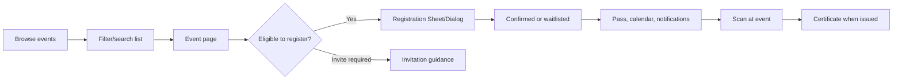
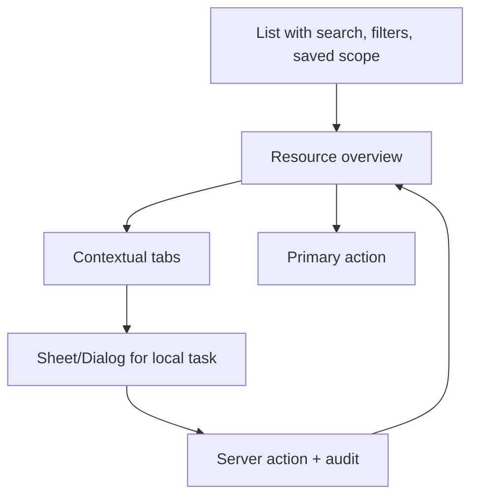

# Goal Pack 02 — role journeys, navigation, and “get work done” UX

## Purpose

This is document 2 of 5. The application currently behaves like a collection of pages a user must already know how to find. Replace that with role-aware workspaces that surface the next action, relevant status, and direct controls. The user should not need to remember which of `/admin`, `/manage`, `/events`, or another nested route contains their task.

Read Goal Pack 01 first. All UI controls in this document must use the shadcn/Lucide-only rules in Goal Pack 03 and the screen-level details in Goal Pack 04.

## Product UX principles

1. **Work, not pages.** The interface starts from what the user needs to finish today: approve, register, scan, send, issue, review, or resolve.
2. **One obvious next action.** Each workspace header has exactly one primary action appropriate to role and state.
3. **Context remains visible.** Do not push the user through a route maze for an event, certificate, roster, approval, or campaign. Use tabs, a contextual Sheet, or a clearly named management page.
4. **Explain state.** Status badges must pair with an explanation or next action: “Needs approval — submit changes”, “Waitlist — 2 seats pending”, “Email failed — retry delivery”.
5. **Show consequences before commitment.** Audience count before send, recipient count before issue, schedule impact before event update, import preview before write, and warning before destructive action.
6. **Make recovery routine.** Empty/error/offline states always have a concrete recovery action, not only an error sentence.
7. **Progressive disclosure.** Show essential data and primary action first; place advanced settings, exports, logs, and low-frequency actions in tabs/menus/sheets.

## Canonical app shell

Implement one dashboard shell that all protected screens use.

### Header

The header must include:

- Sidebar trigger on mobile/smaller desktop widths.
- Breadcrumbs that reflect the current resource, e.g. `Events / DevFest 2026 / Registrations`.
- A global `Command` trigger labelled “Search or run a command…” with `⌘/Ctrl+K` shortcut.
- A compact `Create` button/dropdown, showing only actions the current user is authorized to create.
- `NotificationBell` transformed into an action center with unread count, event/certificate/campaign status, mark-all-read, and “View all notifications”.
- Profile/avatar dropdown with profile, settings, theme, help/feedback, and sign out.

The header must not become a second sidebar. It exposes universal tools; navigation stays in the sidebar and resource header.

### Command menu

Build `components/app/command-menu.tsx` with shadcn Command, Dialog, Input, Empty, and Lucide icons. It must be keyboard-first and role filtered.

Command groups:

| Group | Examples |
| --- | --- |
| Navigate | Dashboard, Events, My Certificates, Communications, Members, Scanner, Finance, Settings. |
| Create | Create event, compose announcement, create certificate template, create form, add member, submit expense, add inventory item. |
| Current work | Pending approvals, registrations awaiting review, failed certificate deliveries, campaign failures, expiring invitations, low-stock alerts. |
| Find | Events by title, members by name/email, certificates by code, campaigns by name. |
| Personal | View my QR pass, my registrations, my tasks, submit feedback, sign out. |

Requirements:

- Use server-authorized, scoped search results. Never leak an event/member/certificate from a different organization through command search.
- Search is debounced, keyboard navigable, and has empty/loading/error states.
- Commands that mutate open the appropriate Dialog/Sheet or route rather than executing destructive work immediately.
- Do not make the command palette the only way to use a feature; it is an accelerator.

### Sidebar

Replace the hard-coded branching structure in `components/app-sidebar.tsx` with a typed navigation configuration containing label, href, Lucide icon, permission predicate, badge source, and optional children. Use the existing shadcn Sidebar and its `SidebarGroup`, `SidebarMenuButton`, `SidebarMenuAction`, `SidebarRail`, and mobile behavior.

Canonical groups:

| Visible to | Group | Destinations |
| --- | --- | --- |
| All members | My club | Home, Events, My registrations, My pass, Certificates, Achievements, Feedback. |
| Leads and admins | Operations | Work queue, Events, Scanner, Communications, Forms, Recruitment. |
| Leads and admins | Resources | Projects, Inventory, Finance, Content calendar. |
| Admin/owner | Administration | Approvals, Members, Certificate templates, Audit log, Settings, System health. |

Sidebar behavior:

- Highlight the active route and parent section.
- Display compact badges only for actionable counts: approvals, unread critical notifications, failed campaign deliveries, low inventory, pending interview decisions. Do not show badges for vanity counts.
- Use `SidebarMenuAction` for a contextual “+” only where creation is valid (for example Events → create event, Communications → compose campaign). It must be labelled for screen readers.
- Avoid duplicate entries such as separate generic “Events”, “Manage Events”, and “Admin Events” when one role-aware Events destination with correct tabs/controls can serve all roles.
- Make the mobile sidebar off-canvas and close it after navigation.

## Role workspaces and journeys

### Member journey

The member sees a personal dashboard, not club administration.

Home must answer:

- What am I attending next?
- What requires my action now?
- Where is my pass/certificate/application status?
- What changed recently?

Required home blocks:

1. **Today / next event**: event title, date/time/location, registration status, “View event” and “Open pass” actions.
2. **Action required**: complete registration form, verify email, respond to invitation, RSVP to interview, submit required document, join waitlist offer before it expires.
3. **My club activity**: unread announcements, achievement/recruitment updates, newly issued certificate.
4. **Quick actions**: Browse events, View pass, View certificates, Submit achievement/feedback. Render only useful actions.

Member event flow:

Do not require members to visit an administrator route to view their pass, certificate, application state, or registration.

### Lead journey

The lead dashboard is an operations cockpit for an assigned domain/events, not a generic statistics board.

Lead home blocks:

1. **My work queue**: event drafts needing completion, pending approval responses, registrations/capacity alerts, open tasks, campaign drafts/scheduled sends, certificate failures.
2. **Today’s operations**: events today/next 7 days, scan button, current attendance, staff coverage, time-sensitive notices.
3. **My events**: status, registrations/capacity, approval state, next session, and action menu.
4. **Operations health**: low inventory assigned to lead, budget approval/remaining funds if permitted, overdue task count.
5. **Quick actions**: Create event, Scan attendance, Compose event update, Add session, Import attendees, Issue certificates (only when contextual/authorized).

Lead must complete a common event operational loop without leaving its resource context:

1. Create draft.
2. Complete planning checklist and submit/publish according to permissions.
3. Track registrations and invitations.
4. Operate sessions/scanner on event day.
5. Send update/reminder/cancellation through scoped Communications.
6. Export or import roster through a preview flow.
7. Verify attendance/certificate eligibility and issue certificates.
8. Close event, review outcomes, archive when appropriate.

### Admin/owner journey

The admin dashboard is a **Club Command Center**. It should surface exceptions and decisions—not duplicate every module’s list page.

Admin home blocks:

1. **Needs decision**: event approvals, recruitment decisions, procurement/expense approvals, access requests, certificate revocations, critical audit/security events.
2. **Today at the club**: active/upcoming events, scan count, registration pace, staff coverage, scheduled campaigns.
3. **Delivery and system health**: failed email/certificate jobs, queue delay, unverified domain/config status, imports with errors, backup/health summary.
4. **Club pulse**: membership growth, engagement/attendance, finance/inventory alerts. Show only metrics that link to a concrete drill-down.
5. **Admin quick actions**: Review approvals, Create event, Compose campaign, Add member, Create certificate template, Open scanner, View audit log.

Admins should be able to open a contextual Sheet from a queue item, inspect summary/evidence/history, make an authorized decision, record a reason, and see the queue update without manually navigating back and forth.

## Resource navigation pattern

Every high-value resource follows the same pattern:

Rules:

- List pages contain query/filter state, bulk selection only when bulk action is safe, a primary create/import action, row action menu, empty state CTA, and pagination.
- Resource overview pages contain status, owner, latest relevant count, next deadline, primary action, quick action menu, and tab navigation.
- Tabs must represent persistent resource concerns such as Overview, Registrations, Sessions, Communications, Certificates, Activity. Do not create a tab for a one-field edit.
- Contextual Sheets are for “inspect/edit one record while retaining the list”; Dialogs are for short form/confirmation; full page is for complex creation/wizard.

## State language

Standardize human-facing statuses. Each must use a Badge with text, icon where useful, not color alone, and a description/action in details view.

| Domain | Good state | Needs action | Terminal/negative |
| --- | --- | --- | --- |
| Event | Published, Completed | Draft, Pending review, Registration closes soon | Cancelled, Archived |
| Registration | Confirmed, Checked in | Waitlisted, Action needed | Cancelled, No show |
| Certificate | Issued, Delivered | Queued, Rendering, Delivery retry | Revoked, Failed |
| Campaign | Sent, Delivered | Draft, Scheduled, Sending | Cancelled, Partial failure, Failed |
| Import | Completed | Preview ready, Processing, Completed with warnings | Failed, Needs resolution |
| Approval | Approved | Pending review, Changes requested | Rejected, Withdrawn |

Use the same status naming in API error codes, table filters, badges, action labels, notifications, audit records, and tests. Do not let one screen say “Waiting” while another says “Pending” for the same state.

## Empty, loading, offline, and error state requirements

Every module must implement all four, using shadcn primitives:

- **Empty**: an Empty/Card with relevant Lucide icon, one sentence about what belongs here, and a permission-appropriate CTA. Example: “No events match these filters. Clear filters” or “No certificate templates yet. Create template.”
- **Loading**: Skeleton for initial data layout; disabled buttons with Spinner for a user-triggered submit. Do not flash generic page text or blank regions.
- **Error**: Alert with a plain-language problem, safe retry, and an additional recovery/help action when appropriate. Preserve user inputs/filters.
- **Offline**: only scanner/import draft flows may queue work. Else say clearly that action requires a connection and leave saved draft intact. Never fake successful server work.

## Journey acceptance criteria

- A new member can find/register for an event and open their pass within three intentional interactions from the dashboard.
- A lead can start the scanner for today’s assigned event from their dashboard or command palette without searching the sidebar.
- An admin can reach an approval, inspect its history, decide with a reason, and return to the updated queue without a manual route reconstruction.
- Every sidebar/command action is filtered by actual server-enforced permission.
- No resource requires two separate role-specific list pages when a role-aware resource page can safely show the right controls.
- Back navigation restores the relevant list filter/tab/page state.
